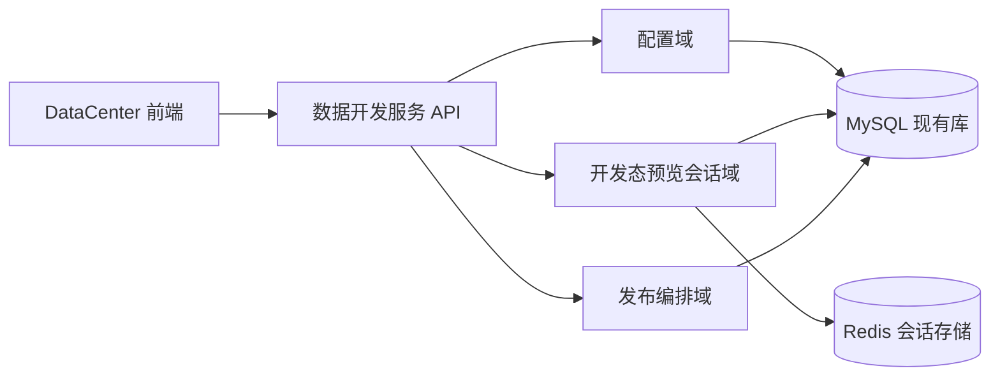

# 数据开发服务完整设计（评审稿）

> 更新时间：2026-04-15  
> 适用范围：DataCenter（中心侧，开发态与编排态）

## 1. 背景与目标

当前 `dev_core` 内承载了 DataCenter 的连接管理、查询、MQTT、数据点等能力。目标是在不破坏现有业务连续性的前提下，抽离为独立“数据开发服务”，并保持前端可平滑迁移。

本设计稿聚焦中心侧完整方案，节点侧采集服务仅保留接口契约，不展开内部实现细节。

## 2. 设计范围

本稿覆盖：

1. 中心侧服务边界与架构。
2. 协议能力矩阵（完整目标态，不按阶段拆分）。
3. 库表设计（共用现有数据库，允许结构调整）。
4. API 兼容与新增接口草案。
5. 开发态预览会话机制（30 分钟滑动过期）。
6. Redis 作为正式数据源的接入设计。
7. 发布编排数据契约（中心侧视角）。

本稿不覆盖：

1. 节点侧采集服务内部模块拆分与实现细节。
2. 生产级安全收敛策略的最终值（本轮以功能跑通优先，策略后置）。

## 3. 已确认约束（冻结）

1. DataCenter 前端直连新服务，路由语义尽量与现有 `/api/v1/data` 保持一致。
2. 新服务共用当前数据库，但允许做表结构演进。
3. 协议配置采用“每协议独立配置表”，不走统一 JSON 大表。
4. 开发态预览由中心侧“临时采集会话”提供。
5. 预览会话策略：30 分钟无操作过期，滑动续期。
6. 数据中心职责为配置与编排；数据中心与开发态不提供写回。
7. 写回仅允许节点侧工程客户端前端触发。
8. Redis 作为正式数据源参与发布编排与下发。
9. 凭据安全本轮沿用现状，优先功能打通；安全治理后置。
10. TDengine 连接器入口与关系库同级，先按查询能力接入，时序特性后置增强。
11. Kafka 作为协议能力矩阵中的独立接入协议，首版先做消费链路（不生产）。
12. 数据中心能力整体从 `dev_core` 拆分，独立数据中心服务采用 `Go` 实现。
13. `dev_core` 保留控制面与统一 RBAC，数据中心服务消费 capability 不维护角色主数据。
14. OPC DA 采用 Windows 专用适配器（建议 C#/.NET）接入 Go 主服务。

## 4. 核心定位

数据开发服务是“控制面服务（Control Plane）”，负责：

1. 数据源配置管理。
2. 协议元数据管理（连接、点位、查询、订阅）。
3. 开发态预览会话编排。
4. 发布编排数据输出（供运行态消费）。
5. 状态与审计聚合。

## 5. 总体架构（中心侧）

说明：

1. 预览会话状态主存放 Redis，数据库记录审计快照。
2. 节点侧运行态不在本文展开，但发布编排域需输出可下发契约。

### 5.1 技术选型结论（稳定性/性能优先）

1. 数据中心能力从 `dev_core` 拆分为独立服务，主实现语言采用 `Go`。
2. `dev_core` 保留平台控制面职责：认证、工程与成员管理、统一 RBAC、网关聚合与发布总入口。
3. 数据中心 Go 服务承载协议接入、预览会话、数据计算、报警计算、通知中心等高并发核心能力。
4. 前端接口路径保持 `/api/v1/data` 不变，通过网关路由实现前端无感迁移。
5. OPC DA 采用 Windows 专用适配器（建议 C#/.NET）实现，通过服务接口对接 Go 主服务。

### 5.2 角色权限透传方案（Go 服务）

1. 工程角色配置入口统一在工程卡片 `成员与权限`，角色主数据不迁移到 Go 服务。
2. Go 服务只消费能力点（capabilities）并执行鉴权，不维护独立角色体系。
3. 请求链路建议：前端携带平台 JWT -> 网关转发 -> Go 服务校验 -> 权限校验（本地缓存 + 平台校验）。
4. 权限缓存建议短 TTL，并支持权限变更事件驱动失效，确保权限调整可快速生效。
5. 会话类能力（预览、调试、订阅）在创建与执行阶段均需鉴权，权限撤销后可主动回收会话。

## 6. 协议能力矩阵（完整目标态）

### 6.1 协议接入矩阵

| 协议 | 连接测试 | 对象发现 | 实时订阅 | 周期采集 | 开发态预览 | 参与发布编排 |
| --- | --- | --- | --- | --- | --- | --- |
| MySQL/PostgreSQL/SQLServer | 支持 | 表/字段发现 | 否 | 支持 | 支持 | 支持 |
| TDengine | 支持 | 库表/超级表发现（逐步增强） | 否 | 支持 | 支持 | 支持 |
| MQTT | 支持 | Topic/Tag（手工+自动发现） | 支持 | 支持 | 支持 | 支持 |
| Kafka | 支持 | Topic 发现 | 支持（仅消费） | 支持 | 支持 | 支持 |
| HTTP/REST | 支持 | 端点/字段映射（手工+模板） | 可选（SSE/长轮询） | 支持 | 支持 | 支持 |
| WebSocket | 支持 | Topic/事件名映射 | 支持 | 可选 | 支持 | 支持 |
| OPC UA | 支持 | Browse/Node 树 | 支持 | 支持 | 支持 | 支持 |
| OPC DA | 支持 | Item 浏览 | 支持 | 支持 | 支持 | 支持 |
| S7-300/1200 | 支持 | 标签导入/映射 | 可选 | 支持 | 支持 | 支持 |
| Modbus TCP | 支持 | 点表映射 | 否 | 支持 | 支持 | 支持 |
| Modbus RTU | 支持 | 点表映射 | 否 | 支持 | 支持 | 支持 |
| Redis（单机） | 支持 | DB/Key 浏览 | Pub/Sub 支持 | 可选 | 支持 | 支持 |

### 6.2 通用能力维度矩阵

说明：

1. 本表用于约束各协议在工业现场落地时的“工程能力”下限。
2. 记录方式分为 `必需`、`可选`、`不适用` 三类。

| 协议 | 断线缓存与补传 | 时间戳策略（设备/网关/平台） | 质量码映射（good/bad/uncertain） | 采样与上报策略（周期/变化/死区） | 安全能力（TLS/证书/账号） | 重连与退避策略 | 最大吞吐与延迟等级 |
| --- | --- | --- | --- | --- | --- | --- | --- |
| MySQL/PostgreSQL/SQLServer | 可选 | 必需 | 必需 | 必需 | 必需 | 必需 | 必需 |
| TDengine | 可选 | 必需 | 必需 | 必需 | 必需 | 必需 | 必需 |
| MQTT | 必需 | 必需 | 必需 | 必需 | 必需 | 必需 | 必需 |
| Kafka | 必需 | 必需 | 必需 | 必需 | 必需 | 必需 | 必需 |
| HTTP/REST | 可选 | 必需 | 必需 | 必需 | 必需 | 必需 | 必需 |
| WebSocket | 必需 | 必需 | 必需 | 必需 | 必需 | 必需 | 必需 |
| OPC UA | 必需 | 必需 | 必需 | 必需 | 必需 | 必需 | 必需 |
| OPC DA | 可选 | 必需 | 必需 | 必需 | 可选 | 必需 | 必需 |
| S7-300/1200 | 可选 | 必需 | 必需 | 必需 | 可选 | 必需 | 必需 |
| Modbus TCP | 可选 | 必需 | 必需 | 必需 | 可选 | 必需 | 必需 |
| Modbus RTU | 可选 | 必需 | 必需 | 必需 | 不适用（链路层） | 必需 | 必需 |
| Redis（单机） | 可选 | 必需 | 必需 | 必需 | 必需 | 必需 | 必需 |

## 7. 统一数据契约

所有接入协议统一输出以下字段：

1. `pointId`
2. `path`
3. `value`
4. `quality`（`good|bad|uncertain` + 协议原始码）
5. `timestamp`（设备时间）
6. `serverTimestamp`（平台接收时间）
7. `source`（`db|mqtt|kafka|http|websocket|opcua|opcda|s7|modbus_tcp|modbus_rtu|redis`）
8. `connectionId`
9. `sessionId`（开发态预览）或运行态上下文标识

## 8. 库表设计

### 8.1 复用现有表

1. `data_connections`
2. `data_relational_configs`
3. `data_queries`
4. `data_points`
5. `data_mqtt_configs`
6. `data_mqtt_subscriptions`
7. `data_mqtt_tag_groups`
8. `data_mqtt_tags`

### 8.2 新增协议配置表（1:1 连接）

1. `data_opcua_configs`
2. `data_opcda_configs`
3. `data_s7_configs`
4. `data_modbus_configs`
5. `data_redis_configs`
6. `data_http_configs`
7. `data_websocket_configs`
8. `data_kafka_configs`

建议通用字段：

1. `id`
2. `connectionId`（唯一）
3. `projectId`
4. `enabled`
5. `config`（协议专有 JSON）
6. `createdBy`
7. `updatedBy`
8. `createdAt`
9. `updatedAt`

### 8.2.1 TDengine 建模约定

1. `tdengine` 先通过关系库入口接入，建议在 `data_relational_configs.dbType` 增加 `tdengine`。
2. 建议在 `data_connections.category` 预留 `timeseries`（与 `database` 同级，用于语义区分）。
3. 首轮能力聚焦“连接+查询+预览+发布编排”；超级表、Tag、保留策略、降采样后续补齐。

### 8.3 新增协议点位定义表（1:N）

1. `data_opcua_nodes`
2. `data_opcda_items`
3. `data_s7_tags`
4. `data_modbus_points`
5. `data_redis_keys`（用于受控操作与映射，不要求全量落库）
6. `data_http_mappings`
7. `data_websocket_topics`
8. `data_kafka_topics`

建议通用字段：

1. `id`
2. `projectId`
3. `connectionId`
4. `path`
5. `name`
6. `sourceType`
7. `sourceRef`
8. `dataType`
9. `meta`
10. `isEnabled`
11. `createdBy`
12. `updatedBy`
13. `createdAt`
14. `updatedAt`

### 8.4 预览会话审计表

1. `data_preview_sessions`
2. `data_preview_session_logs`（可选）

`data_preview_sessions` 建议字段：

1. `id`
2. `projectId`
3. `userId`
4. `status`（`active|expired|closed|error`）
5. `startedAt`
6. `lastActiveAt`
7. `expiredAt`
8. `meta`

### 8.5 索引建议

1. 所有主业务表至少含 `projectId` 二级索引。
2. 协议点位表建立 `(projectId, connectionId, path)` 唯一索引。
3. 预览会话表建立 `(projectId, userId, status)` 与 `lastActiveAt` 索引。

## 9. API 设计（中心侧）

### 9.1 兼容保留（保持语义）

1. `/api/v1/data/projects/:projectId/connections`
2. `/api/v1/data/projects/:projectId/queries`
3. `/api/v1/data/projects/:projectId/datapoints`
4. `/api/v1/data/projects/:projectId/mqtt/...`
5. `/api/v1/data/projects/:projectId/kafka/...`
6. `/api/v1/data/projects/:projectId/http/...`
7. `/api/v1/data/projects/:projectId/websocket/...`
8. `/api/v1/data/projects/:projectId/modbus-rtu/...`

### 9.2 协议新增接口

1. `/api/v1/data/projects/:projectId/opcua/...`
2. `/api/v1/data/projects/:projectId/opcda/...`
3. `/api/v1/data/projects/:projectId/s7/...`
4. `/api/v1/data/projects/:projectId/modbus/...`
5. `/api/v1/data/projects/:projectId/redis/...`

### 9.3 预览会话接口

1. `POST /api/v1/data/projects/:projectId/preview/sessions`
2. `POST /api/v1/data/preview/sessions/:sessionId/heartbeat`
3. `POST /api/v1/data/preview/sessions/:sessionId/read`
4. `POST /api/v1/data/preview/sessions/:sessionId/subscribe`
5. `POST /api/v1/data/preview/sessions/:sessionId/unsubscribe`
6. `DELETE /api/v1/data/preview/sessions/:sessionId`

### 9.4 响应结构

统一按仓库约束使用 `ApiResponse`：`success/errorCode/message/requestId/data`。

## 10. 开发态预览会话机制

### 10.1 会话规则

1. 创建即激活会话。
2. 任意读/订阅/心跳操作触发滑动续期。
3. 连续 30 分钟无操作自动过期。
4. 过期后自动清理会话资源。

### 10.2 Redis Key 约定

1. `preview:session:{sessionId}`：会话主状态。
2. `preview:session:{sessionId}:connections`：会话内连接状态。
3. `preview:session:{sessionId}:subscriptions`：会话内订阅状态。

## 11. Redis 接入设计（受控运维面板）

### 11.1 目标能力

1. 单机 Redis 连接管理。
2. Key 浏览与值查看。
3. 受控读写操作（无通用命令行）。
4. Pub/Sub 消息查看。
5. 作为正式数据源参与发布编排。

### 11.2 界面原则

1. 不提供自由命令输入终端。
2. 只开放平台定义的受控操作入口。
3. 操作留痕（谁、何时、对哪个连接做了什么）。

### 11.3 风险治理策略（后置）

本轮先跑通功能，不在实现前置硬限制；但必须预留：

1. 操作策略开关。
2. 命令分级与白名单配置位。
3. 连接级审计日志。

## 11.4 Kafka（可插拔能力）

1. 定位：协议能力矩阵中的消息类接入协议，与 MQTT 同级但独立。
2. 首版范围：仅实现 Kafka Source（消费），不实现 Kafka Sink（生产）。
3. 交互模型：连接管理、测试、启停、状态、Topic 订阅、消息预览、数据点映射。
4. 实现策略：流程与界面尽量对齐当前 MQTT 实现，降低迁移成本。

## 12. 发布编排契约（中心侧输出）

发布时输出统一数据编排对象，至少包括：

1. 连接定义（含协议类型与连接基础参数）。
2. 协议配置引用。
3. 点位定义与路径映射。
4. 查询/订阅/采集策略。
5. 运行所需元数据版本号。

本稿仅定义中心侧“输出契约”；节点侧“如何执行”后续单独文档化。

## 13. 安全与治理（本轮策略）

### 13.1 本轮执行策略

1. 凭据治理沿用现状，先保证主流程联通。
2. 审计能力与策略开关必须先埋好。

### 13.2 后续治理清单

1. 凭据加密与密钥托管。
2. 敏感操作分级授权。
3. 协议连接最小权限校验。
4. 导入导出脱敏策略。

## 14. 非功能要求

1. 多租户与项目隔离。
2. API 可观测：请求链路可追踪。
3. 会话可观测：在线会话数、超时数、异常断开数。
4. 协议可观测：连接状态、错误率、延迟分布。

## 15. 待确认项

1. 协议配置字段的最小必填集合（尤其 OPCDA/S7）。
2. Redis 运维操作初始开放列表。
3. 发布编排对象与运行态消费契约版本号策略。
4. 是否统一 UUID 字段类型（`CHAR(36)` 与 `UUID` 的长期治理）。

## 16. 评审结论模板

评审时请按以下三类反馈：

1. 必改项（阻塞实现）。
2. 建议项（可后续优化）。
3. 暂缓项（记录到治理清单）。

## 17. 工程级成员与权限入口（新增决策）

1. 工程用户角色配置入口统一放在“工程卡片”的 `成员与权限`。
2. 设计中心与数据中心共用同一套工程级 RBAC，不再分别提供角色配置入口。
3. 数据中心仅消费权限能力点并执行鉴权，不维护角色主数据。
4. 权限变更后需对设计中心和数据中心即时生效，避免权限口径不一致。
