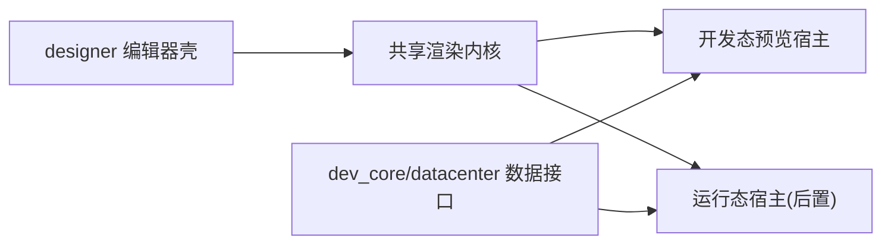

# 开发态预览专项计划

## 1. 文档定位
- 本文档用于替代当前阶段“运行时闭环优先”的执行主线。
- 本阶段目标是先形成设计器内可用、可复用到未来运行态的开发态预览能力。

## 2. 当前已实现
### 2.1 已有基础
- `designer` 已具备编辑器壳、页面模型、属性面板、绑定与表达式基础能力。
- `dev_core` 已具备项目、页面、数据连接、查询、数据点等主数据能力。
- `datacenter` 已具备关系库、MQTT、数据点主干能力。

### 2.2 当前缺口
- 设计器预览和未来运行态之间缺少共享渲染内核。
- 当前没有稳定的预览宿主结构。
- Schema 虽已有基础，但尚未完全以“预览/运行共用”方式冻结。

## 3. 目标
- 在 `designer` 内实现开发态预览。
- 让预览内核未来可迁移到独立运行态宿主。
- 先打通页面解释、组件渲染、基础绑定和预览数据接入。

## 4. 架构方案

## 5. 模块职责
### `designer`
- 负责编辑器与预览宿主整合。
- 负责触发预览、切换预览态、承接预览容器。

### `runtime_engine`
- 当前阶段先不做独立宿主。
- 先承接共享渲染内核、页面解释、组件渲染和基础绑定求值。

### `dev_core`
- 提供工程聚合与预览所需接口。
- 保证页面、资源、数据对象可被预览消费。

### `datacenter`
- 提供可被预览引用的数据点、查询和 MQTT Tag。
- 当前不把处理层一期拉入主线。

### `runtime_node_agent`
- 后置，不进入第一批核心投入。

### `dev_ide`
- 当前不以运维为主线，保留后续运行态接入口。

## 6. 当前阶段边界
### 纳入本专项
- 共享渲染内核
- 设计器预览宿主
- 发布态 Schema 与预览结构统一
- 基础组件渲染
- 基础交互
- 真实数据 / Mock / 降级占位

### 不纳入本专项
- NodeAgent Runtime 托管
- 独立运行态部署
- 完整运维闭环
- 复杂动作系统
- 多视图

## 7. 分阶段计划
### 阶段 0：契约冻结
- 冻结发布态 Schema。
- 明确预览宿主输入结构。
- 冻结基础组件白名单。

### 阶段 1：共享渲染内核
- 建立页面解释层。
- 建立基础组件注册表。
- 建立绑定求值层。

### 阶段 2：设计器预览宿主
- 在 `designer` 中挂接预览容器。
- 支持预览切换、刷新和错误提示。
- 支持真实数据、Mock 数据、降级占位。

### 阶段 3：预览验收
- 对示例页面做预览验证。
- 校验页面结构、基础绑定、组件渲染一致性。

### 阶段 4：为运行态迁移预留
- 抽离与宿主无关的共享层。
- 为未来独立 Runtime 宿主预留接口。

## 8. 验收标准
- 设计器内可打开预览。
- 入口页可渲染。
- 白名单组件可展示。
- 基础绑定可工作。
- 预览支持真实数据、Mock 数据、占位降级至少三种模式。

## 9. 风险与约束
- 若预览直接依赖编辑器内部状态而非发布态 Schema，未来运行态会返工。
- 若一开始就扩动作系统，预览内核 scope 会失控。
- 若 DataCenter 同时拉入处理层一期，会分散当前主线资源。

## 10. 关联文档
- [产品定义](../../../../docs/产品定义.md)
- [产品决策确认版（归档）](./产品决策确认版.md)
- [运行时闭环专项计划](./运行时闭环专项计划.md)
- [发布态 Schema 契约](../../../../docs/contracts/designer-publish-schema.md)
