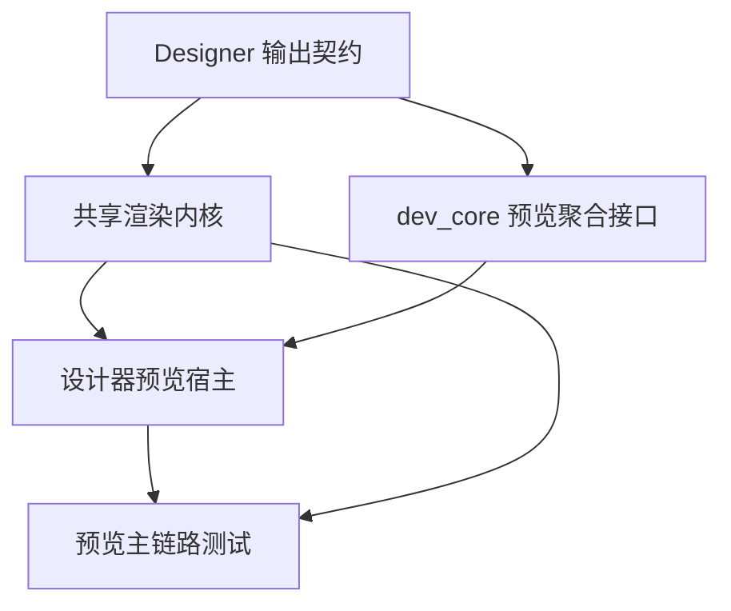

# 开发计划

## 1. 当前状态
### 1.1 已完成基础
- `dev_core` 已具备项目、设计、数据、发布、部署、节点管理主干能力。
- `dev_ide` 已具备平台管理和运维管理主界面。
- `datacenter` 已具备关系库、MQTT、数据点主干。
- `designer` 已具备编辑器核心、属性面板、绑定与表达式基础能力。
- `runtime/node_agent` 已具备节点控制面、部署执行和本地管理前端。

### 1.2 当前关键缺口
- 缺少 RuntimeEngine，部署后无法真正运行工程页面。
- 发布制品结构还不足以支撑长期运行态消费。
- Designer 输出契约未冻结。
- DataCenter 缺少处理层对象。
- 自动化测试对主流程覆盖不足。

### 1.3 当前阶段优先级调整
- 当前阶段第一优先级已调整为“开发态预览闭环”。
- 共享渲染内核与设计器预览宿主优先于独立运行态宿主、NodeAgent 托管和完整部署链路。

## 2. 目标状态
- 当前阶段先形成“设计 -> 预览 -> 校验”的开发态闭环。
- 下一阶段再形成“发布 -> 部署 -> 运行 -> 监控”的运行态闭环。
- 每个模块都有稳定边界，可独立交给 AI 或团队成员推进。
- 文档、设计、任务拆分与当前代码状态一致。

## 3. 差距分析
| 领域 | 当前状态 | 目标状态 | 差距 |
| --- | --- | --- | --- |
| 开发态预览 | 设计器可编辑但预览主线未成型 | 有共享渲染内核和预览宿主 | 最高优先级缺口 |
| 运行时 | 空目录 | 可加载制品并渲染页面 | 核心缺口 |
| 发布制品 | 基础打包 | 标准化制品协议 | 高 |
| 设计契约 | 部分分散 | 统一导出 Schema | 高 |
| 数据处理层 | 接入层为主 | 有计算/报警/写回一期 | 中 |
| 测试 | 局部存在 | 覆盖主链路 | 中高 |
| 文档治理 | 多数过期 | 与现状一致的重建文档 | 高 |

## 4. 任务拆分
### 4.1 P0：必须先完成
1. 共享渲染内核方案冻结与目录初始化。
2. Designer 输出契约冻结。
3. 设计器预览宿主方案冻结。
4. 预览数据接入与降级策略冻结。

### 4.2 P1：主线闭环
1. `dev_core` 提供预览可消费的工程聚合与数据接口。
2. `runtime_engine` 实现共享渲染内核、页面解析和基础组件渲染。
3. `designer` 接入开发态预览宿主。
4. `dev_ide` 保持管理端稳定并预留扩展位。

### 4.3 P2：能力完善
1. DataCenter 处理层一期。
2. 独立 Runtime 宿主。
3. NodeAgent 托管联调。
4. 文档与任务清单持续回写。

## 5. 优先级
### 5.1 推荐优先级
- `P0`：预览主线、共享渲染内核、设计契约。
- `P1`：设计器预览闭环、体验打磨、测试补强。
- `P2`：独立运行态、节点托管、运维闭环。

### 5.2 不建议当前阶段优先推进
- Electron 或独立壳程序。
- 大规模新组件库扩展。
- 多人协同编辑。
- 复杂权限模型二期。
- NodeAgent 侧重投入的独立运行态联调。

## 6. 依赖关系

## 7. 阶段交付物
### 阶段 0：基线冻结（3-5 天）
- 预览输入结构说明。
- 共享渲染内核组件清单。
- Designer 输出契约草案。
- 预览数据接入与降级策略说明。

### 阶段 1：共享渲染内核（2 周）
- `runtime/engine_core`
- `runtime/engine_front`
- 页面解释与基础组件渲染
- 基础绑定求值

### 阶段 2：设计器预览宿主（1.5-2 周）
- 设计器预览容器接入
- 真实数据 / Mock / 占位降级支持
- 预览错误提示和刷新机制

### 阶段 3：数据与设计联调（2 周）
- 数据点/查询绑定接入
- 绑定诊断
- 预览链路一致性校验

### 阶段 4：运行态后置准备（1-1.5 周）
- 为独立 Runtime 宿主预留接口
- 为 NodeAgent 托管预留协议

### 阶段 5：质量与交付（1-1.5 周）
- 集成测试与 smoke
- 文档回写
- 试点工程验收

## 8. 风险与注意事项
- 不能继续让旧文档驱动实现，必须以代码和新文档为准。
- 预览若不直接复用发布态 Schema，未来独立运行态会二次返工。
- 共享渲染内核未先定义边界前，不要继续扩 Designer 大功能。
- 制品协议一旦被多个模块消费，变更成本会快速上升，必须先冻结最小版本。
- NodeAgent 已较完整，若运行时长期缺位会造成控制面和业务面脱节。

## 9. 当前已实现 / 建议目标 / 待确认
### 当前已实现
- 平台控制面与节点控制面已存在。
- 运维管理基础流程已经可见。

### 共创后建议目标
- 把下一阶段资源集中到开发态预览闭环与共享渲染内核。

### 待确认事项
- DataCenter 处理层是否继续后置。
- 预览阶段的真实数据权限边界是否还需补充。
