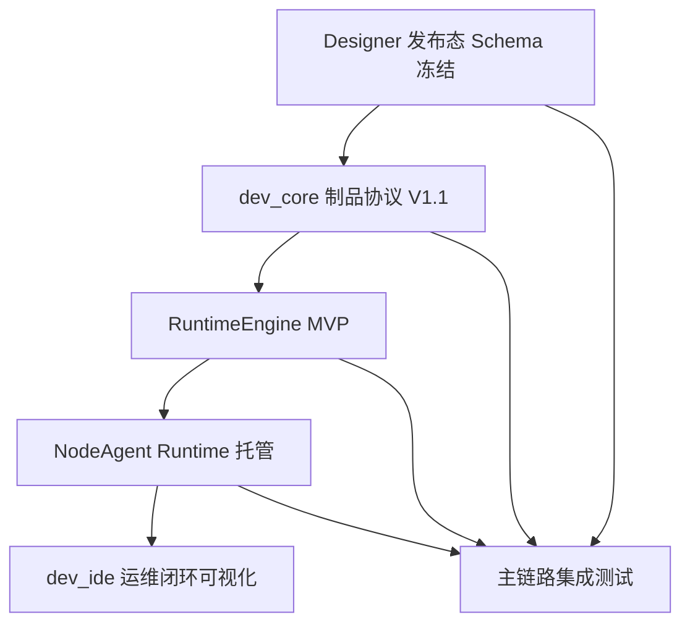

# 运行时闭环专项计划

## 1. 文档定位
- 本文档用于把 `designer`、`dev_core`、`runtime/node_agent`、`runtime/engine_*` 串成一条可执行的跨模块交付主线。
- 本文档不替代 `docs/ai-packages/tasks/` 下的模块任务文档，而是作为总控、排期、依赖和验收依据。
- 当前平台正式背景以 [产品定义](./产品定义.md)、[高层设计](./高层设计.md)、[详细设计](./详细设计.md) 为准。
- 注意：本专项已从当前阶段第一优先级下调，现阶段执行主线以 [开发态预览专项计划](./开发态预览专项计划.md) 为准。

## 2. 当前已实现
### 2.1 已有基础
- `designer` 已具备页面设计、组件编排、绑定与表达式基础能力。
- `dev_core` 已具备项目、设计、数据、发布、部署、节点管理主干。
- `runtime/node_agent` 已具备节点初始化、部署执行、日志与状态回传主干。
- `dev_ide` 已具备运维管理界面，可作为部署与监控入口。

### 2.2 关键缺口
- `runtime/engine_core`、`runtime/engine_data`、`runtime/engine_front` 当前为空。
- Designer 发布态 Schema 未冻结。
- 发布制品协议未冻结。
- NodeAgent 与 RuntimeEngine 的启动/探活协议未冻结。

## 3. 总体目标
- 形成“设计 -> 发布 -> 部署 -> 运行 -> 监控”的最小闭环。
- 让一个简单工程可在节点侧被真实启动并访问页面。
- 将跨模块约束收敛为少量稳定契约，避免多模块并行开发时互相反复。

## 4. 当前阶段边界
### 纳入本专项
- 发布态 Schema 冻结。
- 制品协议 V1.1。
- RuntimeEngine MVP。
- NodeAgent 对 RuntimeEngine 的进程托管。
- 运维端部署状态和运行状态可见。

### 不纳入本专项
- 复杂动作系统。
- 多视图适配。
- 独立桌面壳。
- 完整权限二期。
- 大规模组件扩展。

## 5. 核心契约冻结清单
### 5.1 Designer -> dev_core
- `project.json` 结构。
- `page.json` 结构。
- 组件节点最小字段。
- `bindings` 对象字段。
- 入口页配置字段。

### 5.2 dev_core -> runtime/node_agent
- 部署状态枚举。
- 版本制品下载地址与摘要。
- 节点命令类型。
- 回执字段和错误字段。

### 5.3 dev_core -> runtime_engine
- `manifest.json` 结构。
- 页面索引与资源索引。
- 数据清单格式。
- Schema 版本与兼容策略。

### 5.4 runtime/node_agent -> runtime_engine
- 启动命令格式。
- 工作目录结构。
- 端口注入方式。
- 健康检查路径。
- 停止与回滚约定。

## 6. 跨模块依赖链

## 7. 模块职责分工
### 7.1 `designer`
- 冻结发布态工程 Schema。
- 区分编辑态模型与发布态模型。
- 为导出提供校验和诊断。

### 7.2 `dev_core`
- 聚合项目、页面、资源和数据对象。
- 生成标准制品与版本元数据。
- 编排部署、节点命令和回执处理。

### 7.3 `runtime/node_agent`
- 下载制品。
- 解压版本包。
- 启停 RuntimeEngine。
- 上报状态、健康和错误日志。

### 7.4 `runtime/engine_*`
- 加载制品。
- 解释页面。
- 渲染基础组件。
- 提供数据绑定和运行接口。

### 7.5 `dev_ide`
- 展示发布版本、部署状态、运行健康、错误详情。
- 作为运维闭环的统一操作入口。

## 8. 分阶段计划
### 阶段 0：契约冻结
#### 目标
- 冻结本专项所有必须先定的接口和文件结构。

#### 输出
- 发布态 Schema 说明。
- `manifest.json` 字段表。
- NodeAgent 启动协议。
- Runtime 健康检查协议。

#### 负责人模块
- `designer`
- `dev_core`
- `runtime_node_agent`
- `runtime_engine`

### 阶段 1：制品和运行时骨架
#### 目标
- 让 RuntimeEngine 能读取制品并提供基础服务。

#### 输出
- `runtime/engine_core` 基础骨架。
- `runtime/engine_front` 基础页面渲染。
- `runtime/engine_data` 最小数据上下文。
- `dev_core` 新制品打包能力。

### 阶段 2：节点托管联调
#### 目标
- 让 NodeAgent 能稳定下载、启动、探活和停止 Runtime。

#### 输出
- 版本目录规范。
- 进程托管逻辑。
- 探活失败与回滚策略。
- 日志与状态上报增强。

### 阶段 3：运维可视化闭环
#### 目标
- 让运维人员可以从 `dev_ide` 看到部署结果和运行健康。

#### 输出
- 部署状态展示升级。
- 节点运行状态、版本、错误详情展示。
- 最小 smoke 验证路径。

## 9. 任务拆解
### 9.1 `designer`
1. 定义最小发布态 Schema。
2. 增加导出校验。
3. 增加诊断结果输出。

### 9.2 `dev_core`
1. 升级 `publishService`。
2. 实现制品 V1.1 输出。
3. 统一部署状态和节点命令回执。

### 9.3 `runtime_node_agent`
1. 实现 Runtime 启停协议。
2. 规范版本目录切换。
3. 增强探活和错误处理。

### 9.4 `runtime_engine`
1. 初始化三层目录和基础骨架。
2. 实现制品加载和页面路由。
3. 支持首批组件和基础绑定。

### 9.5 `dev_ide`
1. 补版本详情展示。
2. 补运行状态和错误详情展示。
3. 补运维页 smoke 测试。

## 10. 里程碑与验收
### 里程碑 M1：契约冻结完成
验收标准：
- 四类核心契约形成正式文档。
- 模块负责人对字段和边界无歧义。

### 里程碑 M2：Runtime MVP 可启动
验收标准：
- RuntimeEngine 可读取制品。
- 可访问入口页。
- `/health` 和 `/status` 可用。

### 里程碑 M3：节点联调通过
验收标准：
- NodeAgent 可下载、解压、启动、停止 Runtime。
- 失败状态可回传平台。

### 里程碑 M4：平台闭环可演示
验收标准：
- `dev_ide` 中完成一次发布部署。
- 节点页面可打开。
- 可看到基础数据展示和状态反馈。

## 11. 风险与约束
### 风险
- 契约未冻结前并行开发会造成高返工。
- Runtime 空目录意味着阶段 1 必须严格控 scope。
- DataCenter 若同时大规模扩展，会分散运行时闭环资源。

### 约束
- 接口仍统一在 `/api/v1`。
- 平台响应统一 `ApiResponse`。
- 不通过 `sequelize.sync()` 初始化数据库。

## 12. 推荐执行顺序
1. 先完成契约冻结，不先写 Runtime 大量代码。
2. 先保证最小组件和最小绑定跑通，不扩大 Runtime 范围。
3. 先做部署成功与探活成功，再做更复杂的回滚和增强功能。

## 13. 关联文档
- [开发计划](./开发计划.md)
- [详细设计](./详细设计.md)
- [dev_core.task](./ai-packages/tasks/dev_core.task.md)
- [designer.task](./ai-packages/tasks/designer.task.md)
- [runtime_node_agent.task](./ai-packages/tasks/runtime_node_agent.task.md)
- [runtime_engine.task](./ai-packages/tasks/runtime_engine.task.md)

## 14. 待确认事项
- 是否把 DataCenter 处理层一期并入本专项，还是完全后置。
- Runtime 首版是否只支持 Web 访问。
- 首批组件白名单是否固定为文本、图片、按钮、表格、容器。
