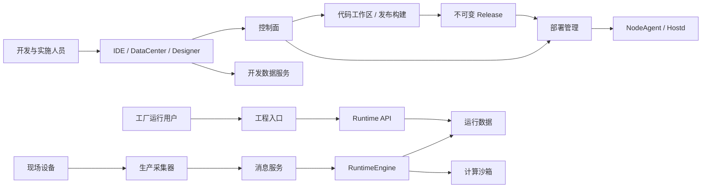

# 平台系统架构

本文承接 [产品定义](./产品定义.md)，区分系统职责与当前实现。代码存在不等于目标环境已验收。

## 系统关系

箭头表示主要调用或数据方向。NodeAgent 负责交付与节点管理，不经过每条业务数据。部署形态见 [平台部署拓扑架构](../02-系统设计/平台部署拓扑架构.md)。

## 模块与所有权

| 系统       | 当前代码                                                                              | 负责的内容                                                   |
| ---------- | ------------------------------------------------------------------------------------- | ------------------------------------------------------------ |
| 平台管理   | dev_core、dev_ide                                                                     | 平台身份、租户与工程归属、工作区、版本、部署、节点和运维汇聚 |
| 数据开发   | data_service、datacenter                                                              | 连接、查询、数据点、计算和报警建模，开发调试与冻结工件       |
| 应用创作   | designer、designer/code-workspace                                                     | AI 工具宿主、源码编辑、Vite 预览、场景创作                   |
| 工程运行   | runtime/project_gateway、runtime/runtime_api、runtime/runtime_engine、compute_sandbox | 入口、运行授权、业务数据访问、数据处理、计算与报警执行       |
| 节点与采集 | runtime/node_agent、runtime/node_agent_front、collector                               | 节点生命周期、受限宿主操作、开发采集调试和生产采集           |
| 共享契约   | contracts、runtime/web-sdk                                                            | 驱动描述、工程模板与运行 SDK                                 |

平台主数据基线为 [core-schema.sql](../../dev_core/db/schema/core-schema.sql)，开发数据域基线为 [schema.sql](../../data_service/internal/db/schema/schema.sql)。数据域的工程归属映射是授权副本，不成为第二套工程主数据。运行域消费冻结工件与部署绑定，不直接读取开发库可变草稿。

## 当前实现与交付边界

| 领域     | 代码证据                                                                                                                                  | 边界                                                                                                                                                                                                                  |
| -------- | ----------------------------------------------------------------------------------------------------------------------------------------- | --------------------------------------------------------------------------------------------------------------------------------------------------------------------------------------------------------------------- |
| 中心部署 | [centerctl](../../scripts/k3s/center/centerctl) 与中心清单使用 K3s                                                                        | 工作区与发布构建仍使用 Docker；单中心不具备高可用承诺                                                                                                                                                                 |
| 正式发布 | [releasebuilder](../../dev_core/internal/releasebuilder)、[deployment](../../dev_core/internal/deployment) 已有冻结、构建、签名与版本流程 | 不能继续写“Builder 尚未实现”，也不能由此推定所有模板及升级路径均已验收                                                                                                                                                |
| 工程部署 | [ops](../../dev_core/internal/ops) 已有工作负载生成、Secret 装配与观测；NodeAgent 有下载、安装与激活                                      | 二进制存在、单元测试通过、安装和现场验收分别说明                                                                                                                                                                      |
| 工程身份 | 控制面 [runtimeaccess](../../dev_core/internal/runtimeaccess) 管理独立工程用户与角色                                                      | [部署凭据](../../dev_core/internal/ops/deployment_secret_manager.go) 目前只生成 deployment-user / viewer；[工程网关](../../runtime/project_gateway/internal/gateway/server.go) 注入该身份并限制为只读，不接通客户账号 |
| 运行 API | [httpapi](../../runtime/runtime_api/internal/httpapi) 有本地 token 摘要、会话及部分授权动作                                               | 底层 API 能力不能视为工程网关已开放；没有完整现场用户名密码与用户生命周期                                                                                                                                             |
| 生产采集 | [节点打包](../../scripts/release/build-node-agent-packages.sh) 使用 .NET Runtime；runtime/collector_engine 保留独立 Go 实现               | 两套实现不等价；开发驱动支持也不代表生产驱动支持                                                                                                                                                                      |
| 生产安全 | 原生节点包模板目前使用 development，Linux 生产加载器要求只读挂载                                                                          | 开发验证结果不能当作生产安全验收                                                                                                                                                                                      |

## 架构约束

- 源码快照、正式 Release、部署绑定、运行身份与运行数据分别拥有生命周期。Release 不携带现场长期凭据；升级不覆盖客户业务数据。
- 平台权限、运行用户权限、节点机器身份分别校验，不能相互替代。
- 一个业务状态只有一个权威写入方。事件通知用于刷新事实，不能与 HTTP、数据库或节点观测争夺最终状态。
- 运行代次贯穿命令、进程、持久状态与清理；过期命令不得操作新进程或删除其数据。
- 跨模块通过 API、事件、工件或 SDK 交互，不跨服务写表、不跨模块引入 Go internal 实现。
- 隔离需要目标系统上的凭据、只读挂载、网络和资源限制验证；语言级沙箱与开发开关不能替代生产边界。
- 当前开发数据库仍遵守空库最终基线规则。首个客户版本前必须确定存量客户升级和恢复策略，不能把重建开发库作为客户升级方案。

模块职责、目标目录及验证要求见 [仓库结构与模块规范](../05-研发与交付/仓库结构与模块规范.md)。本总览不替代逐模块实现审查。
