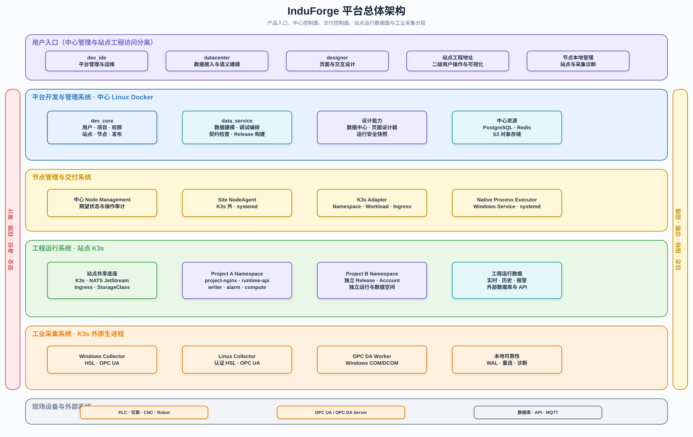
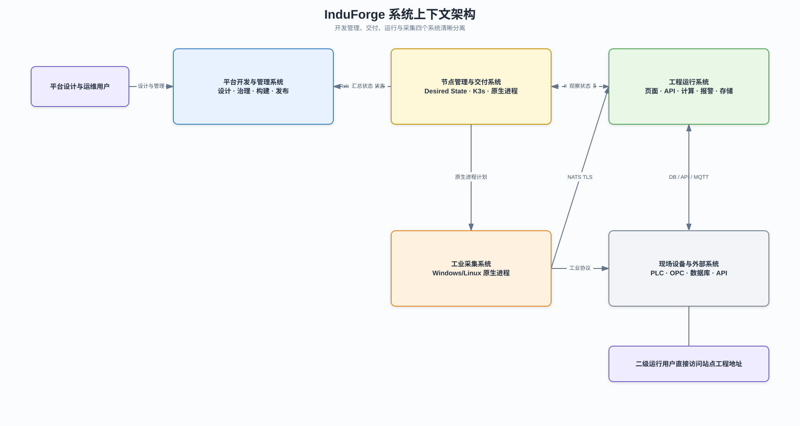
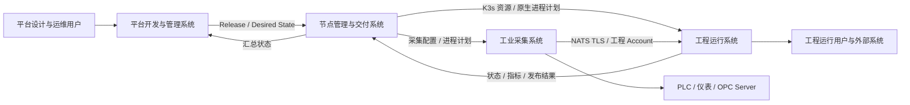
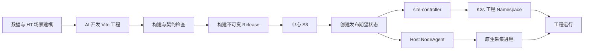

# InduForge 平台系统架构

## 1. 文档定位

本文档是 InduForge 的系统级架构基线，定义平台开发与管理、节点管理与交付、工程运行、工业采集四个系统及其边界。

技术实现细节分别见：

- [平台开发与管理系统架构](../02-系统设计/平台开发与管理系统架构.md)
- [节点管理与交付架构](../02-系统设计/节点管理与交付架构.md)
- [运维与节点运行态总体架构](../02-系统设计/运维与节点运行态总体架构.md)
- [工程运行系统架构](../02-系统设计/工程运行系统架构.md)
- [工业采集架构](../02-系统设计/工业采集架构.md)

## 2. 平台总体架构

平台总体架构图从产品入口、中心控制面、节点交付控制面、站点运行数据面和工业采集层展示完整能力分层。



可编辑源文件：[平台总体架构.drawio](../diagrams/平台总体架构.drawio)。

> 现有图片尚未同步 per-host NodeAgent、site-controller、infrastructure-controller 与
> deploymentId 边界；冻结前以运维与节点运行态总体架构的文字和 Mermaid 为准。

## 3. 总体原则

- 中心平台负责设计、治理、构建和发布，不承担工程长期运行。
- 运行站点以一套 K3s 和一套 NATS JetStream 承载多个工程。
- 每个 ProjectDeployment 按 `deploymentId` 使用独立 K3s Namespace、NATS Account、配置、
  密钥和数据空间，同一工程多阶段可以并存。
- 工程页面、配置和运行资源属于不可变 Release，存放于中心 S3，发布后下载到工程自己的运行空间。
- 站点、密钥、连接、资源和环境差异由版本化 DeploymentBinding 提供，同一 Release 在开发、预发和生产之间晋级。
- Windows 和 Linux 工业采集统一采用原生进程，不进入容器和 K3s。
- 站点失去中心连接后，已发布工程、页面、采集、计算、报警和存储继续运行。
- 中心与站点之间只有运维控制、发布分发和状态汇聚关系。
- 二级运行用户直接访问站点已部署工程的独立地址，不通过中心入口或中心服务转发。

## 4. 系统上下文



可编辑源文件：[系统上下文架构.drawio](../diagrams/系统上下文架构.drawio)。

> 本图的节点侧组件边界同样以上述新总纲为准。



## 5. 四个核心系统

### 4.1 平台开发与管理系统

部署于中心 Linux Docker，包含 `dev_ide`、`datacenter`、`designer`、`dev_core`、`data_service`、中心数据库、Redis 和 S3 对象存储。

负责：

- 平台用户、租户、项目、权限和站点管理。
- 接入源、数据点、查询、计算、报警和历史存储建模。
- AI 页面开发、HT 2D/3D 场景创作，以及 Designer 中独立的 Vite 实时预览。
- Release 构建、签名、版本管理和发布计划。
- 运行状态、日志摘要和运维入口。

不负责：

- 长期连接工业设备。
- 工程运行态登录、查询和报警执行。
- K3s 内业务工作负载调度。

### 4.2 节点管理与交付系统

由中心节点管理能力、每台受管宿主机的 NodeAgent 和每个 K3s 站点的 site-controller 组成。

负责：

- 站点注册、资源与能力上报。
- 将平台期望状态转换为 K3s 资源或原生进程计划。
- 发布、升级、回滚和健康聚合。
- K3s 运行底座和原生采集进程的产品级生命周期管理。

NodeAgent 运行在 K3s 外部，Linux 使用 systemd，Windows 使用 Windows Service，负责本机资源、
产品组件和原生进程。site-controller 运行在 `induforge-system` Namespace，负责工程资源、
发布状态和站点级协调；中心不持有站点 Kubeconfig。

### 4.3 工程运行系统

部署于运行站点 K3s。一个站点允许同时运行多个工程：

```text
Site
├─ HostNode 1..N
│  └─ NodeAgent
├─ K3s
│  ├─ induforge-system
│  │  ├─ site-controller
│  │  └─ 站点公共服务
│  ├─ project-a Namespace
│  ├─ project-b Namespace
│  └─ project-c Namespace
└─ NATS JetStream
```

工程运行系统负责页面、运行 API、实时数据、计算、报警、写库和动作执行。每个工程离线自治，不在线查询中心数据库。

### 4.4 工业采集系统

部署在 Windows 或 Linux 原生操作系统：

```text
NodeAgent
└─ industrial_collector 子进程
   ├─ HSL Adapter
   ├─ OPC UA Adapter
   └─ 本地 WAL

Windows 可选：opcda_worker 子进程
```

Collector 将标准采集值发布到目标工程的 NATS Account，不进入 K3s。

## 6. 开发系统与运行系统边界

| 维度     | 平台开发与管理系统         | 工程运行系统                   |
| -------- | -------------------------- | ------------------------------ |
| 使用者   | 平台管理员、工程设计人员   | 操作员、运行用户、外部系统     |
| 数据     | 设计元数据、Release 元数据 | 实时值、历史值、报警、运行状态 |
| 生命周期 | 持续演进和集中治理         | 按工程 Release 独立升级和回滚  |
| 依赖中心 | 本身即中心系统             | 已发布后不依赖中心在线         |
| 页面资源 | 构建并上传 S3              | 从工程本地资源加载             |
| 消息     | 平台控制和状态汇聚         | NATS JetStream 工程内部事件流  |
| 工业驱动 | 不加载                     | Collector 原生进程加载         |

## 7. 设计、发布和运行主流程



## 8. 发布资源边界

工程 Release 至少包含：

```text
release-manifest.json
client-assets.tar.zst
runtime-artifact.tar.zst
collector-artifact.tar.zst
checksums.json
signature.sig
```

- 工程前端静态产物与运行资源由工程 Namespace 内的 Release Loader 下载到工程 PVC。
- 采集节点 NodeAgent 下载 Release 中的逻辑采集模型，并使用 DeploymentBinding 与
  CollectorAssignment 实例化真实设备连接、Secret、目标 deployment 和所有权；生成结果保存到
  对应 deployment 的本地版本目录。
- Collector 程序和驱动属于节点能力包，不随每次工程 Release 重复交付。

## 9. 架构约束

- 中心不得成为站点实时运行链路的一部分。
- NodeAgent 与 site-controller 不解释页面、数据点、报警和采集地址语义；它们只处理已校验的部署与运行契约。
- K3s 只部署 Linux 工程运行工作负载，不部署工业 Collector。
- NATS JetStream 是站点级内部可靠消息底座；MQTT 是工程对外协议能力。
- 不允许以 Subject 前缀替代 NATS Account 安全隔离。
- 页面不得直接从中心 S3 加载。
- 工程 Release 不可变，升级和回滚通过切换 Release 完成。

## 10. 关联文档

- [产品定义](./产品定义.md)
- [工程发布与资源分发架构](../02-系统设计/工程发布与资源分发架构.md)
- [运维与节点运行态总体架构](../02-系统设计/运维与节点运行态总体架构.md)
- [平台运维体系设计](../06-运维与安全/平台运维体系设计.md)
- [NATS JetStream 消息架构](../02-系统设计/NATS-JetStream消息架构.md)
- [NodeAgent 与运行系统协议](../04-契约与规范/跨模块契约/node-agent-runtime-protocol.md)
