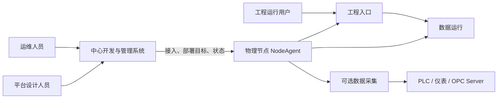

# InduForge 平台系统架构

## 1. 文档定位

本文档是 InduForge 的系统级架构基线，定义平台开发与管理、节点管理与交付、工程运行、工业采集四个系统及其边界。

技术实现细节分别见：

- [平台开发与管理系统架构](../02-系统设计/平台开发与管理系统架构.md)
- [节点管理与交付架构](../02-系统设计/节点管理与交付架构.md)
- [运维与节点运行态总体架构](../02-系统设计/运维与节点运行态总体架构.md)（未来多节点内部设计参考）
- [工程运行系统架构](../02-系统设计/工程运行系统架构.md)
- [工业采集架构](../02-系统设计/工业采集架构.md)

## 2. 当前正式用户模型

平台对运维用户只提供两个一级对象：

1. **物理节点**：接入、确认、在线状态、主机身份和可用能力。
2. **工程部署**：选择工程、正式 Release 和一台物理节点，按需启用数据采集。

一个工程部署当前只绑定一台物理节点，工程入口和数据运行必须同节点承载。同一节点的多个工程
使用客户分别选择且不冲突的访问端口；Secret、资源配额和完整进程隔离仍需继续验收。多个节点同时在线不表示某个
工程已经分布式运行，也不表示高可用。

用户看到的服务只有：

| 用户名称 | 当前内容                                             | 是否必选 |
| -------- | ---------------------------------------------------- | -------- |
| 工程入口 | Project Gateway、Runtime API、Release 的前端静态文件 | 是       |
| 数据运行 | Runtime Engine 及工程运行配置                        | 是       |
| 数据采集 | Industrial Collector 及工程采集配置                  | 否       |

Project Gateway 是内部组件名。静态前端不是独立服务或部署对象，默认 UI 和公共 API 统一使用
“工程入口”。

## 3. 当前系统上下文



- NodeAgent 只主动访问中心；中心不要求打开物理节点管理端口。
- 工程运行用户直接访问物理节点提供的工程入口，页面、API 和 WebSocket 不经中心转发。
- 中心断线时，已运行的本机服务不因单次通信失败被主动停止；恢复连接后再更新观测状态。

## 4. 四个核心系统

### 4.1 平台开发与管理系统

部署于中心 Linux Docker，包含 `dev_ide`、`datacenter`、`designer`、`dev_core`、`data_service`、
中心数据库、Redis 和对象存储。

当前负责用户、租户、工程、权限、开发工作空间、物理节点接入、工程单节点部署记录和状态汇聚。
产品目标还包括正式 Release 构建、签名、升级和回滚，但这些能力必须在完整链路通过验收后才开放。

### 4.2 节点管理与交付系统

由中心 `/api/v1/ops/*` 管理能力和每台物理节点上的 NodeAgent 组成：

- Center 创建一次性接入任务、审批节点、保存部署目标并汇总观测状态。
- NodeAgent 领取独立身份，回传主机资源和服务状态，只执行本机明确配置的固定服务组。
- Linux 节点承载工程入口、数据运行和可选数据采集；Windows 节点当前只承载数据采集。
- Center 不下发 shell、可执行路径、命令行参数、环境变量或长期中心凭据。

### 4.3 工程运行系统

当前工程运行系统位于被选中的 Linux 物理节点，按单工程部署提供：

```text
物理节点
├─ NodeAgent
├─ 工程入口
│  ├─ Project Gateway
│  ├─ Runtime API
│  └─ Release/client 静态文件
├─ 数据运行
│  └─ Runtime Engine
└─ 可选数据采集
   └─ Industrial Collector
```

工程运行系统负责页面、运行 API、实时数据、计算、报警和运行状态，不在线读取中心数据库。

### 4.4 工业采集系统

Collector 由 NodeAgent 以原生进程托管，实际设备地址、凭据和工程分配属于节点部署配置，不写入
不可变 Release。Windows 可按需托管 OPC DA Worker。Collector 的现场协议、WAL、补传和写入安全
仍必须通过真实设备验收，不能由进程存活替代。

## 5. 当前已交付与未闭环

| 领域            | 当前事实                                                                                        |
| --------------- | ----------------------------------------------------------------------------------------------- |
| 节点接入        | 已有一次性接入、领取、人工确认、心跳和固定能力上报                                              |
| 单节点部署      | 已有工程、正式版本、物理节点和可选采集的控制面记录及固定服务组调和                              |
| Release 门禁    | 已校验正式 Manifest、工件摘要和供应链元数据，旧源码发布/部署链路已 fail-closed                  |
| Release Builder | **未闭环**；不能从工程源码生成并签名可部署正式 Release                                          |
| 节点交付        | 已有本地安装/校验基础原语，但 Center 到 Agent 的 Binding/下载/验签/激活/Secret/进程切换尚未接通 |
| 真实运行        | Linux/Windows 安装、工程入口、数据运行和现场采集尚需完整物理机竖链验收                          |
| 升级与回滚      | **未交付**；缺少 current/target/last-successful 状态、历史 revision 和安全切换 API              |
| 多节点分布式    | **未交付**；当前 UI/API 不得提供多节点工程部署或高可用承诺                                      |

只要 Builder 或节点交付能力未启用，创建 Release、部署、升级和回滚必须由后端权威门禁拒绝；前端
隐藏或没有候选版本不能替代服务端 fail-closed。

## 6. 正式 Release 目标链路


此图是必须完成的正式交付门槛。当前 Builder、Agent 接线、Secret 装配和版本切换仍未闭环，不得
因本机旧服务健康而把目标 Release 标记为部署成功。

工程 Release 至少包含：

```text
release-manifest.json
client-assets.tar.zst
runtime-artifact.tar.zst
collector-artifact.tar.zst（按需）
checksums.json
signature.sig
```

节点、端口、Secret、真实设备连接和运行目录属于版本化部署配置，不得写入不可变 Release。

## 7. 开发系统与运行系统边界

| 维度     | 平台开发与管理系统               | 工程运行系统                           |
| -------- | -------------------------------- | -------------------------------------- |
| 使用者   | 平台管理员、工程设计人员         | 操作员、运行用户、外部系统             |
| 数据     | 设计元数据、源码、Release 元数据 | 实时值、历史值、报警、运行状态         |
| 生命周期 | 集中治理和持续开发               | 当前按单工程、单节点独立运行           |
| 页面资源 | Builder 生成并上传               | 工程入口从本机已激活 Release 加载      |
| 依赖中心 | 本身即中心系统                   | 运行流量不经过中心；断线后保持既有服务 |
| 工业驱动 | 不加载                           | Collector 原生进程加载                 |

## 8. 当前架构约束

- 中心不得成为工程实时运行链路的一部分。
- NodeAgent 不解释页面、数据点、报警和采集语义，只处理已校验的部署目标和本机固定服务组。
- 页面不得直接从中心对象存储加载，工程入口不得让浏览器绕过 Runtime API。
- Release 不可变；源码快照、开发预览和旧源码包不可部署。
- 当前只允许单节点工程部署；同一节点可承载端口不冲突的多个工程，但不得将多个 NodeAgent、进程或心跳描述为
  副本系统或高可用。
- 普通用户界面不得展示内部进程、PID、路径、代次或副本字段；诊断信息必须使用安全原因码和
  可追踪的诊断编号。

## 9. 未来多节点分布式与可选内部实现（未交付）

未来产品可以让一个工程选择多台物理节点，并展示节点拓扑、角色分配、版本一致性、容量、故障
状态和切换结果。开放前必须冻结分片、唯一 owner、fencing、排空、检查点、数据一致性、故障转移
及 Release/Secret 一致性，并完成故障注入验收。

实现层未来可以选择 K3s、Pod、Namespace、site-controller、infrastructure-controller、Ingress、
PVC 或其他编排与存储技术。这些都是可替换的内部实现，不是当前正式基线；即使采用，也不得进入
普通用户的对象模型、公共 API、错误文案或默认 UI。

旧的[平台总体架构图](../assets/architecture/平台总体架构.svg)、
[系统上下文架构图](../assets/architecture/系统上下文架构.svg)及其 Drawio 源文件包含上述未来方案，
在重新绘制前只作为历史设计参考，不作为当前实现或验收证据。

## 10. 关联文档

- [产品定义](./产品定义.md)
- [工程发布与资源分发架构](../02-系统设计/工程发布与资源分发架构.md)
- [运维与节点运行态总体架构](../02-系统设计/运维与节点运行态总体架构.md)（未来多节点内部设计参考）
- [平台运维体系设计](../06-运维与安全/平台运维体系设计.md)（未来多节点与容灾设计参考）
- [NATS JetStream 消息架构](../02-系统设计/NATS-JetStream消息架构.md)
- [NodeAgent 与运行系统协议](../04-契约与规范/跨模块契约/node-agent-runtime-protocol.md)
