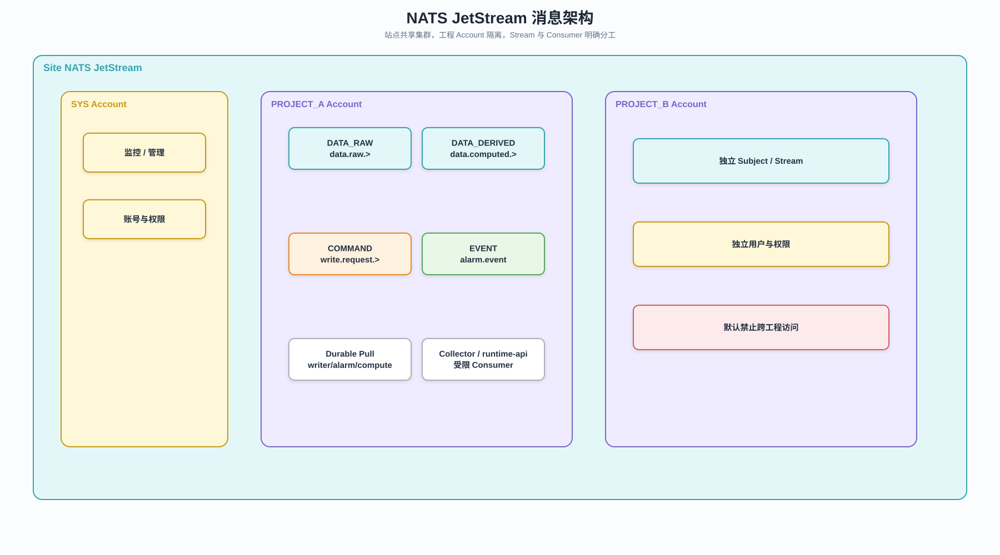

# NATS JetStream 消息架构

## 1. 定位

NATS JetStream 是站点工程运行系统的内部可靠事件总线，不等同于工程对外 MQTT 能力。

## 2. 部署和隔离



可编辑源文件：[JetStream消息架构.drawio](../diagrams/JetStream消息架构.drawio)。

```text
一个站点 = 一套 NATS JetStream
一个工程 = 一个 NATS Account
一个运行角色 = 一个受限 NATS User / NKey
```

工程之间默认不可互相发布、订阅和管理 Stream。跨工程共享必须显式设计 Account Export/Import。

## 3. Subject

工程 Account 内推荐：

```text
data.raw.<pointId>
data.normalized.<pointId>
data.computed.<pointId>
alarm.event
alarm.command
write.request.<collectorId>
write.result.<requestId>
runtime.event
runtime.status
```

## 4. Stream

| Stream         | Subjects                               | Retention  | 主要消费者                 |
| -------------- | -------------------------------------- | ---------- | -------------------------- |
| `DATA_RAW`     | `data.raw.>`                           | Limits     | writer、alarm、compute     |
| `DATA_DERIVED` | `data.normalized.>`、`data.computed.>` | Limits     | writer、alarm、runtime-api |
| `COMMAND`      | `write.request.>`、`alarm.command`     | Work Queue | collector、alarm           |
| `EVENT`        | `alarm.event`、`runtime.event`         | Limits     | runtime-api、审计和通知    |

## 5. Consumer

- writer、alarm、compute 默认使用 Durable Pull Consumer。
- COMMAND 消费者按目标 Collector 或队列组隔离。
- Consumer 必须设置 Ack、最大投递次数、退避和死信处理。
- JetStream 是至少一次交付，所有业务消费者必须幂等。

## 6. 事件标识

```json
{
  "eventId": "node-01:collector-project-a:12345",
  "projectId": "project-a",
  "sourceId": "source-1",
  "variableId": "temperature",
  "value": 36.5,
  "quality": "good",
  "sourceTimestamp": "2026-07-13 10:20:30",
  "receivedAt": "2026-07-13 10:20:31"
}
```

Writer、Alarm 和 Compute 使用 `eventId` 去重。

## 7. Collector WAL

```text
设备
→ Collector 本地 WAL
→ JetStream Publish
→ PubAck
→ 标记 WAL 已提交
```

未收到 PubAck 时保留数据并重试，重连后按顺序批量补投。

## 8. 权限

Collector 最小权限：

- 发布 `data.raw.>`、`write.result.>` 和自己的状态事件。
- 订阅目标自己的 `write.request.<collectorId>`。
- 不允许创建 Stream、Consumer 或访问其他工程 Account。

## 9. Core NATS 与 JetStream

- 需要可靠保存、重放和确认的事件使用 JetStream。
- 可丢弃的瞬时心跳和低价值在线提示可使用 Core NATS。
- 工程运行状态当前值可使用 KV，但状态变化审计仍进入 EVENT Stream。

## 10. MQTT 边界

MQTT 仅用于：

- 工程接入外部 MQTT Broker。
- 工程向第三方发布业务数据。
- 用户配置的 MQTT 数据源和输出。

平台内部数据引擎不得使用 MQTT 替代 JetStream。
