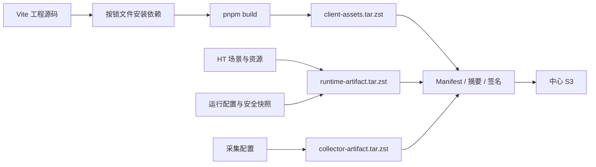
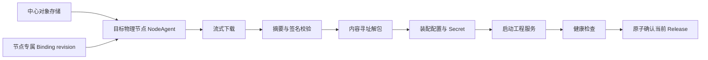
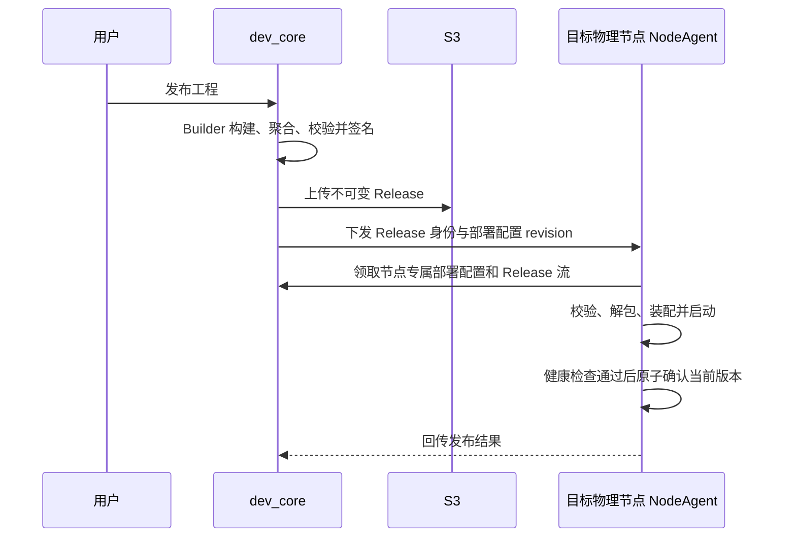

# 工程发布与资源分发架构

## 1. 文档定位与原则

本文档定义工程正式 Release 的构建产物、单节点分发目标和未来升级/回滚边界。当前代码已具备
Release 契约、确定性 Builder 核心、Center 节点专属 Binding/Release 流与 Agent 安全安装，但从工程
产物到真实运行的交付链尚未闭环；本文不得被用作“已可生产发布”的证明。

- 工程前端、HT 场景、运行配置和采集配置统一随不可变 Release 交付。
- Vue/React Vite 源码必须经过正式 Builder；源码目录、源码 ZIP 和开发预览不可直接部署。
- 中心对象存储是 Release 主存储，目标物理节点将完整 Release 下载到该部署的本地版本目录。
- 浏览器不直接访问中心对象存储；页面由目标节点的“工程入口”从已激活 Release 托管。
- 节点、入口地址、真实设备/数据库连接、Secret、端口和运行目录属于版本化部署配置，不写入
  Release。
- Builder、下载、验签、解包、激活或健康检查任一步失败，都不得生成或切换可部署当前版本。

## 2. 构建输入与输出

```text
工程 /workspace
├─ Vite 工程源码和 pnpm-lock.yaml
├─ HT 2D/3D 场景公开契约与运行产物
├─ 数据与运行安全快照
└─ 逻辑采集模型
```

正式 Builder 的目标输出：

```text
/releases/<projectId>/<releaseId>/
├─ release-manifest.json
├─ client-assets.tar.zst       Vite dist
├─ runtime-artifact.tar.zst    HT 场景、资源、运行配置和安全快照
├─ collector-artifact.tar.zst  工程逻辑采集模型
├─ checksums.json
└─ signature.sig
```

HT 场景、模型和材质不重复写入 `client-assets.tar.zst`。工程前端通过 Runtime SDK 和场景 ID
访问展开后的运行资源。

## 3. 正式构建目标与当前门禁



`pnpm build`、资源契约校验、摘要或签名任一失败时，不得生成可部署 Release。只有 Builder 完成
受控依赖安装、构建、聚合、签名和对象上传后，Release 才能进入 `ready/deployable`。

当前 `releasebuilder` 已能接收已构建、受控的字节输入，生成固定文件集、排序摘要、Ed25519 签名和
确定性 tar.zst；它不执行主机构建命令，也尚未接入工程源码/构建产物来源、签名密钥管理、对象存储
写入或版本状态流转。因此旧 `/publish` 源码发布和开发态部署链路仍必须 fail-closed；历史源码记录
只能标记为“源码快照（不可部署）”。前端隐藏按钮不是权威门禁，后端必须保证：

- Builder 能力未启用时不创建 `ready` Release；
- 节点交付能力未启用时不创建 Deployment、Run 或 Agent 命令；
- 不能通过手工补齐少数字段把旧源码版本伪装成正式 Release；
- 错误文案只说明“正式版本构建/交付尚未开放”，不向普通用户暴露内部构建器或存储细节。

## 4. 当前已有基础与未闭环

| 环节           | 当前事实                                                                            |
| -------------- | ----------------------------------------------------------------------------------- |
| Release 契约   | 已有 Manifest、Artifact、摘要、签名及供应链字段 Schema                              |
| Center 校验    | 创建单节点部署前校验版本状态、工程归属、Manifest、工件摘要及可选采集工件            |
| 部署配置       | Center 已持久化并校验节点专属 `DeploymentBinding`；端口为当前固定值，Secret 为空，尚未驱动启动器 |
| NodeAgent 安装 | 已接入自身 Binding/Release 拉取、本地 trust store、流式限额、安全解包、验签/摘要/兼容性校验与原子 `current.json` |
| Builder        | **核心已交付、生产接入未闭环**；只接受受控字节输入，尚不能从工程源码/产物来源完成正式状态流转 |
| Agent wiring   | Binding/Release 下载和安全安装已接通；Secret、Activation 物化、真实只读挂载、launcher 启动/回滚未接通 |
| 真实验收       | **未完成**，不能用单元测试或旧本机服务健康代替物理机 Release 身份验证               |
| 升级/回滚      | **未交付**，缺少 current/target/last-successful 和成功历史 revision                 |

## 5. 单节点分发目标



NodeAgent 只能为明确分配到本节点、且节点已审批、在线并保持新鲜心跳的 Deployment 获取对应
Binding 和 Release；不能接收对象存储内部键、任意 URL、任意路径或 shell 命令。Center 以
`application/zstd` 且固定 Content-Length 流式返回 Release；Agent 不跟随重定向，签名公钥只来自
本地 trust store。Release 归档校验必须覆盖：

- 归档外层 SHA-256、Manifest 摘要、checksums 摘要和签名密钥 ID；
- 包内所有文件的摘要、大小、路径和覆盖范围；
- Release、工程、部署配置 revision 和目标节点的一致性；
- 文件数、单文件大小、总展开大小、路径穿越、链接和特殊文件限制。

逻辑采集模型随 Release 交付，实际设备地址、凭据和节点分配由部署配置注入。Collector 程序和
驱动属于节点能力包，不随每次工程 Release 重复交付。

## 6. 正式发布时序目标



其中“领取节点专属部署配置和 Release 流 → 校验、解包、原子选择”已经有代码实现；“Builder 构建
并上传”“配置与 Secret 装配”“启动工程服务”“健康通过后确认成功”仍是正式交付验收目标，当前未
端到端接通。Agent 在正式 launcher 未交付时会在安全安装后明确拒绝启动，Center 不得因为旧服务健康
而把新 Release 的 Run 标为成功。

## 7. 页面加载

```text
浏览器
→ 工程独立地址
→ 工程入口（内部 Project Gateway）
→ 当前 Release 的工程前端静态产物
```

API 和 WebSocket 由同一工程入口转发到同一物理节点的 Runtime API。静态前端不是独立部署、
服务或 PID；用户只看到“工程入口”。

## 8. 升级与回滚目标（未交付）

- ProjectDeployment 必须分离当前 Release、目标 Release 和最后成功部署 revision。
- 升级创建新的 DeploymentRun，先准备目标版本；健康检查通过前旧版本保持当前状态和入口。
- 下载、摘要、签名、配置装配、启动或健康检查失败时不得切换当前 Release。
- 回滚目标必须来自该部署不可变的成功历史 revision，而不是任意 Release ID。
- 回滚创建新的 DeploymentRun 和部署配置 revision，不修改历史 Release 或成功记录。
- Release 被成功历史引用时不得物理删除；可以停止新部署使用，但必须保留回滚所需物料。
- 写接口必须支持幂等键和预期当前版本，拒绝并发 Run 与过期页面状态。
- 数据库结构升级必须声明兼容窗口和回滚边界，不可逆变更不得承诺自动回滚。

上述状态对象、API 和切换编排尚未完整实现；当前 UI/API 必须隐藏并拒绝升级、回滚。

## 9. 安全与验收门槛

- Release 使用 SHA-256 摘要和可信签名，下载或校验失败不得激活。
- 下载使用短期、节点和部署受限的授权，不保存中心长期对象存储密钥。
- 一次失败不得覆盖已激活 current 指针或删除上一成功 Release。
- Agent 重启和命令重试必须幂等，不重复安装、启动或确认同一 revision。
- 节点失联显示“状态未知”，恢复后继续同一 Run；不能凭超时猜测已切换。
- 真实验收必须证明工程入口静态页面、Runtime API/WebSocket、数据运行和可选数据采集使用同一
  目标 Release，并覆盖下载篡改、签名错误、磁盘不足、健康失败、断线和 Agent 重启。

## 10. 未来多节点分布式与可选内部实现（未交付）

未来多节点分发必须保证所有参与物理节点的 Release、部署配置和 Secret revision 一致，并定义
分片、唯一 owner、fencing、排空、检查点、故障转移及失败补偿。用户只选择物理节点拓扑和工程
版本，不接触内部资源对象。

实现层未来可以选择 K3s、Pod、Namespace、site-controller、release-loader、Ingress、PVC、Lease
或其他编排与存储技术。这些都不是当前正式链路；任何内部 Ready 状态都不能替代 Release 身份、
业务健康和成功切换证据。

## 11. 关联文档

- [IFP Manifest 契约](../04-契约与规范/跨模块契约/ifp-manifest-contract.md)
- [工程前端源码与构建产物契约](../04-契约与规范/跨模块契约/工程前端源码与构建产物契约.md)
- [工程运行系统架构](./工程运行系统架构.md)
- [运维与节点运行态总体架构](./运维与节点运行态总体架构.md)（未来多节点内部设计参考）
- [平台运维体系设计](../06-运维与安全/平台运维体系设计.md)（未来多节点与容灾设计参考）
