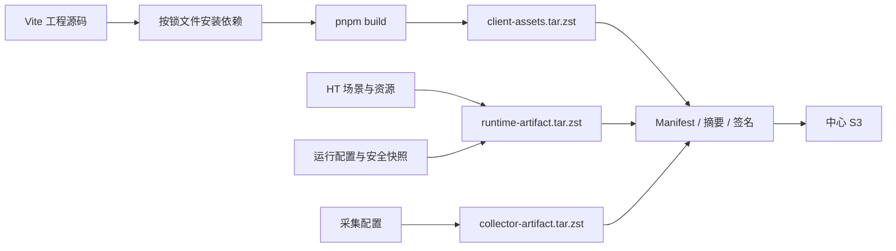
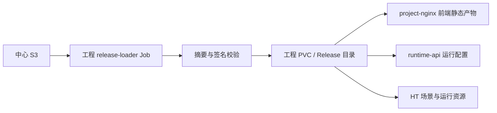
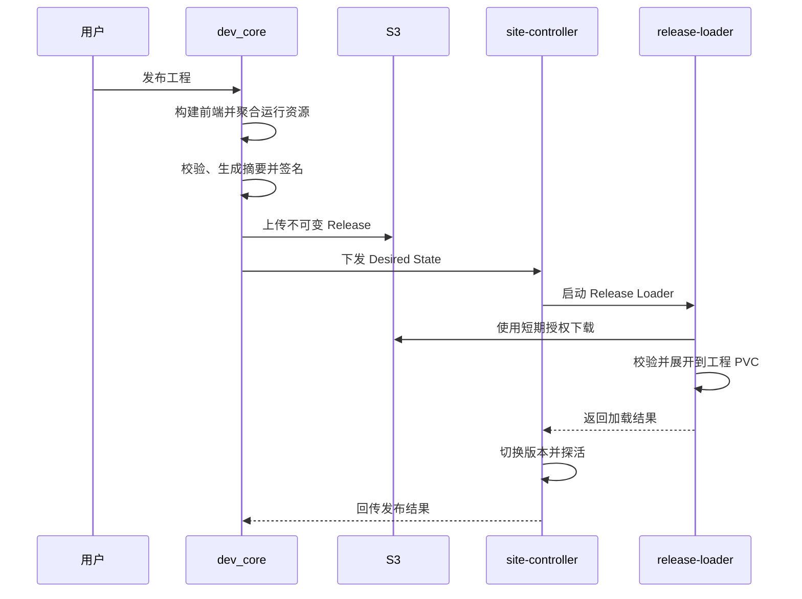

# 工程发布与资源分发架构

## 1. 原则

- 工程前端、HT 场景、运行配置和采集配置统一随不可变 Release 交付。
- Vue/React Vite 源码必须先完成正式构建，源码目录不直接作为运行资源发布。
- 中心 S3 是 Release 主存储，运行站点将资源下载到工程自己的 PVC。
- 浏览器不直接访问中心 S3，中心断网不影响已经部署的工程。
- 同一 Release 在 development、staging 和 production 之间晋级，不为生产环境重新构建。
- 站点、域名、真实设备/数据库连接、Secret、资源、副本和保留策略属于 DeploymentBinding，
  不写入 Release。

## 2. 构建输入与输出

```text
工程 /workspace
├─ Vite 工程源码和 pnpm-lock.yaml
├─ HT 2D/3D 场景公开契约与运行产物
├─ 数据与运行安全快照
└─ 逻辑采集模型
```

发布构建输出：

```text
/releases/<projectId>/<releaseId>/
├─ release-manifest.json
├─ client-assets.tar.zst       Vite dist
├─ runtime-artifact.tar.zst    HT 场景、资源、运行配置和安全快照
├─ collector-artifact.tar.zst  工程逻辑采集模型
├─ checksums.json
└─ signature.sig
```

HT 场景、模型和材质不重复写入 `client-assets.tar.zst`。工程前端通过 Runtime SDK 和场景 ID
访问展开后的运行资源。

## 3. 发布构建



`pnpm build`、资源契约校验、摘要或签名任一失败时，不得生成可部署 Release。

## 4. 站点分发



逻辑采集模型由对应采集节点的 NodeAgent 下载到工程版本目录，实际设备地址、凭据和采集节点分配
由 DeploymentBinding 注入。Collector 程序和驱动属于节点能力包，不随每次工程 Release 重复交付。

## 5. 发布时序



## 6. 页面加载

```text
浏览器
→ 站点 Ingress
→ project-nginx
→ 当前 Release 的工程前端静态产物
```

API 和 WebSocket 由同一工程入口转发到 `runtime-api`。

## 7. 回滚与安全

- 以 `releaseId` 为单位切换，新版本探活前旧版本继续运行。
- 已缓存的上一成功版本直接恢复，不存在时重新从 S3 下载。
- Release 使用 SHA-256 摘要和数字签名，下载或校验失败不得切换当前版本。
- Loader 使用短期下载授权，不保存中心长期 S3 密钥。
- 无状态服务使用滚动切换；writer、alarm、compute 和 Collector 使用预热、排空、Lease + epoch
  的单权切换，不能仅以 Pod Ready 判断业务切换成功。
- 数据库结构升级必须声明兼容窗口和回滚边界，不可逆变更不得承诺自动回滚。

## 8. 关联文档

- [IFP Manifest 契约](../04-契约与规范/跨模块契约/ifp-manifest-contract.md)
- [工程前端源码与构建产物契约](../04-契约与规范/跨模块契约/工程前端源码与构建产物契约.md)
- [工程运行系统架构](./工程运行系统架构.md)
- [运维与节点运行态总体架构](./运维与节点运行态总体架构.md)
- [平台运维体系设计](../06-运维与安全/平台运维体系设计.md)
