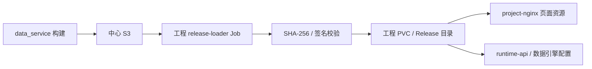
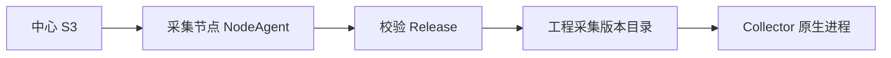
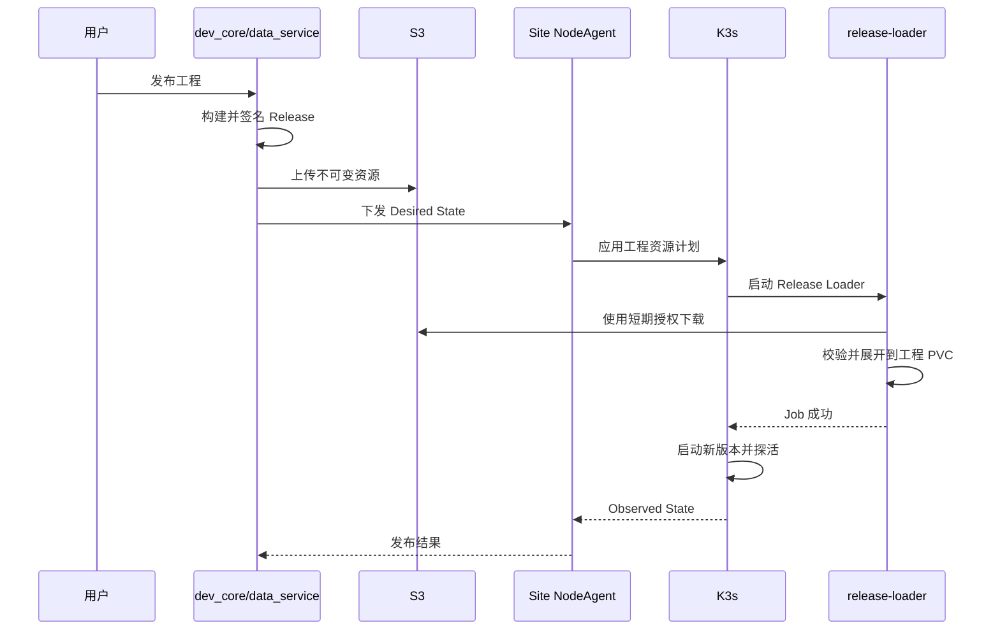

# 工程发布与资源分发架构

## 1. 原则

- 资源随工程 Release 走，站点公共服务不解释和管理工程资源。
- 中心 S3 是不可变资源主存储。
- 页面和运行资源下载到工程自己的 PVC。
- 采集配置下载到原生采集节点的工程版本目录。
- 页面不直接访问中心 S3。

## 2. Release 结构

```text
/releases/<projectId>/<releaseId>/
├─ release-manifest.json
├─ client-assets.tar.zst
├─ runtime-artifact.tar.zst
├─ collector-artifact.tar.zst
├─ checksums.json
└─ signature.sig
```

## 3. K3s 工程资源路径



## 4. 原生采集配置路径



NodeAgent 不解释配置内容，只负责下载、校验、版本切换、启动和回滚。

## 5. 发布时序



## 6. 页面加载

```text
浏览器
→ 站点 Ingress
→ project-nginx
→ 当前工程 Release 的 client 目录
```

中心断网不影响已部署页面加载。

## 7. 回滚

- 以 `releaseId` 为单位切换。
- 新版本探活前旧版本继续运行。
- 旧版本仍在工程 PVC 时直接恢复；不存在时重新从 S3 下载。
- 工程自行保留当前、上一个成功版本和配置数量的历史版本。

## 8. 安全

- Release 使用 SHA-256 和数字签名。
- Loader 使用短期下载授权，不保存中心长期 S3 密钥。
- 下载失败、校验失败和启动失败不得切换当前版本。
