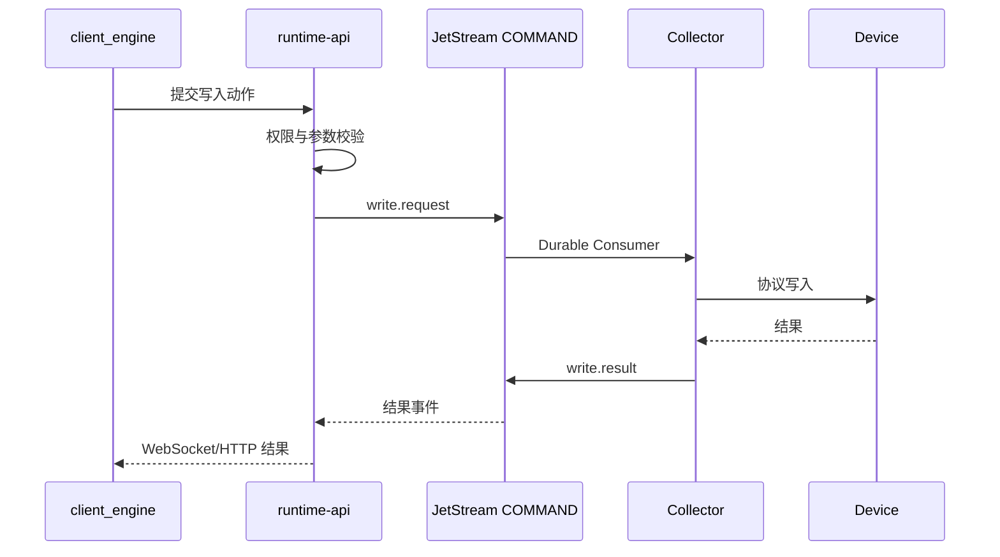

# 工程运行微服务设计

## 1. 目标

本文档定义工程 Namespace 内各运行角色的职责、部署形态和交互边界。

## 2. 角色总览


可编辑源文件：[工程运行微服务交互.drawio](../diagrams/工程运行微服务交互.drawio)。

| 角色             | 形态       | 输入                       | 输出                         |
| ---------------- | ---------- | -------------------------- | ---------------------------- |
| `project-nginx`  | Deployment | HTTP 请求、工程静态资源    | 页面、反向代理               |
| `runtime-api`    | Deployment | HTTP、WebSocket、NATS 事件 | 查询结果、动作结果、实时推送 |
| `writer`         | Deployment | DATA_RAW、DATA_DERIVED     | 运行数据库                   |
| `alarm`          | Deployment | 数据事件、报警命令         | 报警事件、报警状态           |
| `compute`        | Deployment | 数据事件、定时触发         | 计算数据事件                 |
| `query`          | Deployment | runtime-api 查询请求       | 当前值、历史值、聚合结果     |
| `coord`          | Deployment | 拓扑和租约                 | 分区、调度和角色状态         |
| `release-loader` | Job        | S3 Release                 | 工程 PVC 内容                |

## 3. project-nginx

- 暴露工程唯一 HTTP/HTTPS 入口。
- 托管 `client_engine` 静态资源。
- 反向代理 `/api/*` 和 `/ws/*` 到 `runtime-api`。
- 不代理 NATS 原生 TCP 连接。

## 4. runtime-api

- 工程运行态唯一可信动态 API。
- 加载本地 `RuntimeSecuritySnapshot`。
- 负责登录、会话、权限、查询、报警确认和动作入口。
- 将 NATS 实时事件转换为 WebSocket 推送。
- 不直接执行工业协议和批量写库。

## 5. 数据引擎角色

同一 `runtime-data-engine` 镜像通过 `--role` 区分：

```text
--role=writer
--role=alarm
--role=compute
--role=query
--role=coord
```

### 5.1 writer

- Durable Pull Consumer。
- 批量写入实时库、历史库或外部目标。
- 使用事件 ID 保证幂等。

### 5.2 alarm

- 消费原始和计算数据。
- 维护报警状态机。
- 发布报警事件，不直接向浏览器推送。

### 5.3 compute

- 执行实时计算、窗口计算和定时计算。
- 结果发布到派生数据 Stream。
- 不直接写页面状态。

### 5.4 query

- 对运行存储提供受控查询能力。
- 仅接受 `runtime-api` 调用或受限内部请求。
- 默认提供分页、时间范围和聚合限制。

### 5.5 coord

- 管理角色租约、分区和运行拓扑。
- 不承担平台节点管理职责。

## 6. 写设备链路



## 7. 故障边界

- 单个角色异常不应停止其他角色。
- JetStream 短时不可用时，消费者恢复后继续处理。
- `runtime-api` 异常不应阻断采集、写库、计算和报警。
- `project-nginx` 只影响页面访问，不影响数据处理。

## 8. 扩缩容

- `runtime-api` 可无状态扩容，状态保存在本地安全快照和共享运行存储。
- writer、alarm、compute 使用明确分区或队列消费者扩容。
- 不允许多个实例无分区地重复执行同一有状态报警或计算任务。
