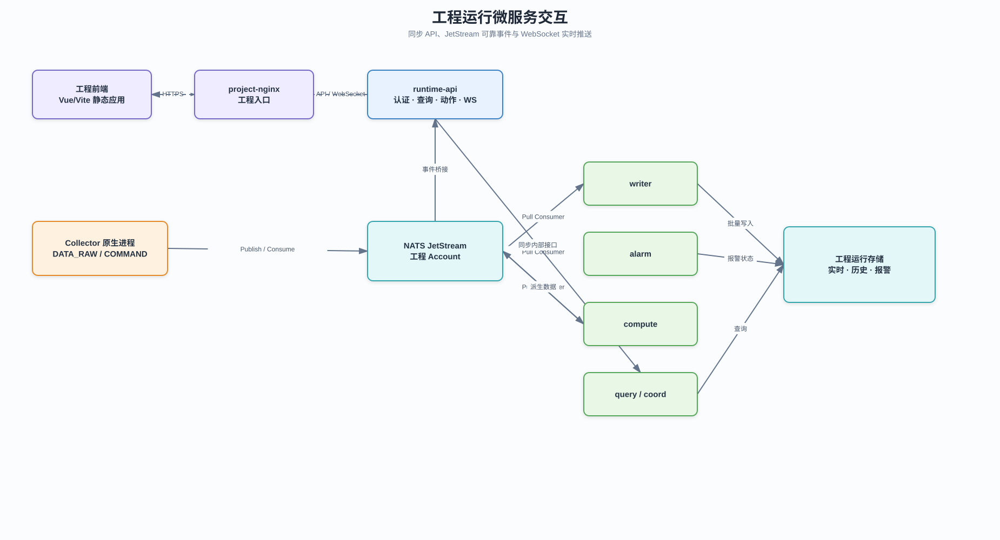
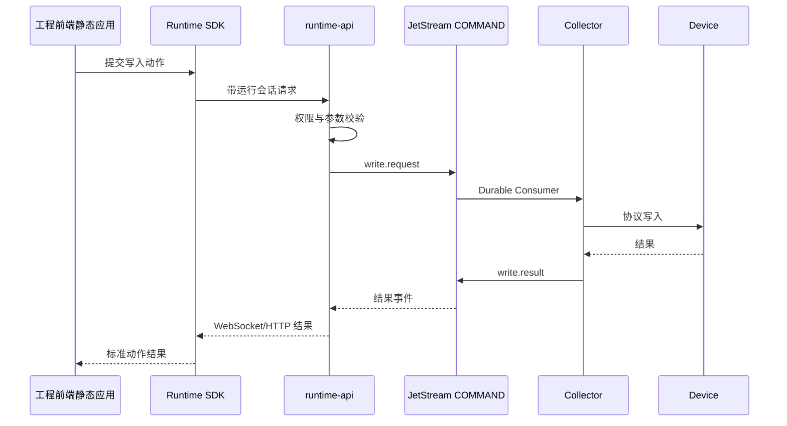

# 工程运行微服务设计

## 1. 目标

本文档定义工程 Namespace 内的运行角色、部署形态和交互边界。

## 2. 角色总览

可编辑源文件：[工程运行微服务交互.drawio](../diagrams/工程运行微服务交互.drawio)。

| 角色             | 形态       | 输入                        | 输出                     |
| ---------------- | ---------- | --------------------------- | ------------------------ |
| `project-nginx`  | Deployment | HTTP 请求、工程前端静态产物 | 页面、反向代理           |
| `runtime-api`    | Deployment | HTTP、WebSocket、NATS 事件  | 查询、动作和实时推送     |
| `writer`         | Deployment | DATA_RAW、DATA_DERIVED      | 运行数据库               |
| `alarm`          | Deployment | 数据事件、报警命令          | 报警事件与状态           |
| `compute`        | Deployment | 数据事件、定时触发          | 派生数据事件             |
| `query`          | Deployment | runtime-api 查询请求        | 当前值、历史值和聚合结果 |
| `coord`          | Deployment | 拓扑和租约                  | 分区、调度和角色状态     |
| `release-loader` | Job        | S3 Release                  | 工程 PVC 内容            |

## 3. `project-nginx`

- 暴露工程唯一 HTTP/HTTPS 入口。
- 托管当前 Release 的 Vue/Vite 静态构建产物。
- 反向代理 `/api/*` 和 `/ws/*` 到 `runtime-api`。
- 不解释前端源码、HT 场景或数据配置，不代理 NATS 原生 TCP。

## 4. `runtime-api`

- 是工程运行态唯一可信动态 API。
- 加载本地运行安全快照，负责登录、会话、权限、查询、报警确认和动作入口。
- 将 NATS 实时事件转换为 WebSocket 推送。
- 向 Runtime SDK 提供稳定的鉴权、数据点和场景访问接口。
- 不直接执行工业协议和批量写库。

## 5. 数据引擎角色

同一 `runtime-data-engine` 镜像通过 `--role` 区分 writer、alarm、compute、query 和 coord。

- writer 使用 Durable Pull Consumer 批量写入，并以事件 ID 保证幂等。
- alarm 维护报警状态机并发布报警事件。
- compute 执行实时、窗口和定时计算，将结果发布为派生数据。
- query 为 `runtime-api` 提供受控查询，限制分页、时间范围和聚合规模。
- coord 管理角色租约、分区和运行拓扑，不承担平台节点管理。

## 6. 写设备链路

## 7. 故障与扩缩容

- 单个数据角色异常不应停止其他角色。
- JetStream 短时不可用时，消费者恢复后继续处理。
- `runtime-api` 异常不应阻断采集、写库、计算和报警。
- `project-nginx` 只影响页面访问和 HTTP 入口。
- 有状态数据角色必须按明确分区或队列消费者扩容，禁止多个实例无分区重复执行。
