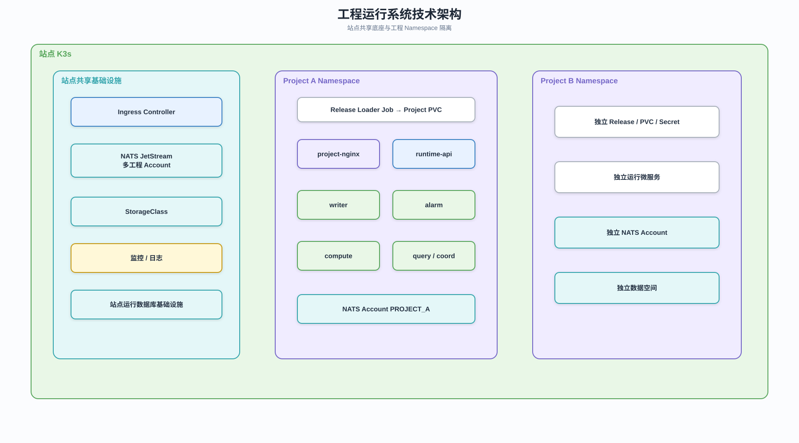

# 工程运行系统架构

## 1. 系统定位

工程运行系统部署在运行站点，承载发布后工程的前端静态应用、Runtime API、数据处理、报警、
计算、存储和动作执行。工程可以按 development、staging 或 production 阶段部署，但都使用
不可变 Release 和同一运行契约。运行用户直接访问站点为工程分配的独立地址，中心平台不代理
运行请求。

## 2. 站点共享底座



可编辑源文件：[工程运行技术架构.drawio](../diagrams/工程运行技术架构.drawio)。

> 当前 SVG/drawio 尚未同步 NodeAgent/site-controller/infrastructure-controller 和 deploymentId
> 边界；组件职责以[运维与节点运行态总体架构](./运维与节点运行态总体架构.md)为准，冻结后统一重画。

站点共享 K3s、NATS JetStream、Ingress Controller、StorageClass、监控日志、每台宿主机
K3s 外的 NodeAgent，以及 `induforge-system` 中的 site-controller。工程资源始终随不可变
Release 交付，站点公共服务不解析工程前端内容。

## 3. 工程隔离模型

| 平台对象 | 运行资源                                               |
| -------- | ------------------------------------------------------ |
| Site     | 一套 K3s 和 NATS JetStream                             |
| ProjectDeployment | 按 `deploymentId` 隔离 K3s Namespace 和 NATS Account |
| ProjectDeployment | 按 `deploymentId` 隔离 ServiceAccount、Secret、ConfigMap、PVC 和数据空间 |
| Release  | 独立不可变工程版本                                     |

## 4. 工程 Namespace

```text
if-project-a-prod-a81f
├─ release-loader Job
├─ project-nginx
├─ runtime-api
├─ runtime-engine
│  ├─ writer
│  ├─ alarm
│  ├─ compute
│  ├─ query
│  └─ coord
├─ optional sandbox-worker
├─ ConfigMap / Secret
└─ Project PVC
   └─ releases/<releaseId>/
      ├─ client/
      └─ runtime/
```

工程前端是 `project-nginx` 托管的静态文件，不运行常驻 Node 服务。writer、alarm、compute、
query 和 coord 是逻辑角色；首版默认由打包式 `runtime-engine` 承载，达到容量、隔离或故障域
阈值后再按角色或分片拆分，不为每个计算单元、报警项或数据点创建 Pod。

## 5. 服务职责

| 角色                  | 职责                                              |
| --------------------- | ------------------------------------------------- |
| `project-nginx`       | 工程 HTTP 入口、静态应用托管和 API/WebSocket 代理 |
| `runtime-api`         | 登录、权限、查询、动作和实时推送                  |
| `runtime-engine`      | writer、alarm、compute、query、coord              |
| `release-loader`      | 下载、校验和展开工程 Release                      |

## 6. 访问链路

### 6.1 页面与动态接口

```text
浏览器中的工程前端静态应用
→ Ingress
→ project-nginx
├─ 静态路径 → 当前 Release 的 client 目录
└─ /api、/ws → runtime-api
```

工程源码通过 `@induforge/runtime-sdk` 使用鉴权、权限、数据点和场景能力。Runtime SDK 只封装
稳定运行契约，不决定页面布局、路由和业务交互。

### 6.2 数据事件

```text
Collector
→ NATS JetStream
→ writer / alarm / compute
→ runtime-api
→ WebSocket
→ 工程前端静态应用
```

### 6.3 HT 场景资源

HT 场景、模型和材质随 `runtime-artifact.tar.zst` 展开到工程运行目录。工程前端按场景 ID 通过
Runtime SDK 请求，不能依赖中心 S3 或开发工作空间路径。

## 7. 离线自治

中心断开时，页面加载、运行态登录、采集上行、数据处理、报警计算、本地查询和 Runtime API
继续可用；新 Release 发布、中心管理和新授权下载不可用。

## 8. 高可用与故障边界

- 小站点允许 `edge-single`；扩容但不承诺控制面 HA 的站点使用 `site-standard`；重要站点使用
  至少 3 台奇数 K3s Server、JetStream 关键 Stream/Consumer R3 和存储副本组成的 `site-ha`。
- 两台服务器不作为自动高可用规格；副本必须跨独立故障域放置。
- `project-nginx` 故障只影响页面和 HTTP 入口，不停止采集、写库、计算和报警。
- `runtime-api` 故障不应阻断后台数据处理。
- writer、alarm、compute、定时任务和 Collector 按分片保持单 owner，并使用 Lease、epoch 和
  幂等键防止网络分区、滚动发布或主备切换导致双写。
- 单个工程故障不得访问或影响其他工程的 Namespace、NATS Account 和 PVC。

## 9. 关联文档

- [工程运行微服务设计](./工程运行微服务设计.md)
- [运维与节点运行态总体架构](./运维与节点运行态总体架构.md)
- [工程发布与资源分发架构](./工程发布与资源分发架构.md)
- [工程前端源码与构建产物契约](../04-契约与规范/跨模块契约/工程前端源码与构建产物契约.md)
