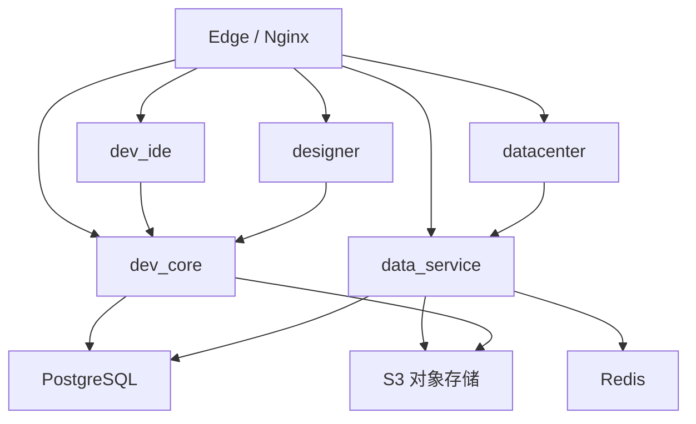

# 平台开发与管理系统架构

## 1. 系统定位

平台开发与管理系统是 InduForge 中心控制面，部署于 Linux Docker，负责设计、治理、构建、发布和运行状态汇聚。

## 2. 模块组成

| 模块           | 形态           | 职责                                              |
| -------------- | -------------- | ------------------------------------------------- |
| `dev_ide`      | SPA            | 平台管理、项目入口、发布与运维工作台              |
| `datacenter`   | SPA            | 接入源、数据点、查询、计算、报警和存储建模        |
| `designer`     | SPA            | 页面、组件、绑定、事件和交互设计                  |
| `dev_core`     | 中心后端服务   | 用户、租户、项目、权限、站点、节点和发布管理      |
| `data_service` | 中心数据域服务 | 数据建模、开发态调试编排、契约检查和 Release 构建 |
| PostgreSQL     | 中心数据库     | 控制面和设计元数据                                |
| Redis          | 中心缓存       | 会话、缓存和开发态实时数据                        |
| S3             | 对象存储       | 不可变 Release、安装包、驱动包和工程资产          |

## 3. 中心模块关系



## 4. 中心微服务形态

当前阶段不将中心拆成大量微服务：

- `dev_core` 保持模块化单体，承载控制面一致性事务。
- `data_service` 保持独立数据域服务，隔离高频数据建模与构建任务。
- 前端均为静态 SPA，不称为微服务。
- Release 构建压力需要隔离时，可使用 `data_service` 同镜像 Worker role，不增加新的业务边界。

## 5. 开发态调试

中心只负责会话编排。真实协议执行由原生 development Collector 完成：

```text
datacenter
→ data_service
→ development Collector
→ 设备或模拟器
```

没有 Collector 时仍可完成离线建模，但连接、浏览、读写和订阅不可用。

## 6. Release 构建

`data_service` 根据发布快照生成：

- 页面静态资源。
- 运行配置和安全快照。
- 数据点、计算、报警和存储快照。
- Collector 工程配置。
- Release Manifest、SHA-256 和签名。

生成结果上传中心 S3，`dev_core` 仅保存 Release 元数据和期望部署状态。

## 7. S3 资源模型

```text
/releases/<projectId>/<releaseId>/
/packages/runtime/<version>/
/packages/collector/<version>/<rid>/
/packages/drivers/<driverId>/<version>/<rid>/
```

Release 路径不可覆盖；`latest` 只能作为元数据指针。

## 8. 与运行系统边界

- 中心通过 Site NodeAgent 下发 Desired State，不直接访问站点 K3s API。
- 中心不直接向工程 JetStream 发布采集和计算数据。
- 中心 S3 是资源主存储，但不是页面运行时资源服务器。
- 站点离线时，中心只能显示最后上报状态，不能阻断工程运行。

## 9. 关联文档

- [平台系统架构](../01-产品与架构/平台系统架构.md)
- [工程发布与资源分发架构](./工程发布与资源分发架构.md)
- [dev_core 模块概览](../03-模块设计/dev_core/README.md)
- [data_service 模块概览](../03-模块设计/data_service/README.md)
