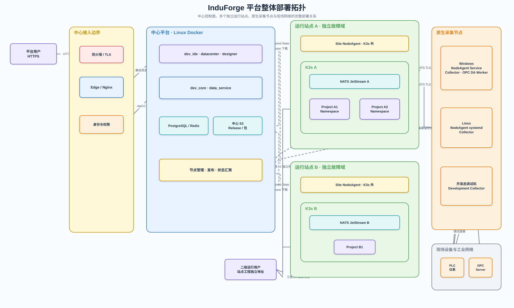

# 平台部署拓扑架构

## 1. 文档定位

本文档定义中心平台、多个独立运行站点、Windows/Linux 原生采集节点和现场设备的物理部署及网络关系。

## 2. 整体部署拓扑



可编辑源文件：[平台整体部署拓扑.drawio](../diagrams/平台整体部署拓扑.drawio)。

> 现有图片尚未同步 per-host NodeAgent、site-controller、infrastructure-controller 与
> deploymentId 边界；冻结前以[运维与节点运行态总体架构](./运维与节点运行态总体架构.md)为准。

## 3. 部署单元

### 3.1 中心平台

- 部署于 Linux Docker。
- 运行开发管理前端、`dev_core`、`data_service`、PostgreSQL、Redis 和中心 S3。
- Traefik 作为中心平台统一外部入口；Nginx 在内部托管平台静态前端。
- 每个工程拥有独立开发容器和独立 Docker 网络，Traefik 按工程路由到 Pi Web、code-server 和开发态预览服务。
- 负责设计、构建、发布和状态汇聚，不承载工程长期运行。
- 中心入口只服务平台管理和工程设计，不代理二级用户的工程运行流量。

### 3.2 运行站点

- 每个站点拥有独立 K3s 和 NATS JetStream，站点之间不是同一个跨广域网集群。
- 一个站点可运行多个 ProjectDeployment，每个 deployment 独立 Namespace 和 NATS Account。
- 每台 Linux 服务节点运行 K3s 外的 NodeAgent systemd 服务；`induforge-system` 中运行
  site-controller 与 infrastructure-controller，分别承担宿主机生命周期、工程编排和公共基础设施协调。
- 每个已部署工程提供站点侧独立访问地址，二级用户直接连接该地址。

### 3.3 原生采集节点

- Windows 使用 NodeAgent Windows Service、Collector 和可选 OPC DA Worker。
- Linux 使用 NodeAgent systemd 和 Collector。
- Collector 不进入 Docker 或 K3s，通过 NATS TLS 连接目标运行站点。

## 4. 网络通道

| 通道                  | 用途                      | 推荐协议                   |
| --------------------- | ------------------------- | -------------------------- |
| 用户到中心            | 设计与管理                | HTTPS                      |
| 中心入口到开发容器    | AI 对话、源码和开发态预览 | Docker 内部 HTTP/WebSocket |
| NodeAgent/site-controller 到中心 | Desired/Observed、节点资源、状态和操作 | 主动出站 mTLS 长连接 |
| NodeAgent 到中心 S3   | Release 和能力包下载      | HTTPS 短期授权             |
| site-controller 到 K3s | 工程资源应用与观察        | 集群内 ServiceAccount      |
| NodeAgent 到本机 K3s  | 安装、升级、诊断与恢复    | 本机受限管理接口           |
| 运行用户到工程        | 页面、API 和实时数据      | HTTPS/WebSocket            |
| Collector 到站点      | 采集值和写入命令          | NATS TLS                   |
| Collector 到设备      | 工业采集和写入            | S7、Modbus、OPC UA/DA 等   |

## 5. 访问地址边界

```text
平台管理员 / 工程设计人员
→ 中心平台地址

二级运行用户 / 操作员
→ 站点工程独立地址
→ 站点 Ingress
→ project-nginx
→ runtime-api
```

中心可以保存和展示工程访问地址，便于管理员跳转，但不得代理、转发或中转工程运行请求和实时数据。
中心与站点之间只传递发布期望状态、Release、运维命令、节点资源摘要、健康状态和操作结果。站点与
节点主动建立出站连接，中心不要求开放 K3s API 或宿主机入站管理端口。

## 6. 故障域

- 中心不可用时，站点已发布工程继续运行。
- 站点 A 故障不影响站点 B。
- K3s 故障不应停止宿主机原生 Collector，Collector 写入本地 WAL。
- Collector 节点故障只影响其承载的采集任务。
- 新 Release 下载或启动失败时，当前成功版本保持运行。

## 7. 安全边界

- 中心入口统一 TLS 和身份认证。
- 生产环境工程开发容器不发布宿主机端口，只允许 Traefik 通过工程独立 Docker 网络访问。
- 不同工程的开发容器不共享工作空间卷、Pi 会话目录或工程网络。
- 中心不保存 K3s 管理凭据；site-controller 使用集群内 ServiceAccount，NodeAgent 只持有本机
  安装与恢复所需权限。
- Collector 使用工程级最小权限 NATS 凭据。
- 现场设备网络不直接暴露给中心平台。
- 页面运行不依赖浏览器访问中心 S3。

## 8. 关联文档

- [平台系统架构](../01-产品与架构/平台系统架构.md)
- [工程开发工作空间网络架构](./工程开发工作空间网络架构.md)
- [节点管理与交付架构](./节点管理与交付架构.md)
- [运维与节点运行态总体架构](./运维与节点运行态总体架构.md)
- [平台运维体系设计](../06-运维与安全/平台运维体系设计.md)
- [工程运行系统架构](./工程运行系统架构.md)
- [工业采集架构](./工业采集架构.md)
