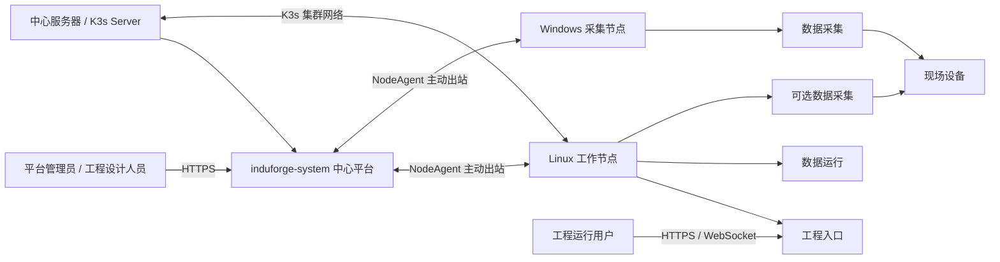

# 平台部署拓扑架构

## 1. 文档定位

本文档定义当前中心平台、物理节点、运行环境和现场设备之间的物理部署及网络关系。工程按运行
环境部署尚未交付，不得把基础服务的多节点分布误解为工程部署已经完成。

## 2. 当前整体部署拓扑



每个中心维护一套 K3s 集群：中心服务器是唯一 K3s Server 和不可移除的中心内置节点，其他 Linux
服务器作为 Worker 加入。运行环境是该集群中的命名空间与调度边界，可以关联一台或多台节点；当前
基础服务支持多节点单实例分布，但不承诺数据库主备、自动故障转移或工程多副本。

## 3. 当前部署单元

### 3.1 中心平台

- 部署于中心服务器 K3s 的 `induforge-system` 命名空间，所有中心 Pod 固定到带有
  `induforge.io/center-node=true` 标签的中心节点。
- 当前已纳管 IDE/Nginx 入口、`dev_core`、PostgreSQL、Redis 和对象存储；中心数据固定保存到安装时
  选择的数据目录，不与 `if-env-*` 运行环境共享。
- NodeAgent 与 K3s 仍由 systemd 宿主服务管理，使中心 Pod 或 K3s 工作负载异常时保留宿主恢复通道。
- `induforge-centerctl` 提供状态、诊断、日志、重启和幂等应用入口；中心前端不可用时仍可恢复。
- 现有 Docker 代码工作区保留兼容 Socket 挂载，工作区改为 K3s 调度后删除；中心核心服务已经不由
  Docker 托管。
- 负责设计、权限、节点接入、部署目标和状态汇聚，不承载工程长期运行流量。
- 正式 Release Builder 尚未闭环；未启用时不得生成或部署可执行正式 Release。

### 3.2 Linux 运行节点

- 每台节点独立安装 NodeAgent 与 root 权限 Node Hostd systemd 服务，使用独立身份、目录、端口和日志。
- 中心节点初始化 K3s Server，其他已审批节点加入为 Worker；运行环境不再各自安装 K3s。
- 节点固定提供工程入口和数据运行能力，可在安装时选择同时提供数据采集。
- Project Gateway 对用户统一称为“工程入口”，托管前端静态文件并代理 Runtime API/WebSocket。
- 客户在工程部署阶段选择访问端口，Center 和 NodeAgent 执行双重冲突检查；Secret、资源配额和完整进程隔离仍需继续验收。

### 3.3 Windows 采集节点

- 安装 NodeAgent Windows Service、Collector 和可选 OPC DA Worker。
- 当前固定为数据采集节点，不提供工程入口或数据运行能力。
- Collector 与设备的连接、凭据和目标工程来自部署配置，不固化在 Release 中。

## 4. 当前网络通道

| 通道                      | 用途                       | 当前要求                                |
| ------------------------- | -------------------------- | --------------------------------------- |
| 用户到中心                | 设计与管理                 | HTTPS                                   |
| 中心入口到开发工作空间    | AI 对话、源码和开发态预览  | 中心内部 HTTP/WebSocket                 |
| NodeAgent 到中心          | 领取、心跳、部署目标和状态 | 节点主动出站；远程节点使用 HTTPS        |
| NodeAgent 到 Release 存储 | 正式 Release 下载          | 目标为 HTTPS 短期授权；完整接线尚未闭环 |
| 运行用户到工程入口        | 页面、API 和实时数据       | HTTPS/WebSocket，不经中心转发           |
| Collector 到运行服务      | 采集值和受控写入命令       | 工程级最小权限安全通道                  |
| Collector 到设备          | 工业采集和写入             | S7、Modbus、OPC UA/DA 等现场协议        |

所有正式节点（包括中心内置节点）都通过中心 HTTPS 入口访问控制面；loopback HTTP 只允许本地开发，
不得成为正式安装依赖。中心不主动连接物理节点，也不要求开放宿主机管理端口。

## 5. 工程访问地址边界

```text
平台管理员 / 工程设计人员
→ 中心平台地址

工程运行用户 / 操作员
→ 工程独立地址
→ 工程入口（内部 Project Gateway）
→ 当前 Release 的静态页面
→ 同节点 Runtime API / WebSocket
```

中心可以保存和展示工程入口地址，但不得代理、转发或中转工程页面、API、WebSocket 和实时数据。
浏览器不得直接访问中心对象存储。

## 6. 当前故障边界

- 中心短时不可用时，已经运行的本机工程服务不因通信失败被主动停止；恢复后更新状态。
- 一台物理节点故障只影响其当前承载的单节点工程和采集任务；当前没有自动跨节点接管。
- Collector 故障只影响其分配的采集任务，并应使用本地 WAL 保护可恢复数据。
- 目标 Release 下载、校验、启动或健康检查失败时不得切换当前成功版本。
- 节点失联时中心展示“状态未知”，不能把最后一次心跳误当成当前故障或成功证据。

上述边界是正式验收目标；Release 下载/激活和升级回滚尚未接通前，不得宣称旧版本保持与自动恢复
已经完成端到端验证。

## 7. 安全边界

- 中心入口统一 TLS 和身份认证。
- 不同工程的开发工作空间不共享源码卷、会话目录或工程网络。
- NodeAgent 只持有本机最小权限，中心命令不包含 shell、路径、参数、环境变量或长期中心密钥。
- Release 下载使用短期授权，归档、摘要、签名和节点身份必须一致。
- Collector 使用目标工程的最小权限凭据，现场设备网络不直接暴露给中心。
- 页面运行不依赖浏览器访问中心对象存储。

## 8. 当前未闭环门禁

- Builder 未交付时，工程源码和开发预览只能保存，不能生成可部署正式 Release。
- Center 到 NodeAgent 的 Binding/Release 下载、验签、Secret 装配和进程切换未闭环时，创建部署
  必须由服务端能力门禁拒绝，不能只靠前端隐藏。
- 升级和回滚尚无 current/target/last-successful 状态与历史 revision，UI/API 不得开放。
- 真实 Linux/Windows 安装、运行、断线恢复和现场采集必须在隔离物理机验收。

## 9. 未来多节点分布式与可选内部实现（未交付）

未来一个工程可以选择多台物理节点，产品只展示物理拓扑、角色、容量、工程版本、健康与切换结果。
必须先冻结分片、唯一 owner、fencing、排空、检查点、故障转移及 Release/Secret 一致性，才能开放。

未来节点内部可选择 K3s、Pod、Namespace、site-controller、infrastructure-controller、Ingress、
PVC 或其他编排技术。它们不是当前正式拓扑，也不得成为用户输入、公共 API 字段或默认 UI。

旧的[平台整体部署拓扑图](../assets/architecture/平台整体部署拓扑.svg)及其
[Drawio 源文件](../diagrams/平台整体部署拓扑.drawio)包含未来内部设计，在重新绘制前只作为历史
参考，不作为当前实现或验收证据。

## 10. 关联文档

- [平台系统架构](../01-产品与架构/平台系统架构.md)
- [工程开发工作空间网络架构](./工程开发工作空间网络架构.md)
- [节点管理与交付架构](./节点管理与交付架构.md)
- [运维与节点运行态总体架构](./运维与节点运行态总体架构.md)（未来多节点内部设计参考）
- [平台运维体系设计](../06-运维与安全/平台运维体系设计.md)（未来多节点与容灾设计参考）
- [工程运行系统架构](./工程运行系统架构.md)
- [工业采集架构](./工业采集架构.md)
