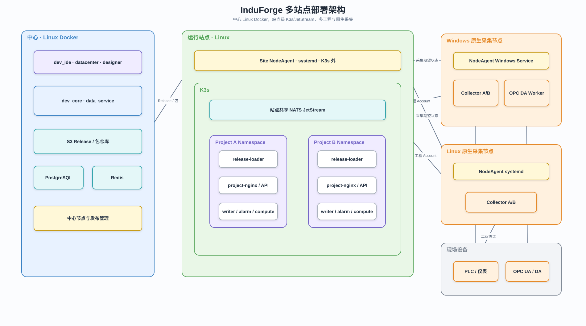

# 节点管理与交付架构

## 1. 系统定位

节点管理与交付系统连接中心控制面、站点 K3s 和原生采集节点，负责将工程期望状态转换为可执行部署。

## 2. 组成



可编辑源文件：[多站点部署架构.drawio](../diagrams/多站点部署架构.drawio)。

```text
dev_core Node Management
        │
        ▼
Site NodeAgent
├─ K3s Adapter
├─ Native Process Executor
├─ Release State Manager
├─ Health Aggregator
└─ Upgrade / Rollback Manager
```

## 3. Site NodeAgent 部署

- Linux 服务站点：systemd 服务，运行在 K3s 外部。
- Windows 采集节点：Windows Service。
- Linux 采集节点：systemd 服务。

Site NodeAgent 位于 K3s 外，是为了在 K3s 不可用时仍能检查、修复、升级和恢复站点。

## 4. K3s 管理边界

Site NodeAgent 负责：

- 检查 K3s 健康和版本。
- 创建工程 Namespace、ServiceAccount、ConfigMap、Secret、PVC 和工作负载。
- 应用工程 Release 对应的 Kubernetes 资源。
- 观察 Deployment、Job、Pod、Ingress 和 PVC 状态。
- 聚合工程运行状态并回传中心。

Site NodeAgent 不自行调度 Pod，也不解释工程业务配置。

## 5. 原生采集进程边界

所有 Windows/Linux Collector 都由 NodeAgent 通过 `native-processes.json` 托管：

```text
NodeAgent
├─ collector-project-a
├─ collector-project-b
└─ opcda-worker-project-a（Windows 可选）
```

NodeAgent 负责二进制安装、工程配置下载、启停、探活、升级和回滚，不解释设备地址与变量语义。

## 6. 多工程模型

- 一个站点共享一套 K3s 和 JetStream。
- 一个工程对应一个 Namespace 和一个 NATS Account。
- 一个采集节点可承载多个工程，但默认每工程一个 Collector 进程。
- 工程删除时，只删除该工程 Namespace、NATS Account、运行数据空间和采集版本目录。

## 7. 期望状态

中心下发的核心对象：

```text
SiteDesiredState
ProjectReleaseDesiredState
NativeCollectorDesiredState
InfrastructureDesiredState
```

NodeAgent 回传：

```text
ObservedState
ReleaseApplyResult
WorkloadHealth
NativeProcessHealth
InfrastructureHealth
```

## 8. 发布和回滚

- 新 Release 先下载、校验和探活，再切换入口。
- 新版本失败时旧版本继续运行。
- 回滚按 Release ID 恢复，不从当前版本反向修改文件。
- NodeAgent 不通过消息总线传输大型 Release 文件。

## 9. 安全

- 中心和 NodeAgent 使用双向认证或设备凭据。
- S3 下载使用短期授权，不下发长期中心密钥。
- K3s 管理凭据只保存在站点 NodeAgent。
- Collector 只持有目标工程 NATS Account 的最小权限凭据。

## 10. 关联文档

- [工程运行系统架构](./工程运行系统架构.md)
- [工业采集架构](./工业采集架构.md)
- [NodeAgent 协议](../04-契约与规范/跨模块契约/node-agent-runtime-protocol.md)
