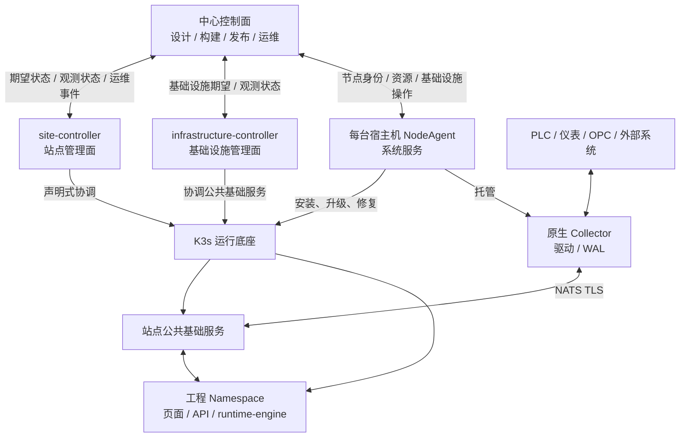

# 运维与节点运行态总体架构

## 1. 文档定位

本文档是 InduForge 节点侧运行态、站点高可用和运维控制面的总体设计基线。它回答以下问题：

- 中心、站点、宿主机、K3s、原生采集进程分别负责什么。
- 工程发布后，页面、API、计算、报警、采集和存储如何部署与协同。
- 单机、扩容、高可用、采集冗余和异地灾备如何组合。
- 站点断开中心、节点故障、网络抖动或版本升级时如何保持可控。
- 开发、预发和生产部署如何复用同一不可变 Release。

运维对象、监控指标、发布操作和运维工作台的详细设计见
[平台运维体系设计](../06-运维与安全/平台运维体系设计.md)。

## 2. 设计结论

以下结论作为后续实现基线：

1. K3s 是 Linux 服务站点的编排底座，不是所有现场节点的统一进程容器。
2. Windows/Linux 工业 Collector 继续使用原生进程；纯采集节点不要求安装 K3s。
3. 每台受管宿主机运行一个 K3s 外的 `NodeAgent`，负责宿主机及本机 K3s/原生进程生命周期。
4. 每个 K3s 站点运行一个逻辑 `site-controller`，负责工程资源的声明式编排；共享基础设施由
   独立权限域的 `infrastructure-controller` 协调。两者首版可复用镜像但不得共用高权限身份；
   `site-ha` 中以多副本和 Lease 选主部署。
5. 中心不保存站点 Kubeconfig，也不直接调用 K3s API；普通发布由 `site-controller` 协调，K3s 故障恢复由宿主机 `NodeAgent` 执行。
6. 工程运行角色先按“少量进程、逻辑分工”部署，不按每个计算单元、报警项或数据点创建 Pod。
7. 同一运行引擎镜像支持多个 `role`；默认打包运行，只有容量、隔离或故障域明确要求时才拆分。
8. 无状态服务可多副本；会产生副作用的采集、写入、计算和报警任务只能由一个分片所有者执行。
9. 高可用必须同时覆盖控制面、消息副本、数据存储、工作负载放置和单写者防护；“装成集群”不等于业务已经高可用。
10. 站点之间保持独立 K3s 集群，不跨广域网拉伸 etcd；异地灾备通过异步复制和显式提升实现。
11. 部署环境与拓扑规格是两个独立维度：`development / staging / production` 不决定副本数，`edge-single / site-standard / site-ha` 不决定是否允许调试。
12. 同一 Release 在环境间晋级，不为生产环境重新构建；站点绑定、密钥、设备连接和资源配额不写入 Release。
13. 中心失联不影响既有工程运行；所有控制、遥测和发布通道都按“站点主动出站、可排队重试”设计。

## 3. 分层架构



### 3.1 中心控制面

中心负责工程设计、Release 构建与签名、部署策略、节点与站点资产、期望状态、运维权限、状态汇聚和审计。中心不承担：

- 工程页面与 Runtime API 的运行流量。
- 站点实时数据、计算和报警的必经转发。
- 对现场 K3s API、设备网络或数据库的长期直连。
- 站点离线期间的选主和业务调度。

### 3.2 宿主机管理面：NodeAgent

每台受管 Linux 或 Windows 宿主机只运行一个 `NodeAgent`。其职责是：

- 节点注册、证书轮换、硬件和操作系统能力上报。
- CPU、内存、磁盘、网络、时钟和关键服务的最小健康采集。
- 安装、升级、启停和恢复 K3s、Collector 与节点级运维组件。
- 管理本机 Release 缓存、日志目录、WAL 目录、密钥目录和磁盘配额。
- 执行重启、排空、进入维护、退出维护等受控宿主机操作。
- K3s 不可用时提供独立诊断和恢复通道。

NodeAgent 不解释数据点、报警规则、计算脚本、页面 Schema 或工业地址语义，也不代替 Kubernetes 调度器。

### 3.3 站点管理面：site-controller

`site-controller` 运行在 `induforge-system` Namespace，使用集群内 ServiceAccount：

- 协调 ProjectDeployment、Release 与 DeploymentBinding 的期望状态。
- 在 infrastructure-controller 已分配的工程 Namespace 内生成并应用 ServiceAccount、Secret、
  ConfigMap、PVC、Job、Deployment、StatefulSet 和 Service。
- 作为站点 DeploymentRun 的唯一状态推进者，维护发布阶段、成功 Snapshot、能力校验和工程观测状态。
- 使用 Kubernetes Lease 选举单个活动协调者；其他副本只热备。
- 将工程工作负载和 DeploymentRun 状态聚合后通过出站通道回传中心。

常规业务发布由 `site-controller` 处理；NodeAgent 只负责引导、宿主机操作和 K3s 故障恢复。
这样既不把 Kubeconfig 交给中心，也不会因 K3s 故障失去恢复入口。

### 3.4 站点公共基础服务

站点公共能力部署在 `induforge-system` 或专用基础设施 Namespace：

- Ingress 与可选 VIP/负载均衡。
- NATS JetStream。
- 关系、时序、实时缓存和消息接入等运行数据底座。
- 镜像与 Release 本地缓存。
- 指标、日志、事件采集和站点遥测网关。
- 备份控制、证书与密钥分发。

公共数据库可以采用“站点共享实例、工程独立数据库/Schema/账号”的默认方式。超大工程或强隔离工程可使用独立实例，但不应默认每个工程部署一整套数据库。

共享基础设施由独立权限域的 `infrastructure-controller` 协调，包括 Namespace 分配/回收、
Ingress/域名、NATS Account、工程数据空间、遥测、备份控制及选定的数据底座。首版可与
site-controller 复用代码仓库和镜像，但应使用独立 Deployment、ServiceAccount、CRD 与审计域，
避免工程控制器拥有无边界的集群管理员权限。准入策略校验 Namespace 和资源上的
`deploymentId/owner` 标签；不能错误依赖 Kubernetes RBAC 对新建 Namespace 名称做前缀限制。

### 3.5 站点首次引导

site-controller 和 infrastructure-controller 不能安装自己。新站点采用唯一引导所有者：

1. 中心生成签名、限时的 `SiteBootstrapPlan`，包含 Site、`bootstrapEpoch`、目标 Profile、K3s
   版本、节点角色、固定注册地址、能力摘要和恢复要求，不包含可长期复用的明文 Secret。
2. 运维人员指定一台已注册 NodeAgent 为 bootstrap owner；该 Agent 校验签名后创建首个 K3s
   Server，并在本地生成 K3s server token。中心不生成、保存或返回该长期凭据。
3. 新增 Server 仍需使用同一个静态 server token；bootstrap owner 只通过绑定
   `siteId + bootstrapEpoch + nodeId + expiresAt`、以目标节点公钥封装的一次性传递 capsule 下发，
   一次性的是传递授权而不是 server token。Agent 节点改用 owner 本地创建的每节点限时 K3s
   bootstrap token，加入成功后由控制器执行 `k3s token delete`。中心只中转密文 capsule；
   server token 按轮换版本进入受保护备份并与对应 etcd 快照关联。
4. bootstrap owner 只安装最小 `induforge-system` 基线、infrastructure-controller 和
   site-controller，不直接发布工程。
5. 控制器就绪并接管 CRD 后，bootstrap owner 回传结果、撤销临时权限；后续基础服务由
   infrastructure-controller 协调，本机 K3s 故障仍由各 NodeAgent 恢复。

所有步骤使用 `commandId + desiredRevision + bootstrapEpoch` 幂等，持久化阶段 checkpoint，并由
bootstrap owner Lease 限定当前执行者。接管前必须先通过电源、网络或人工现场手段 fence 旧 owner；
无法确认旧 owner 已停止时不得自动创建另一套首集群。`site-ha` 必须先形成 K3s 多数派再安装
依赖 etcd 的公共服务，禁止多个 NodeAgent 同时自行创建首集群。

### 3.6 工程运行数据面

每个 `ProjectDeployment` 拥有不透明且永久稳定的 `deploymentId`；创建时确定的 `siteId`、
`projectId` 和 `deploymentStage` 不可修改，晋级、迁移或复制部署都创建新的 deployment。
`(siteId, projectId, deploymentStage)` 不作为唯一键，以支持同一阶段的分区或并行实例。资源按
部署实例隔离 Namespace、NATS Account、
运行身份、配置、密钥和数据空间。同一工程的开发、预发、生产可在同一 Site 并存，不得只使用
`projectId` 命名资源：

```text
if-<project-code>-<deployment-short-id>
├─ release-loader Job
├─ project-nginx
├─ runtime-api
├─ runtime-engine
│  ├─ writer
│  ├─ alarm
│  ├─ compute
│  ├─ query
│  └─ coord
├─ optional sandbox-worker
└─ ConfigMap / Secret / PVC
```

表中的 `writer`、`alarm`、`compute`、`query` 和 `coord` 是逻辑角色，不要求一开始就是五个 Deployment：

- `edge-single` 和普通工程默认由一个 `runtime-engine` 进程打包承载。
- 负载上升后按角色或分片拆分，但继续复用同一镜像和契约。
- JavaScript/Python 执行使用受限 Worker 池和工程级依赖缓存，不为每个计算单元常驻一个容器。
- 报警项和计算单元只是运行任务，不能映射为独立 Pod。

### 3.7 原生采集数据面

Collector 由 NodeAgent 以原生进程托管：

```text
NodeAgent
├─ collector-deployment-a-prod
├─ collector-deployment-b-dev
└─ opcda-worker-deployment-a-prod（Windows 可选）
```

Collector 负责驱动连接、采样、协议写入、本地 WAL、断线重连和 NATS 发布。纯采集节点不安装
K3s；同一节点可承载多个 deployment，但默认每个 deployment 一个 Collector 进程，避免阶段、
故障和配置互相污染。

## 4. 运行所有权与防双写

只要任务会写设备、写存储、发布派生结果或推进状态机，就必须显式定义所有者：

| 任务 | 默认所有权 |
| --- | --- |
| 设备连接与采集 | `connectionId` 单活动所有者 |
| 写库 | Stream/Consumer 或 `partitionId` 单活动消费者 |
| 计算 | `computeUnitId + partitionId` 单活动执行者 |
| 报警 | `alarmItemId + partitionId` 单活动状态机 |
| 定时任务 | `scheduleId` 单活动触发者 |
| 发布切换 | `deploymentId` 单活动协调者 |

可被 InduForge 下游校验的所有权使用 Lease 与单调递增 `epoch`：

1. 候选实例获取 Lease。
2. 协调者分配新的 `epoch`。
3. 每个写入、命令和检查点携带 `ownerId`、`epoch` 与幂等键。
4. Writer、消息入口或下游存储拒绝旧 `epoch`。
5. Lease 过期后的新实例从已确认检查点继续。

仅有 Lease 不能消除网络分区中的旧实例写入，因此 `epoch` 防护是强制要求。本架构对关键路径使用 JetStream durable Consumer 与显式确认，并按至少一次投递设计；消费者必须按 `eventId` 或业务幂等键去重。

真实 PLC、仪表和部分工业协议并不认识 InduForge 的 `epoch`，不能声称 Lease 能强制隔离旧
Collector 的设备写入。`collector-ha` 必须按能力矩阵区分：

- 上行采集、写库和派生数据由消息入口或存储执行 epoch fencing。
- 设备写入只有在协议支持排他会话/设备令牌，或部署写入网关、网络隔离等硬 fencing 时才自动接管。
- 不具备硬 fencing 的连接只承诺读采集冗余；主备状态不明确时默认暂停设备写入，恢复需人工确认和审计。

## 5. 部署拓扑

### 5.1 基础拓扑 Profile

| Profile | 组成 | 能力边界 | 推荐场景 |
| --- | --- | --- | --- |
| `edge-single` | 1 台 K3s Server，JetStream R1，单实例数据底座 | 可备份、不可自动容忍宿主机故障 | 演示、小型非关键站点、开发环境 |
| `site-standard` | 1 台 K3s Server + 0..N Worker | 可扩容工作负载，但控制面仍是单点 | 中型站点、允许人工恢复 |
| `site-ha` | 至少 3 台奇数 K3s Server，可选 Worker；基础服务跨故障域 | 目标容忍单节点故障；须同时满足下述约束 | 关键生产站点 |

`site-standard` 增加 Worker 只增加容量，不等于控制面高可用。`site-ha` 必须满足：

- 3 台或更多奇数 K3s Server，至少分散到不同物理宿主机和独立本地磁盘；再按连续性目标跨电源、机架或机房故障域放置。
- API 固定注册地址或 VIP。
- JetStream 至少 3 节点；关键 Stream 和 Consumer 显式使用 R3。
- 数据存储具备与目标 RPO/RTO 一致的副本、备份和恢复方案。
- 无状态服务至少两个副本并设置拓扑分散；维护操作使用 PDB 和 Eviction。
- 站点外保存 K3s etcd 快照和关键数据备份。

两台宿主机不作为 InduForge 的“自动高可用”产品规格。K3s 可以使用独立外部数据存储构建
两个或更多 Server 的控制面，但这还要求外部数据库自身高可用，也没有解决 JetStream 多数派、
业务存储和单写者防护。InduForge 首个 `site-ha` 基线采用 3 台奇数 Server，避免把局部冗余
包装成整站高可用。

Site 同时保存 `desiredTopologyProfile / enabledCapabilities` 与
`observedTopologyProfile / availableCapabilities / unmetConditions`。发布门禁只认 Observed；把
Desired 写成 `site-ha` 不代表已经具备高可用。Profile 变更只能创建独立、可审计的
`SiteInfrastructurePlan/Run`，不能由普通工程发布或直接编辑字段触发破坏性重构。

### 5.2 可选能力

基础 Profile 之外使用能力开关组合，而不是不断增加互斥 Profile：

| 能力 | 说明 |
| --- | --- |
| `collector-ha` | 同一连接在两个采集节点准备，读采集单活动；设备写入自动切换还需协议/网络硬 fencing |
| `runtime-sharding` | 按工程、数据点或任务分片扩展 writer/compute/alarm |
| `site-dr` | 独立灾备站点、异步复制、显式提升和回切 |
| `dedicated-storage` | 工程独享数据库或存储实例 |

### 5.3 异地灾备

- 主、备站点分别运行独立 K3s 和 JetStream，不建立跨广域网 etcd。
- Release、配置、密钥封装和必要数据异步复制到灾备站点。
- 第一阶段采用人工确认提升；自动提升必须引入独立仲裁、明确网络隔离和防回切双写。
- 提升生成新的站点 `epoch`，旧站点恢复后默认只读并等待人工回切。
- 中心可以发起灾备操作，但不能成为站点持续运行所依赖的唯一仲裁者。

### 5.4 “双活”的产品语义

平台不提供一个模糊的“开启双活”开关，而是按工作负载定义：

- 中心无状态 API/前端可多副本主动服务，前提是中心数据库、缓存、对象存储和入口也有匹配的
  高可用方案。
- 站点 runtime-api、查询和静态页面可多副本主动服务。
- writer、alarm、compute 可按分片分布到不同节点形成容量层面的 active-active，但同一分片始终
  只有一个 owner，不能让两个实例同时推进同一状态机。
- Collector 可让不同连接分别在不同节点活动；同一连接保持单活动，设备写入还受硬 fencing 限制。
- 跨站点默认是主站运行、灾备站预热。只有业务数据、设备和写入责任天然分区且不存在共享写
  冲突时，才允许两个 Site 同时承载不同分区；同一 PLC/同一分片不做无仲裁的跨站双写。

## 6. 离线自治与缓存

站点至少有三层耐久缓冲：

1. Collector 本地 WAL：设备数据在收到 JetStream PubAck 前不得删除；是否能在 PubAck 后立即删除
   由工程的 `dataDurabilityClass` 和 RPO 决定，不能把 PubAck 等同于断电级落盘承诺。
2. JetStream：承接可靠事件、重放、消费者进度和短时削峰。
3. 运行状态与检查点存储：保存计算窗口、报警状态、幂等记录、租约 epoch 和发布状态。

关键 Stream 必须使用 FileStorage，并显式记录副本数、同步策略和可承诺 RPO：

- `standard`：允许按 PubAck 推进 Collector WAL 水位，但必须向用户声明底层尚未 `fsync` 或站点
  同时断电时可能丢失近期已确认数据。
- `power-loss-safe`：单节点 R1 必须使用 `sync_interval: always`，或让 Collector WAL 继续保留到
  独立的强持久化水位；该模式以吞吐换取更小 RPO。
- `site-ha` 的 R3 只承诺在多数派仍存活时容忍普通单节点故障，不能默认承诺整个站点同时断电
  时 RPO 为零；站点级灾难仍依赖业务存储、离站备份和 Collector WAL 策略。

站点重启不得依赖先连接中心才能恢复既有工程，但权威状态不能保存在 site-controller Pod
本地目录：

- Site、Binding、ProjectDeployment 与 DeploymentRun 声明状态保存在 Kubernetes API/CRD。
- Release 和运行配置保存在受保护、可恢复的站点持久存储。
- 运行任务的 epoch、幂等记录和检查点保存在支持原子比较更新的站点运行控制库。
- NodeAgent 只缓存恢复 K3s 和重新引导控制器所需的最小 bootstrap 状态。

每层都必须配置字节上限、时间上限、磁盘水位和溢出策略。达到限制时按业务级别降级，不允许无限写满系统盘：

- 优先停止低价值调试日志与低优先级遥测。
- 业务采集按工程策略阻塞、降采样或丢弃，并生成不可消除的数据缺口事件。
- 写设备命令不允许在过期后盲目重放。
- 中心恢复连接后按序回放状态和遥测，但不能让历史状态覆盖更新的观测状态。

## 7. 部署环境与运行策略

### 7.1 正交维度与权威来源

- `ProjectDeployment.deploymentStage`：`development`、`staging` 或 `production`。
- `Site.desiredTopologyProfile / observedTopologyProfile`：目标与已实现拓扑分开，工程发布门禁只认
  observed 和 `availableCapabilities`。
- `DeploymentBinding.continuityPolicy / requiredSiteCapabilities`：声明工程连续性目标和所需站点能力。
- `DeploymentBinding.workloadProfile`：声明工程自身资源与副本建议，不修改整站拓扑。
- `ProjectDeploymentDesiredState.rolloutPolicy`：按无状态、有状态和 Collector 定义切换方式。

环境决定安全、审批、调试和验收策略；Site Profile 决定资源拓扑和容错能力。生产环境原则上推荐
`site-ha`，但若客户接受单点风险，可通过显式豁免运行在 `edge-single`；UI 必须持续显示风险，
不能把单机伪装成高可用。单个工程部署不得把 Site 从一个 Profile 改成另一个 Profile。

### 7.2 环境语义

| 能力 | development | staging | production |
| --- | --- | --- | --- |
| 不可变 Release | 必须 | 必须，使用待投产产物 | 必须，沿用已验证产物 |
| 签名 | 可晋级产物使用统一可信签名；临时开发产物标记不可晋级 | 沿用可晋级产物签名 | 沿用同一产物签名与摘要 |
| 模拟值/调试入口 | 可启用并显著标识 | 默认关闭，按时授权 | 默认禁止，临时授权自动过期 |
| 设备写入 | 默认禁止 | 显式授权 | 权限、审计、联锁全部通过 |
| 发布审批 | 可简化 | 至少一次验收 | 按策略审批和发布窗口 |
| 日志级别 | 详细 | 接近生产 | 受控，敏感字段脱敏 |
| 发布策略 | Recreate 优先 | 生产策略演练 | 健康门禁、可回滚切换 |
| 备份要求 | 推荐 | 必须验证 | 必须且定期恢复演练 |

`staging` 是推荐的可选预发环境，用来验证完全相同的生产 Release。即使 UI 第一阶段只提供“开发/生产”，数据模型也应保留该枚举。

所有 `promotable=true` Release 构建时即由统一 Release 签名服务签名。只供开发调试的临时产物
可以使用开发信任根，但必须标记 `promotable=false`；预发验收、风险接受与生产审批以独立
Promotion Attestation 记录，不修改 Release 内容、摘要或签名。

### 7.3 Release 与环境绑定

Release 只包含可重复验证的不可变内容：

- 页面构建产物、运行模型、计算与报警配置。
- 数据和采集契约、数据库结构计划。
- 镜像与依赖摘要、SBOM/来源信息、健康检查、资源建议。
- 摘要、签名和兼容性要求。

`DeploymentBinding` 保存可变的部署信息，但不绑定 Release ID，也不重复保存 Site、Project 或
Stage：

- `deploymentId`、连续性策略、所需站点能力和工作负载规格。
- 域名、外部数据库、设备连接和数据点实际绑定。
- Secret 引用、资源请求/限制、副本与存储策略。
- `dataDurabilityClass` 与对应 RPO，避免把消息副本数误当成断电零丢失承诺。
- 模拟开关、日志级别、功能开关、维护窗口和审批策略。

`ProjectDeploymentDesiredState` 与 `DeploymentRun` 同时引用 `releaseId + bindingId + bindingRevision`。
从预发晋级生产使用同一 Release，在目标生产 Deployment 上选择或创建 Binding revision 并创建
DeploymentRun，不重新构建 Release。

## 8. 发布、切换与回滚

### 8.1 状态模型

```text
PENDING
→ WAITING_APPROVAL（按策略可选）
→ PREFLIGHT
→ PREPARING
→ DEPLOYING
→ VERIFYING
→ CUTTING_OVER
→ OBSERVING
→ SUCCEEDED

切换前失败 → FAILED（旧 Deployment 保持健康）
切换后失败 → ROLLING_BACK → ROLLED_BACK
回滚失败 → ROLLBACK_FAILED → MANUAL_INTERVENTION_REQUIRED
人工操作 → PAUSED / CANCELLED
```

中心和站点同时保存：

- `desiredReleaseId`：期望版本。
- `observedReleaseId`：实际生效版本。
- `lastSuccessfulSnapshotId`：最后成功且可回滚的完整 DeploymentSnapshot。
- `activeDeploymentRunId`：只出现在观测/运行状态中的当前发布执行，不写入长期 Desired。
- `failureStage / reasonCode`：失败阶段与结构化原因。

### 8.2 组件发布策略

| 组件 | 默认策略 |
| --- | --- |
| project-nginx、runtime-api | Kubernetes RollingUpdate；生产设置 readiness、maxUnavailable/maxSurge |
| runtime-engine 无状态查询角色 | RollingUpdate |
| runtime-engine 有状态/副作用角色 | 新版本预热，Lease + epoch 单权切换，旧版本排空 |
| Collector | 新版本安装与连通性预检，单连接所有权切换，旧进程 WAL 排空 |
| 数据库结构 | 先兼容扩展、后切换、最后收缩；发布前备份并验证回滚边界 |
| 公共基础服务 | 独立于工程 Release，按站点维护计划升级 |

不能同时让两个版本执行同一报警、计算、定时任务或设备连接。所谓蓝绿发布只允许两套资源同时
“准备”。发布不是跨 K3s、数据库和多台 NodeAgent 的分布式原子事务，而是站点内可恢复 Saga：

1. 中心创建不可变 DeploymentPlan/RunRequest 并完成审批，只镜像后续状态。
2. site-controller leader 是 DeploymentRun 状态唯一推进者；各参与者只写自己的 ParticipantStatus。
3. site-controller、infrastructure-controller 和全部相关 Collector NodeAgent 通过站点本地、
   耐久的控制流完成 Prepare。
4. 协调者在站点控制库持久化唯一 `CommitDecision` 后，各参与者按幂等 Commit 切换业务所有权；
   中心此时断线也按本地决议继续。
5. 失败按阶段执行 Compensate 或进入人工介入，不允许形成未记录的半发布状态。

### 8.3 回滚边界

- 每次成功发布生成不可变 `DeploymentSnapshot`，至少固定 Release ref、Binding revision、解析后的
  Secret version、SiteResource revision、全部 CollectorAssignment revision，以及 Schema/checkpoint
  兼容边界。
- 回滚是以目标 DeploymentSnapshot 创建新的 DeploymentRun，禁止只回滚 Release ID 或修改当前
  Release 目录。
- 回滚前检查数据库结构和运行状态是否向后兼容。
- 旧版本恢复所有权前获得新 epoch，旧新实例均不得沿用历史写权限。
- 发布失败不能删除最后成功版本、最后可用凭据和恢复快照。

## 9. 数据、备份与恢复

备份分层管理：

| 层级 | 必备内容 | 说明 |
| --- | --- | --- |
| 中心控制面 | 中心数据库、对象存储、签名与证书恢复材料、审计 | 中心恢复不应要求站点停止运行 |
| K3s 控制面 | etcd 快照、K3s 配置、与每份快照对应的 server token 版本、证书与加密恢复材料 | token 轮换前的快照需要对应的旧 token 才能恢复；etcd 快照不等于业务数据备份，且包含 Kubernetes 资源和 CA 私钥等敏感内容，离站副本必须加密并限制访问 |
| 站点公共数据 | 关系/时序/实时存储、NATS 配置与必要持久数据 | 按存储引擎实现增量或全量备份 |
| ProjectDeployment | Release、Binding、deployment 数据空间、运行安全快照 | Release 在中心和站点均保留 |
| 采集节点 | Collector 配置、凭据封装、WAL 状态 | WAL 是未提交队列，不是长期备份 |
| 运维 | 节点清单、证书、审计和恢复记录 | 恢复后仍需重新核验身份 |

备份只有通过恢复演练才视为有效。每个生产站点必须配置 RPO、RTO、备份位置、保留期和最近一次恢复演练结果。

## 10. 安全边界

- 中心、NodeAgent、site-controller 和 infrastructure-controller 使用独立身份与双向 TLS。
- 所有站点连接由站点主动发起，中心不要求开放 K3s API 或节点管理端口。
- K3s ServiceAccount、Collector NATS 凭据和数据库账号按站点/deployment/角色最小授权。
- Secret 只通过密钥引用进入目标节点或 Namespace，不写入 Release、日志和普通状态。
- 运维命令携带操作者、审批、目标、有效期和幂等 ID；高风险操作必须可审计。
- 生产调试入口使用临时授权和到期时间，不允许永久打开。
- 节点时间同步、证书到期、镜像签名和 Release 签名属于生产健康门禁。
- NodeAgent 拆为普通权限协调进程与最小特权 helper；helper 仅接受签名、白名单、带参数 Schema
  的 K3s/服务/主机动作，并校验目标路径、防目录穿越和记录本地提权审计。
- infrastructure-controller 负责 Namespace 和集群级公共资源；site-controller 只管理已分配
  Namespace 内资源。两者使用独立 ServiceAccount、Lease 和受管 CRD 权限，不授予默认无限制
  `cluster-admin`；准入策略校验 `deploymentId/owner` 标签，不能依赖 Kubernetes RBAC 按名称前缀
  限制 Namespace `create`。

## 11. 分阶段实现

### 阶段 A：单站点闭环

- NodeAgent 注册、最小资源监控和原生 Collector 托管。
- 单节点 K3s、infrastructure-controller、site-controller、工程 Namespace 和不可变 Release 发布。
- 打包式 runtime-engine、Desired/Observed/LastSuccessfulSnapshot 状态。
- 发布失败保留旧 Snapshot、中心断开持续运行。

### 阶段 B：生产运维

- 开发/预发/生产 Binding 与生产门禁。
- 运维指标、日志、事件、维护模式和备份恢复。
- 站点公共服务健康、磁盘容量、证书和时钟检查。
- 单节点完整故障演练和发布回滚演练。

### 阶段 C：站点高可用

- 3 节点 K3s embedded etcd、固定注册地址和拓扑分散。
- JetStream R3、关键 Consumer R3、数据存储副本和站点外备份。
- runtime-engine 分片、Lease + epoch、防双写和 PDB。
- Collector 双机热备和计划内排空切换；设备写入自动切换仅对具备硬 fencing 的连接开放。

### 阶段 D：异地灾备

- 独立灾备站点、异步数据复制和 Release 预热。
- 明确的提升、回切、旧站点隔离和数据校验流程。
- 在满足仲裁条件后再评估自动灾备切换。

## 12. Review 结论与待冻结项

### 12.1 已修正的设计问题

- 将旧文档中的“Site NodeAgent”拆成宿主机 NodeAgent 与集群内 site-controller，避免单个组件同时承担系统恢复和业务编排。
- 将 writer/alarm/compute/query/coord 从固定 Deployment 改为逻辑角色，避免小站点和多工程出现 Pod 数量膨胀。
- 将“高可用 Profile”细化为控制面、消息、存储、工作负载和单写者五个层面的共同约束。
- 将开发/生产环境与单机/高可用拓扑解耦，避免“生产模式 = 多副本”的错误模型。
- 增加 Lease + epoch、防双写、离线缓冲、灾备提升和数据库回滚边界。
- 增加稳定 `deploymentId`，允许同工程多阶段在同一 Site 并存；Site Profile 拆分期望与实际，
  仅 Observed 能力作为发布门禁。
- 将公共基础设施协调从工程 site-controller 权限域拆出，并补齐首次建站 bootstrap owner。
- 明确 Collector 设备写入不能仅靠平台 epoch fencing，以及 K3s/Collector 统一 DeploymentRun。

### 12.2 实现前仍需冻结

1. 关系、时序、实时存储在 `site-ha` 下的具体产品与复制方案。
2. 运行引擎的首个分片键、检查点格式和 epoch 持久化位置。
3. Collector 主备的连接迁移能力矩阵；部分工业协议可能无法无缝热切。
4. 各行业套餐的 RPO、RTO、遥测保留和磁盘最低规格。
5. 生产单节点部署是“警告后允许”还是由授权/行业策略直接禁止。
6. 异地灾备第一阶段需要同步的业务数据范围和回切数据合并规则。

## 13. 外部依据

- [K3s Architecture](https://docs.k3s.io/architecture)：单节点与 HA Server/Agent 拓扑。
- [K3s High Availability Embedded etcd](https://docs.k3s.io/datastore/ha-embedded)：embedded etcd 需要 3 个或更多奇数 Server 维持多数派。
- [K3s token](https://docs.k3s.io/cli/token)：Server token、Agent bootstrap token、生成与删除语义。
- [K3s etcd snapshot](https://docs.k3s.io/cli/etcd-snapshot)：定时/手动快照、S3 兼容存储与恢复流程。
- [Kubernetes Leases](https://kubernetes.io/docs/concepts/architecture/leases/)：节点心跳和工作负载选主的 Lease 机制。
- [Kubernetes Deployments](https://kubernetes.io/docs/concepts/workloads/controllers/deployment/)：无状态工作负载 RollingUpdate 行为。
- [Kubernetes StatefulSets](https://kubernetes.io/docs/concepts/workloads/controllers/statefulset/)：有状态身份与分阶段更新。
- [Kubernetes Disruptions](https://kubernetes.io/docs/concepts/workloads/pods/disruptions/)：PDB、Eviction 和计划内维护边界。
- [Kubernetes Pod Topology Spread Constraints](https://kubernetes.io/docs/concepts/scheduling-eviction/topology-spread-constraints/)：跨节点和故障域分散副本。
- [NATS JetStream in a cluster](https://docs.nats.io/learn/topologies/jetstream-in-a-cluster)：R3、奇数多数派、Consumer 副本和故障域要求。
- [NATS JetStream storage model](https://github.com/nats-io/nats.docs/blob/master/nats-concepts/jetstream/README.md)：FileStore、`sync_interval`、PubAck 与断电持久性边界。
