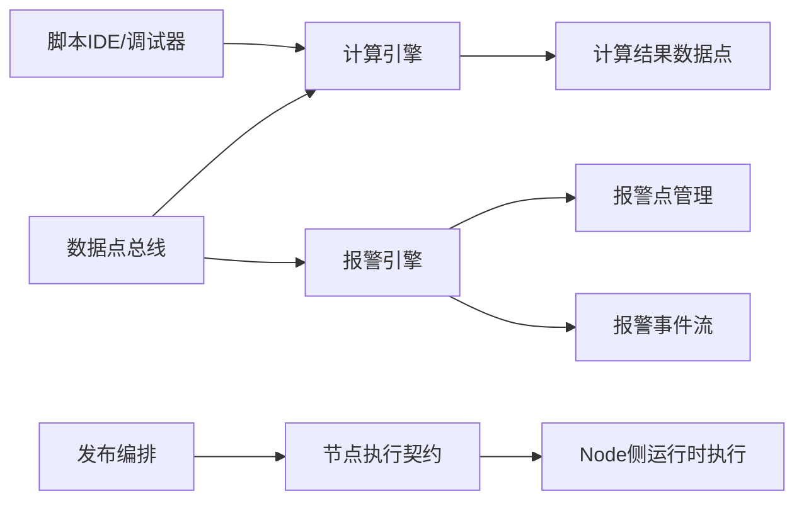
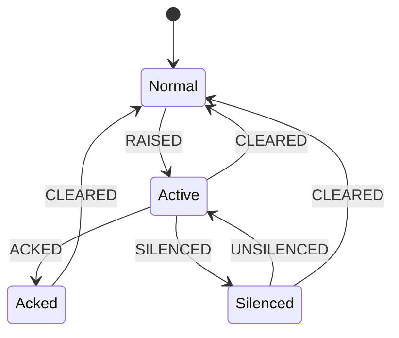

# 数据计算与报警计算设计

> 更新时间：2026-04-15  
> 适用范围：DataCenter（开发态）与 Node 侧运行态（执行契约）

## 1. 背景与目标

在“统一数据点抽象”前提下，数据中心需要新增两项核心能力：

1. 数据计算：基于数据点编写 JS/Python 脚本，对输入数据做加工并输出新的计算结果数据点。
2. 报警计算：基于已有数据点配置报警规则，产出报警点、报警实例与报警事件，支持确认、消音、删除等事件语义。

目标是形成一套完整、可发布、可在节点侧一致执行的设计；开发态提供预览与调试能力，运行态由节点服务执行。

## 2. 边界与原则

1. 数据中心职责：配置、编排、开发态调试与预览。
2. 节点侧职责：正式运行时执行、对接现场采集、对外提供运行态交互。
3. 回写边界：本设计不在数据中心提供回写能力；回写仅允许节点侧用户客户端发起。
4. 输出边界：数据计算输出到“计算结果数据点”；报警能力独立建模，不混入计算输出。
5. 发布边界：数据中心输出执行契约与配置快照，节点侧按契约执行。

## 3. 术语定义

1. 数据点（DataPoint）：统一数据抽象，支持查询与订阅消费。
2. 计算单元（Compute Unit）：一个可执行脚本单元，包含输入映射、触发策略、脚本代码、输出映射。
3. 报警规则（Alarm Rule）：针对一个或一组数据点定义的判定条件。
4. 报警实例（Alarm Instance）：一次报警生命周期（从触发到清除）。
5. 报警事件（Alarm Event）：实例生命周期中发生的离散事件。

## 4. 总体架构

说明：

1. 开发态与运行态执行模型保持一致，避免“调试能跑、上线不一致”。
2. 计算引擎和报警引擎共享数据点订阅能力，但各自独立存储与状态机。

### 4.1 服务落位与实现边界

1. 数据计算、报警计算、报警通知在独立数据中心 Go 服务中实现。
2. `dev_core` 保留控制面能力（认证、工程成员与角色、统一 RBAC、网关聚合），不承载计算/报警执行内核。
3. 前端接口仍通过 `/api/v1/data` 访问，由网关转发到 Go 服务。
4. OPC DA 采用 Windows 专用适配器（建议 C#/.NET）接入，再由适配器与 Go 服务对接。
5. 权限模式沿用工程级统一 RBAC：Go 服务仅消费 capability，不维护角色主数据。

## 5. 数据计算设计

### 5.1 计算单元模型

每个计算单元建议包含：

1. `id`、`projectId`、`name`、`enabled`
2. `language`：`js | py`
3. `triggerType`：`manual | timer | datapoint_change`
4. `triggerConfig`：定时表达式、变化触发条件、死区配置等
5. `inputBindings`：输入变量映射（变量名 -> 数据点 path）
6. `outputBindings`：输出变量映射（输出名 -> 结果数据点 path）
7. `timeoutMs`：单元超时（默认 3000ms）
8. `scriptCode`：脚本正文
9. `version`、`createdAt`、`updatedAt`

### 5.2 脚本语言与组织方式

1. 创建计算单元时选择脚本语言（JS 或 Python）。
2. 同一项目允许同时存在 JS 与 Python 计算单元。
3. 运行时按单元语言路由到对应执行器。

### 5.3 触发策略

支持：

1. 手动触发：用于调试和临时计算。
2. 定时触发：固定周期执行。
3. 变量变化触发：指定输入数据点变化时执行。

变量变化触发策略：

1. 默认“值变化即触发”。
2. 可选死区（Deadband）避免抖动频繁执行。

### 5.3.1 调度语义（补充）

1. 时区：按项目时区执行，默认 `Asia/Shanghai`。
2. 错过窗口补偿策略：支持 `skip`、`catchup_once`、`catchup_all`，默认 `skip`。
3. 重叠执行策略：支持 `skip_if_running`、`queue_one`、`parallel`，默认 `skip_if_running`。
4. 触发抖动保护：支持配置最小触发间隔，避免高频抖动导致调度风暴。

### 5.4 输入访问模型

脚本中支持两种访问方式并存：

1. 变量映射访问：`inputs.temp`（优先）
2. 路径访问：`ctx.get("mqtt.xxx.temp")`

输入源支持查询快照与订阅增量：

1. 查询型：按执行时刻读取最新值。
2. 订阅型：由触发器驱动执行，读取触发上下文中的新值。

### 5.5 输出模型

1. 输出目标固定为“计算结果数据点（calc.\*）”。
2. 一个计算单元可输出多个结果数据点。
3. 输出写入统一数据点总线，供后续页面、规则、其他计算单元消费。

### 5.6 执行模型

1. 开发态：DataCenter 提供调试执行会话。
2. 运行态：发布后由 Node 侧执行器执行。
3. 一致性要求：相同输入下开发态与运行态结果一致（允许微小时间戳差异）。

超时与资源约束：

1. 全局默认超时：3000ms。
2. 支持单元级覆盖。
3. 超时、异常不应阻塞其他计算单元执行。

### 5.6.1 脚本沙箱约束（补充）

1. 资源限制：每次执行受 `timeoutMs`、内存上限、并发上限约束。
2. 导入限制：仅允许平台白名单库，禁止动态加载未授权模块。
3. 权限限制：默认禁止文件系统写入、系统命令执行、任意网络访问。
4. 运行隔离：计算单元之间运行上下文隔离，避免状态污染。
5. 错误分级：区分脚本错误、资源超限、平台错误，统一错误码输出。

## 6. 脚本 IDE 与调试设计

### 6.1 IDE 基线

1. 提供类似 VSCode Web 的编辑体验（Monaco）。
2. 支持语法高亮、自动补全、错误提示、格式化。
3. 内置数据点选择器与变量映射面板。

### 6.2 调试能力

调试会话支持：

1. 断点调试（Breakpoint）
2. 单步执行（Step Over/Into/Out）
3. 变量观察（Watch）
4. 调用栈（Call Stack）
5. 控制台输出与运行日志

约束：

1. 调试仅作用于开发态会话，不影响正式运行任务。
2. 调试会话超时自动释放资源。

## 7. 报警计算设计

### 7.1 核心模型

报警能力拆分为三层：

1. 报警规则（Rule）：定义“何时报警”。
2. 报警实例（Instance）：描述“一次报警过程”。
3. 报警事件（Event）：记录过程中的关键动作。

### 7.2 严重度（Severity）

严重度固定 5 级，映射如下：

1. `5 = 紧急`
2. `4 = 高`
3. `3 = 中`
4. `2 = 低`
5. `1 = 提示`

说明：`severity` 表示风险等级，不等价于报警发生次数。

### 7.3 报警升级级别（escalation_level）

`escalation_level` 与 `severity` 分离，用于表达“重复出现程度”。  
当前默认策略（低噪声）：

1. 新实例触发时从 `1` 开始。
2. 实例未清除期间重复命中不升级。
3. 实例 `CLEARED` 后，下一个新实例重新从 `1` 开始。

补充：累计触发次数使用 `occurrence_count` 统计，不混入 `severity`。

### 7.4 规则类型

规则配置优先支持可视化，覆盖：

1. 高高（HH）
2. 高（H）
3. 低（L）
4. 低低（LL）
5. 大偏差（正偏差超过阈值）
6. 小偏差（负偏差超过阈值）
7. 变化率（默认按单位时间变化百分比超过阈值）

并支持自定义表达式规则（CEL），不使用 JS/Python 作为报警规则语言。

### 7.4.1 死区（滞回）策略

为避免临界值抖动导致频繁报警/清除，阈值类与偏差类规则默认支持滞回参数：

1. 高限类：`high` 触发，`high_clear` 清除（`high_clear < high`）
2. 低限类：`low` 触发，`low_clear` 清除（`low_clear > low`）
3. 偏差类：`dev_high/dev_low` 触发，`dev_high_clear/dev_low_clear` 清除
4. 变化率类：`roc_high/roc_low` 触发，`roc_high_clear/roc_low_clear` 清除，默认单位为 `%/s`

说明：

1. 规则表单需显式展示“触发阈值/清除阈值（回差）”。
2. 未配置清除阈值时，可按系统默认回差自动生成。
3. 变化率默认计算口径：`(当前值 - 前值) / max(|前值|, epsilon) / 时间差`，结果单位 `%/s`。

### 7.5 报警事件类型

事件类型：

1. `RAISED`：触发
2. `CLEARED`：清除
3. `ACKED`：确认
4. `SILENCED`：消音
5. `UNSILENCED`：取消消音
6. `RULE_DELETED`：规则删除

删除策略：

1. 允许删除报警规则。
2. 历史报警事件不做物理删除（保留审计可追溯性）。

### 7.6 报警状态机

### 7.6.1 报警实例归并与新建规则（补充）

1. 实例主键建议：`projectId + ruleId + targetKey`（targetKey 可为设备/点位/对象标识）。
2. `Normal -> Active` 时新建实例并产生 `RAISED` 事件。
3. `Active/Acked/Silenced` 期间重复命中同一规则，不新建实例，仅更新 `occurrence_count` 与最近触发时间。
4. `CLEARED` 后再次命中，创建新实例（新周期），不复用已清除实例。
5. 支持触发延时与清除延时（on-delay/off-delay），降低抖动造成的频繁开合。

## 8. 报警通知中心设计

### 8.1 功能定位

报警通知中心消费报警事件流，按通知策略向外部渠道推送消息，实现“报警事件 -> 通知投递 -> 回执审计”的完整闭环。

### 8.2 通知渠道

内置渠道：

1. HTTP Webhook
2. 钉钉机器人
3. 企业微信机器人
4. 站内消息（`runtime_inapp`，运行态前端消息提示）

设计要求：

1. 渠道统一抽象为 `Channel Adapter`，便于后续扩展。
2. 渠道密钥、Token 等敏感字段加密存储。
3. `runtime_inapp` 渠道支持按项目、节点、角色或用户范围路由。
4. `runtime_inapp` 同时支持通知中心列表、未读数统计、历史查询能力。

### 8.2.1 runtime_inapp 展示形态约定

1. 右上角通知提示采用内置提示形态，不单独建设 UI 组件入口。
2. 通知中心入口后续以独立 UI 组件提供（可复用于不同运行态页面）。
3. 通知中心组件需承载列表、未读数、历史检索与已读管理能力。

### 8.2.2 runtime_inapp 投递链路（补充）

1. 数据中心通知引擎生成 `runtime_inapp` 投递任务并下发到节点消息通道。
2. 节点侧接收后写入本地通知收件箱，再推送给运行态前端会话。
3. 前端 ACK 回执驱动消息状态流转（未读 -> 已读）。
4. 节点离线时消息落本地队列，恢复后按顺序补投。
5. 幂等键建议：`eventId + policyId + channelId + targetUser`，避免重复投递。

### 8.3 通知策略模型

每条通知策略建议包含：

1. 基础信息：`id`、`projectId`、`name`、`enabled`
2. 事件过滤：可选择 `RAISED/CLEARED/ACKED/SILENCED/UNSILENCED/RULE_DELETED`
3. 条件过滤：按 `severity`、规则分组、设备分组、标签过滤
4. 渠道路由：单策略可配置多渠道并行投递
5. 模板配置：标题模板、正文模板、变量映射
6. 抑制与聚合：去重窗口、聚合窗口、静默时段
7. 重试策略：最大重试次数、退避策略、超时阈值

### 8.3.1 策略冲突与优先级（补充）

1. 策略优先级字段：`priority`（数值越大优先级越高）。
2. 同时命中多策略时，按 `priority DESC, createdAt ASC` 决定执行顺序。
3. 去重策略：同一报警事件在同一渠道同一目标内按幂等键去重。
4. 聚合策略：支持 `first_match`、`merge_all`、`highest_severity` 三种模式。

### 8.4 投递机制

1. 报警事件入通知任务队列，异步投递。
2. 失败按指数退避重试，超限进入失败队列。
3. 支持失败任务人工重放。
4. 支持幂等键，避免重复通知。

### 8.5 模板变量

模板内可引用：

1. 报警信息：`alarm.name`、`alarm.ruleType`、`alarm.severity`、`alarm.message`
2. 实例信息：`instance.id`、`instance.status`、`instance.startTime`、`instance.clearTime`
3. 数据点信息：`point.path`、`point.value`、`point.timestamp`
4. 项目信息：`project.name`、`project.id`

### 8.6 审计与追踪

1. 记录每次投递请求、响应码、响应体摘要、耗时、重试次数。
2. 可按报警实例追溯“发给了谁、是否成功、失败原因”。
3. 通知失败不影响报警引擎主流程。

## 9. 数据库设计建议（共用现有库，可调整）

建议新增/扩展如下表（命名可在实现阶段与现有规范再对齐）：

1. `data_compute_units`：计算单元主表
2. `data_compute_unit_inputs`：输入绑定
3. `data_compute_unit_outputs`：输出绑定
4. `data_compute_unit_runs`：执行记录（调试/运行）
5. `data_alarm_rules`：报警规则
6. `data_alarm_instances`：报警实例
7. `data_alarm_events`：报警事件流
8. `data_alarm_channels`：通知渠道配置
9. `data_alarm_notify_policies`：通知策略
10. `data_alarm_notify_deliveries`：通知投递记录

关键字段建议：

1. 时间字段统一 `YYYY-MM-DD HH:mm:ss`
2. 所有查询均参数化
3. 索引优先覆盖 `projectId`、`ruleId`、`instanceId`、`status`、`createdAt`

### 9.1 数据保留与归档策略（补充）

1. `data_compute_unit_runs`：默认保留 30 天（可配置）。
2. `data_alarm_events`：默认保留 180 天（可配置）。
3. `data_alarm_notify_deliveries`：默认保留 90 天（可配置）。
4. `runtime_inapp` 历史消息：默认保留 180 天（可配置）。
5. 支持冷热分层归档与按项目维度清理任务。

## 10. API 草案（路由尽量保持一致）

以 `/api/v1/data/projects/:projectId` 为前缀，新增：

1. `/compute-units`：计算单元 CRUD
2. `/compute-units/:id/debug`：启动调试会话
3. `/compute-units/:id/run`：手动执行
4. `/alarm-rules`：报警规则 CRUD
5. `/alarm-rules/:id/test`：规则试算
6. `/alarm-instances`：报警实例查询
7. `/alarm-events`：报警事件查询
8. `/alarm-events/:id/ack`：确认
9. `/alarm-events/:id/silence`：消音/取消消音
10. `/alarm-channels`：通知渠道 CRUD
11. `/alarm-channels/:id/test`：渠道连通性测试
12. `/alarm-notify-policies`：通知策略 CRUD
13. `/alarm-notify-deliveries`：投递记录查询
14. `/alarm-notify-deliveries/:id/replay`：失败投递重放

响应统一 `ApiResponse`：`success/errorCode/message/requestId/data`。

## 11. 发布与运行契约

发布时输出：

1. 计算单元定义（语言、触发、输入输出、超时、脚本）
2. 报警规则定义（规则类型、阈值/表达式、严重度策略）
3. 报警通知定义（渠道、策略、模板、重试）
4. 版本与校验信息（用于节点侧一致性校验）

节点侧运行约束：

1. 执行模型与开发态对齐。
2. 运行态交互由节点客户端承载（含后续回写入口）。

## 12. 可观测性与运维

1. 计算维度：执行次数、成功率、超时率、平均耗时。
2. 报警维度：规则触发率、活动实例数、确认率、消音率。
3. 通知维度：投递成功率、平均投递延迟、重试率、失败率、失败原因分布。
4. 调试维度：会话数、平均会话时长、断点执行次数。

## 13. 安全与权限

1. 按项目进行访问隔离。
2. 规则编辑、确认、消音、删除分离权限点。
3. 通知渠道与策略编辑独立权限点。
4. 所有敏感动作记录审计日志（谁、何时、操作对象、变更内容）。
5. `runtime_inapp` 权限分层：查看、已读、确认、消音分别授权。
6. 默认最小权限原则：仅可见与当前项目和授权范围匹配的报警消息。

## 13.1 工程级角色入口约定

1. 工程运行态用户与角色主数据配置入口统一放在“工程卡片”的 `成员与权限`。
2. 工程卡片只维护用户与角色主数据；页面、动作、数据对象等资源权限在设计中心和数据中心的就近位置配置。
3. 设计中心与数据中心共用同一套工程运行态用户角色体系，不各自维护独立角色主数据入口。
4. 运行态权限随发布部署一起下发到节点本地安全快照，由节点侧本地生效，不依赖中心在线校验。

## 13.2 规则语言边界

1. 数据计算脚本：使用 `JS/Python`。
2. 报警自定义规则：使用 `CEL` 表达式引擎。
3. 目标是让报警规则具备可校验、可控、可视化互转能力，降低脚本执行风险。

## 13.3 CEL 治理策略（补充）

1. 函数白名单：仅开放比较、逻辑、数学、时间与必要转换函数。
2. 保存前校验：表达式编译校验 + 引用变量存在性校验 + 类型校验。
3. 运行时保护：执行超时与复杂度限制，防止表达式滥用。
4. 版本兼容：规则记录 `celVersion`，升级时提供兼容检查与批量校验。
5. 错误规范：统一 `errorCode` 与可读错误信息，便于前端定位。

## 14. 与现有文档关系

1. 本文为“数据计算 + 报警计算”专项设计。
2. 协议接入与数据开发服务总设计见：`docs/datacenter/data-development-service-design.md`。
3. 数据点抽象与命名规范见：`docs/datacenter/datapoint-design.md`。

## 15. 当前已冻结决策（来自本轮讨论）

1. 先采用脚本 IDE，不引入流程编排（如 Node-RED）。
2. 计算语言支持 JS/Python，按单元选择。
3. 触发包含手动、定时、变量变化。
4. 计算输出先落到“计算结果数据点”。
5. 报警功能独立建模，支持确认、消音、删除事件语义。
6. `severity` 固定 5 级，映射为 `5紧急/4高/3中/2低/1提示`。
7. 报警历史事件保留，不做物理删除。
8. 规则类型补充为 `大偏差/小偏差/变化率`，并在规则层引入死区（滞回）参数。
9. 报警自定义规则语言使用 `CEL`，不采用 `JS/Python`。
10. 报警通知中心纳入完整能力，内置 `HTTP Webhook/钉钉/企业微信/运行态站内消息(runtime_inapp)` 四类渠道，不包含邮件渠道。
11. 补齐调度语义：项目时区、错过窗口补偿、重叠执行策略。
12. 补齐实例策略：实例归并与新建规则、触发/清除延时。
13. 补齐 `runtime_inapp` 链路：节点离线补投、幂等去重、前端 ACK 回执。
14. 补齐通知策略冲突规则：`priority` 优先级与聚合模式。
15. 补齐数据保留策略与 CEL 治理策略。
16. 工程运行态用户角色主数据入口统一上移到工程卡片，资源权限在设计中心与数据中心就近配置，并随发布部署一起生效。
17. 数据计算/报警/通知执行内核在独立数据中心 Go 服务实现，`dev_core` 保留控制面。
18. OPC DA 采用 Windows 专用适配器（建议 C#/.NET）对接 Go 主服务。
