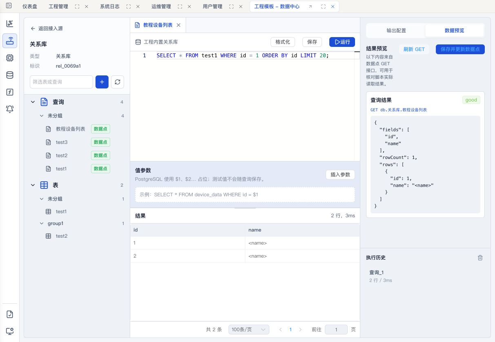
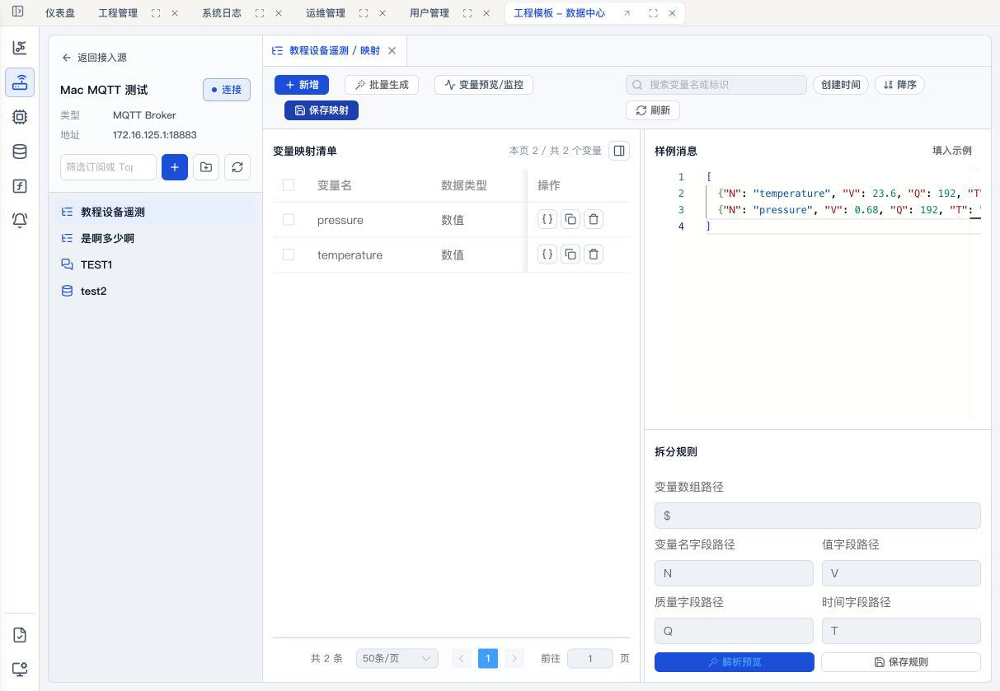
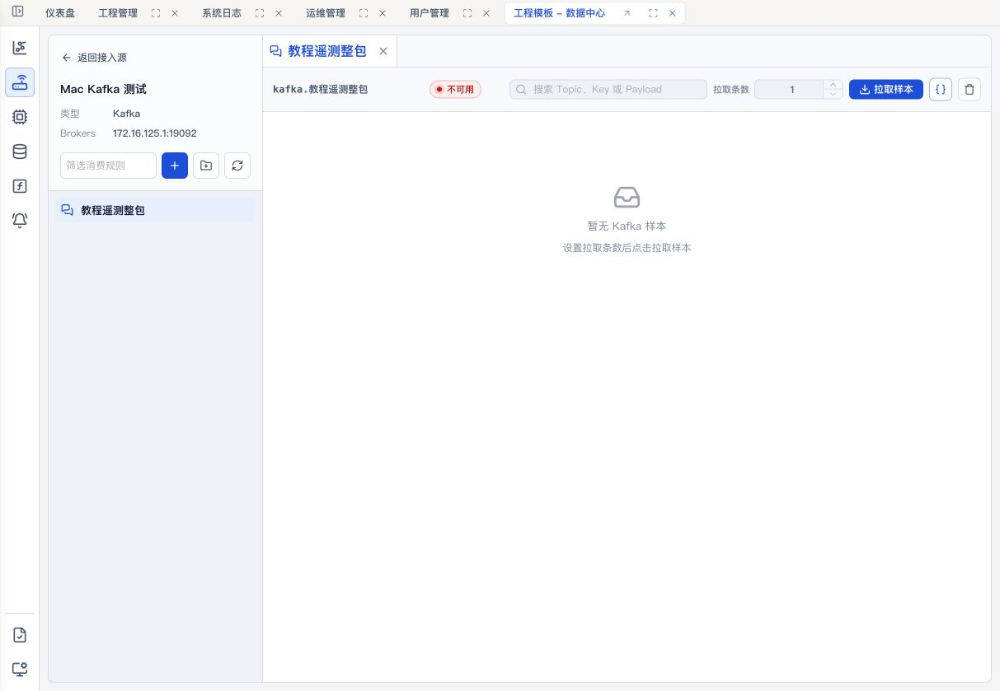
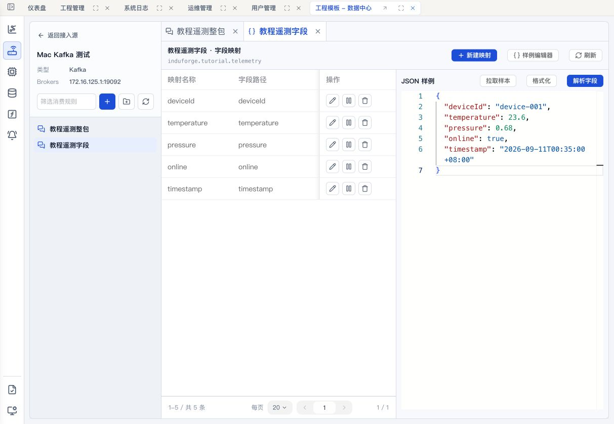
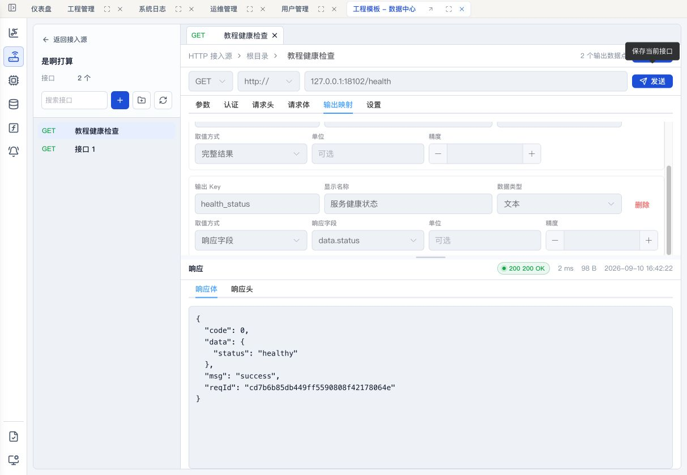
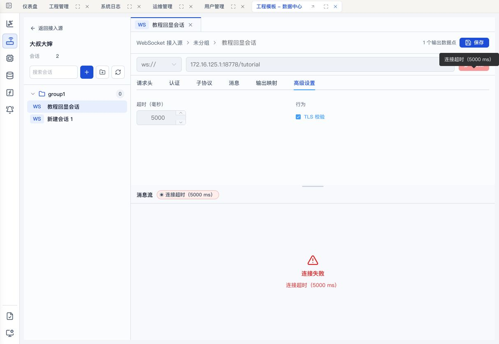

# 接入源工作台用户教程参考

本文整理数据中心当前接入源工作台的真实交互，供后续编写 Wiki 用户教程、准备演示数据和执行回归验收时参考。内容以 2026-09-11 的代码和本地开发环境为准。

## 1. 阅读说明

本文使用以下状态区分结论来源：

- **界面实测**：已在 Studio 右侧浏览器实际创建、保存或执行，并回读界面结果。
- **界面检查**：已打开页面或弹窗，检查控件和状态，但没有完成外部协议调用。
- **代码确认**：从当前前端实现、接口定义和正式契约确认，尚未完成对应运行链路实测。
- **未验证**：当前环境缺少可达的协议服务、消息样本或有效登录会话，不能把代码存在写成运行成功。

工作台验收问题单独记录在 [接入源工作台验收问题清单](./接入源工作台验收问题清单.md)，本文不把待修复行为写成推荐操作。

## 2. 接入源总览

### 2.1 当前类型

| 分类 | 接入源类型 | 工作台实现 |
| --- | --- | --- |
| 内置库 | 关系库 | SQL 工作台 |
| 内置库 | 时序库 | SQL 工作台 + TimescaleDB 时序能力 |
| 内置库 | 实时库 | Key/Value 工作台 |
| 内置库 | 消息库 | MQTT 工作台 |
| 外部数据库 | MySQL | SQL 工作台 |
| 外部数据库 | PostgreSQL | SQL 工作台 |
| 外部数据库 | SQL Server | SQL 工作台 |
| 外部数据库 | TDengine | 只读对象管理的 SQL 工作台 |
| 外部实时库 | Redis | Key/Value 工作台 |
| 消息与协议 | MQTT | MQTT 订阅工作台 |
| 消息与协议 | Kafka | 消费规则工作台 |
| 请求协议 | HTTP | HTTP 请求工作台 |
| 请求协议 | WebSocket | WebSocket 会话工作台 |

### 2.2 列表页公共操作

1. 在数据中心左侧导航进入“接入源”。
2. 使用顶部搜索框按名称筛选；使用“类型”筛选指定协议或数据库。
3. 使用卡片/列表切换查看方式。刷新页面后应保留当前菜单和视图偏好。
4. 卡片分页默认根据可用高度动态计算每页数量；用户仍可在分页区改为固定数量。
5. 外部接入源卡片提供“测试连接”，用于短时验证地址、端口和认证；内置库不需要该按钮。
6. 点击“工作台”进入对应类型的开发工具。名称本身不承担跳转，避免误触。
7. 编辑接入源只修改连接配置；工作台中的查询、Key、订阅、消费规则、接口或会话是另一层对象。

列表页的“正常”表示接入源配置当前处于可用状态，不等于工作台内所有查询、订阅或会话都已经运行。

## 3. SQL 类工作台

内置关系库、内置时序库、MySQL、PostgreSQL、SQL Server 和 TDengine 共用 SQL 工作台。用户可以在相同布局中管理查询和数据库对象，但各数据库的参数方言和写操作范围不同。



### 3.1 页面组成

- 左侧顶部显示接入源名称、类型和数据库信息。
- 左侧对象树分为“查询”和“表”，两类对象都可以按分组组织。
- 中间使用多标签页打开 SQL 查询、表数据预览或表结构。
- SQL 编辑器下方依次是值参数和结果区。
- 右侧在“输出配置”和“数据预览”之间切换。
- 右下方是当前打开工作台的执行历史。
- 编辑器与结果区、结果区与右侧面板均使用稳定的分区布局；分隔条可拖动，双击恢复默认高度。

### 3.2 新建和运行查询

1. 点击左上角“新建查询”。系统创建一个未保存的查询标签，并预填 `SELECT * FROM`。
2. 在 Monaco 编辑器中输入完整 SQL。当前执行的是整个编辑器内容，不支持只执行选中片段。
3. 需要参数时点击“插入参数”，系统按当前数据库方言插入下一个占位符。
4. 在编辑器下方填写测试值。测试值只用于本次运行和 GET 预览，不随查询保存。
5. 点击“格式化”按当前数据库方言整理 SQL。
6. 点击“运行”。成功后结果区显示字段、行数、耗时和分页；无结果集的命令显示成功状态；失败时结果区显示错误。
7. 结果分页只处理本次接口已返回的行，分页总数不是数据库表总行数。数据库总量应由 SQL 自行返回。

参数占位符如下：

| 类型 | 占位符示例 |
| --- | --- |
| 内置关系库、内置时序库、PostgreSQL | `$1`、`$2` |
| MySQL、TDengine | `?` |
| SQL Server | `@p1`、`@p2` |

### 3.3 保存和管理查询

1. 新查询第一次点击“保存”时输入查询名称。
2. 保存后查询出现在左侧查询树；再次保存直接更新，不重复询问名称。
3. 查询右键菜单提供打开、重命名、移动分组和删除。
4. 标签页右键提供关闭当前、关闭右侧和关闭全部。
5. SQL 已修改时关闭标签或离开工作台会提示处理未保存内容。
6. 查询分组支持新建、重命名、移动和删除。删除分组不会删除查询，查询回到未分组。

### 3.4 结果和执行历史

- 结果表格将 `NULL`、对象和数组转换为可读文本，长内容使用溢出显示。
- 接口结果受行数、字节和超时限制；出现“结果不完整”时，当前工作台没有导出完整结果的入口。
- 执行历史最多保留 50 条成功记录，只存在当前组件内存中。
- 点击历史项会创建 SQL 副本，不会自动再次执行。
- 点击执行历史右侧的清理图标并确认，可清空当前工作台历史。

### 3.5 生成数据点

SQL 查询当前只生成一个输出数据点，支持两种形式：

- **完整查询结果**：对象包含 `fields`、`rows`、`rowCount`。
- **提取单个字段**：要求查询结果恰好一行，从该行提取一个字段作为标量数据点。

操作步骤：

1. 先运行 SQL，使工作台取得字段列表和样本结果。
2. 保持“完整查询结果”，或在输出配置中点击“提取单个字段”并选择字段。
3. 点击“保存并生成数据点”。未保存查询会先要求输入名称。
4. 生成成功后，左侧查询显示“数据点”标识。
5. 切换到“数据预览”，点击“刷新 GET”，通过真实数据点 GET 接口检查保存后的 SQL 结果。
6. 修改输出提取方式后，使用“保存并更新数据点”同步输出配置。
7. 修改已保存 SQL 后，应先点击编辑区“保存”，再刷新 GET。当前“保存并更新数据点”只同步输出配置。

2026-09-11 的界面实测创建了查询“教程设备列表”，运行：

```sql
SELECT *
FROM test1
WHERE id = 1
ORDER BY id
LIMIT 20;
```

查询成功返回字段 `id`、`name`，保存后生成完整结果数据点，GET 预览回读 `rowCount = 1`。

### 3.6 表与结构操作

通用只读操作：

- 打开表数据预览，系统生成最多 100 行的查询并执行。
- 打开表结构，查看字段名称、类型、可空、默认值、备注和索引。
- 从结构页进入“查询数据”。

MySQL、PostgreSQL、SQL Server 和内置关系/时序库还提供：

- 新建表：配置字段、长度、精度、小数位、主键、可空、自增、默认值、备注和索引。
- 插入数据：根据结构生成可编辑的 `INSERT` 模板，用户确认后再运行。
- 重命名表和删除表。

仅内置关系库和内置时序库提供“修改表结构”。TDengine 工作台不显示新建、修改、重命名、删除或插入模板入口。

### 3.7 内置关系库

- 使用工程内置 PostgreSQL 兼容关系库。
- 适合工程配置、业务关系数据、查询数据集和计算输入。
- 支持查询、表设计、表结构修改、分组、数据点生成和 GET 预览。
- 用户无需填写连接地址或凭据，运行位置由中心内置服务管理。

### 3.8 内置时序库

内置时序库在 SQL 工作台基础上增加 TimescaleDB 能力：

1. 新建表时可选择普通表或时序超表。
2. 时序超表可配置时间分区字段、维度字段、Chunk 间隔和保留天数。
3. 表结构页额外显示 Hypertable、时间字段、维度字段、Chunk 和保留策略。
4. 超表右键提供“最近时序”“时间聚合”“异常质量”查询模板。
5. 查询模板只生成可编辑 SQL，不会自动执行；用户应检查时间字段、数值字段和 `quality` 字段是否符合实际表结构。

### 3.9 MySQL、PostgreSQL、SQL Server

三者操作一致，主要差异是 SQL 方言和参数占位符：

- 进入工作台后先刷新对象树，确认数据库可访问。
- 表预览会按数据库方言生成限量 SQL；SQL Server 使用 `OFFSET ... FETCH NEXT`，其他类型使用 `LIMIT`。
- 运行写 SQL 会直接作用于外部数据库，应先在测试库验证。
- 查询、输出配置和数据点路径仍属于当前工程，不会写入外部数据库元数据。

当前三个测试接入源在列表页均显示正常；本轮因浏览器会话中途失效，没有再次提交写 SQL，故只把连接和既有对象视为界面检查，不写成外部数据库写入实测通过。

### 3.10 TDengine

- 对象树按超级表、普通表和子表组织。
- 顶部显示 WS 地址和时区信息。
- 支持 SQL 查询、参数、保存查询、表结构查看、分组、输出配置和数据点生成。
- 前端隐藏表写管理入口，定位为查询和结构浏览工作台。
- 时区由数据服务和 TDengine 连接配置处理，用户不应依赖浏览器所在系统时区解释原始时间戳。

## 4. 实时库与 Redis 工作台

内置实时库和外部 Redis 共用 Key/Value 工作台。内置实时库由中心提供运行服务；外部 Redis 使用接入源连接配置。

### 4.1 页面组成

- 左侧按 `:` 分段把 Key 组织成目录树，并显示 Key 类型和数据点标识。
- 搜索调用后端筛选，支持继续加载，最多显示前 10000 个 Key。
- 中间支持多标签打开 Key，标签上的圆点表示未保存修改。
- 顶部可以修改 Key 类型、TTL 和内容；已存在 Key 通过独立“重命名”操作修改名称。
- Key 右键菜单提供打开、创建数据点、重命名和删除。
- 目录右键菜单提供“为该分组创建数据点”。
- 有搜索条件时，可为全部筛选结果批量创建数据点。

### 4.2 新建 Key

1. 点击左上角“新建 Key”。
2. 输入完整 Key，例如 `tutorial:device1:state`。Key 不能为空、不能包含控制字符，UTF-8 长度不能超过 512 字节。
3. 选择类型：`string`、`hash`、`list`、`set` 或 `zset`。
4. 填写 TTL，`0` 表示不过期。
5. 按类型编辑值。
6. 点击“保存”。保存成功后工作台会尝试自动生成对应数据点。

### 4.3 各 Key 类型的编辑方式

| 类型 | 编辑方式 | 常用操作 |
| --- | --- | --- |
| string | Monaco 文本编辑器 | 文本/JSON 视图、格式化、复制、保存 |
| hash | Field/Value 表格 | 搜索、新增行、源码查看、删除行 |
| list | 有序 Value 表格 | 搜索、新增行、源码查看、删除行 |
| set | 无序成员表格 | 搜索、新增行、源码查看、删除行 |
| zset | Member/Score 表格 | 搜索、新增行、调整分值、源码查看、删除行 |
| stream | 只读源码视图 | 刷新和查看，不能在当前工作台保存 |

String 中的合法 JSON 可以格式化；生成数据点时会识别为对象或数组，普通文本识别为字符串。其他 Key 类型根据 Redis 类型和值推断数据点类型。

### 4.4 重命名、删除和草稿保护

- 已存在 Key 的名称输入框只读，点击编辑图标打开“重命名 Key”弹窗。
- 删除 Key 前会确认，并明确对应数据点会标记为失效。
- 关闭有未保存修改的 Key 标签时会确认是否放弃。
- 保存失败不会关闭标签，用户可以修正后重试。

本轮已完成代码确认和既有界面检查；计划使用 `tutorial:device1:state` 验证保存、TTL、重命名和删除确认，但 Studio 会话失效后未完成提交，不能写成实测通过。

## 5. 消息库与 MQTT 工作台

内置消息库和外部 MQTT 使用相同工作台。内置消息库由中心提供 Broker；外部 MQTT 使用接入源中的地址、端口和认证。



### 5.1 连接和订阅树

1. 点击接入源标题旁的“连接”，建立开发预览会话。
2. 左侧可以搜索订阅、新建订阅、新建分组和刷新。
3. 订阅和分组按树形组织；右键订阅可以查看、编辑、移动、删除或打开发布测试。
4. 多个订阅及其功能可以同时作为标签页打开。
5. 点击“断开”会停止当前预览连接、清理实时订阅并关闭变量监控。

### 5.2 新建订阅弹窗

填写：

- 名称：2 到 100 个字符。
- Topic：最长 500 个字符，支持 `+` 和 `#` 通配符。
- QoS：0、1、2。
- 使用方式：整包数据点、单变量、批量变量映射。
- 备注。

使用方式保存后不能修改。需要改变模式时，新建另一条订阅更清晰。

### 5.3 整包数据点

- 一条 MQTT Payload 对应一个对象数据点。
- 连接后在消息页点击订阅状态开始/停止实时订阅。
- 支持搜索 Topic/Payload、显示数量、JSON 格式化、自动滚动、时间戳、刷新、复制和清空。
- 默认显示 500 条，组件内存最多保留 5000 条。
- “清空”调用后端消息清理接口，不只是清空当前浏览器。

### 5.4 单变量

- 变量列表使用后端分页、搜索和排序。
- 支持新增、查看、编辑、删除、批量删除和导出筛选结果 CSV。
- 变量类型支持字符串、float64、布尔、对象和数组。
- 解析方式支持 JSONPath、正则、JavaScript、固定值。
- 可配置默认值、单位、转换函数和 JSON 验证规则。
- “变量预览/监控”显示当前值、质量和时间，不提供趋势图。

### 5.5 批量变量映射

1. 新建订阅时选择“批量变量映射”。
2. 在样例消息编辑器粘贴 JSON。
3. 配置变量数组路径、变量名字段、值字段、质量字段和时间字段。
4. 点击“解析预览”，将样例拆为变量草稿。
5. 在映射清单中修改变量名、类型或单行解析规则。
6. 点击“保存规则”保存订阅级拆分规则。
7. 点击“保存映射”批量新建、更新或删除变量及数据点。
8. 连接后打开“变量预览/监控”检查实时值。

本轮界面实测创建订阅“教程设备遥测”，Topic 为 `induforge/tutorial/device1`，使用以下样例：

```json
[
  {"N": "temperature", "V": 23.6, "Q": 192, "T": "2026-09-11T00:20:00+08:00"},
  {"N": "pressure", "V": 0.68, "Q": 192, "T": "2026-09-11T00:20:00+08:00"}
]
```

拆分规则为：

| 字段 | 路径 |
| --- | --- |
| 变量数组 | `$` |
| 变量名 | `N` |
| 值 | `V` |
| 质量 | `Q` |
| 时间 | `T` |

保存后生成 `temperature` 和 `pressure` 两个活跃数据点。

### 5.6 发布测试

- 从订阅右键菜单进入发布测试。
- 填写 QoS 和 JSON Payload 后发布。
- 当前发布 Topic 固定为订阅 Topic；含 `+/#` 的通配符订阅不能直接作为有效发布目标。

## 6. Kafka 工作台

Kafka 工作台管理消费规则，不是 Broker Topic 管理器。



### 6.1 新建消费规则

1. 点击左上角“新建消费规则”。
2. 选择输出模式：整包数据点或字段映射。保存后不能更换模式。
3. 填写规则名称、真实 Topic 和消费组名称。
4. 展开高级配置，选择分区策略、起始位置、解码方式、样本上限和预览超时。
5. 填写描述并保存。

消费组用于节点持续运行；开发预览读取样本时不使用该消费组，避免推进正式消费进度。

### 6.2 整包模式

- 每条 Kafka 消息作为一个数据点。
- 输出可以是 Payload，或包含 key、headers、partition、offset、payload 的完整消息。
- 顶部显示数据点路径，例如 `kafka.教程遥测整包`。
- 设置本次拉取条数后点击“拉取样本”。
- 样本列表支持 Topic/Key/Payload 搜索、JSON 格式化、复制和本地清空。
- 多次拉取按 Topic、Partition、Offset 去重。

本轮已保存“教程遥测整包”，Topic 为 `induforge.tutorial.telemetry`，但工作台状态为“不可用”，拉取时提示“读取 Kafka 预览配置失败”。规则保存成功，Broker 样本读取未通过。

### 6.3 字段映射模式



1. 新建字段映射规则并保存。
2. 在右侧“JSON 样例”中手工粘贴 JSON，或从 Broker 拉取一条样本。
3. 点击“格式化”检查可读性。
4. 点击“解析字段”，在候选弹窗中勾选需要的数据点。
5. 点击“保存选中字段”。
6. 回到列表后可编辑映射名称和类型、启停映射或删除。

本轮界面实测保存了“教程遥测字段”，并从以下 JSON 生成 5 个字段映射：

```json
{
  "deviceId": "device-001",
  "temperature": 23.6,
  "pressure": 0.68,
  "online": true,
  "timestamp": "2026-09-11T00:35:00+08:00"
}
```

自动推断结果为 `deviceId/string`、`temperature/float64`、`pressure/float64`、`online/bool`、`timestamp/string`。

### 6.4 当前能力边界

- 不管理 Topic 创建、删除或分区扩容。
- 不展示消费组 lag，不提交正式 offset，不创建回放任务。
- 整包样本是人工触发的开发读取，不是持续消费开关。
- 字段样例仅保存在当前组件内存中。

## 7. HTTP 工作台

HTTP 工作台采用请求集合和多标签编辑方式，交互接近 Postman/Apifox，但输出映射直接对接工程数据点。



### 7.1 新建接口和地址输入

1. 点击左上角“新建接口”。系统立即创建未保存标签。
2. 在面包屑末尾直接修改接口名称。
3. 选择 Method。
4. 协议下拉选择 `http://` 或 `https://`。
5. 地址输入框可只填 `host:port/path`；如果粘贴完整 URL，工作台自动识别协议并把协议显示在下拉框。
6. 点击右上角保存图标保存接口。
7. 点击“发送”时，如果接口尚未保存或有修改，工作台会先保存，再通过数据服务发起请求。

### 7.2 请求配置

- **参数**：启用的 Key/Value 会拼入 Query String，可填写说明。
- **认证**：无认证、Bearer Token、Basic Auth。
- **请求头**：默认提供 `Accept: application/json`、空的 `User-Agent` 和 `Cache-Control: no-cache`，可增删和启停。
- **请求体**：无、JSON、原始文本、multipart 表单、URL 编码表单。
- **设置**：超时 1000 到 30000 毫秒、跟随重定向、TLS 校验。

### 7.3 响应区

- 显示 HTTP 状态、耗时、响应字节数和接收时间。
- 可切换响应体和响应头。
- JSON 响应以格式化文本显示。
- 响应区上边界可拖动，双击恢复默认高度。

### 7.4 输出映射

HTTP 一个接口可以生成多个强类型数据点：

1. 默认输出完整响应对象。
2. 点击“添加输出”增加数据点。
3. 填写输出 Key、显示名称和数据类型。
4. 取值方式选择完整结果或响应字段。
5. 有真实响应样本后，响应字段下拉会列出嵌套路径，例如 `data.status`。
6. 可填写单位和精度。
7. 保存接口后，顶部显示输出数据点数量。

本轮界面实测创建“教程健康检查”，请求 `http://127.0.0.1:18102/health?source=wiki`，数据服务返回 `200 OK`：

```json
{
  "code": 0,
  "data": {
    "status": "healthy"
  },
  "msg": "success",
  "reqId": "..."
}
```

接口保存了两个输出：完整响应对象，以及从 `data.status` 提取的文本数据点“服务健康状态”。

## 8. WebSocket 工作台

WebSocket 工作台以会话为对象。浏览器连接 Studio 的数据服务流接口，由数据服务代理到目标 WebSocket，不是浏览器直接访问目标地址。



### 8.1 新建和保存会话

1. 点击左上角“新建会话”。
2. 在面包屑末尾修改会话名称。
3. 协议选择 `ws://` 或 `wss://`。
4. 地址可只填 `host:port/path`；粘贴完整 URL 时自动识别协议。
5. 按需要配置请求头、认证、子协议、消息、输出映射和高级设置。
6. 点击保存图标。点击“连接”时，有未保存修改会先保存会话。
7. 已连接时再次点击顶部按钮执行断开。

### 8.2 配置标签

- **请求头**：多行 Key/Value，支持启停和删除。
- **认证**：无认证、Bearer Token、Basic Auth。
- **子协议**：添加一个或多个 WebSocket subprotocol，可逐项启停。
- **消息**：JSON 或文本编辑模式；连接且内容非空后才能发送。
- **输出映射**：默认完整消息对象，可根据最近收到的 JSON 消息增加响应字段输出。
- **高级设置**：连接超时 1000 到 30000 毫秒，`wss` 可控制 TLS 校验。

### 8.3 消息流

- 显示连接中、已连接、未连接或连接错误。
- 每条消息显示收/发方向、消息类型、字节数和格式化 Payload。
- 重新连接会清空当前消息列表；关闭标签会关闭流连接。
- 当前没有搜索、复制、清空、时间戳、条数限制或持久历史入口。

本轮保存了“教程回显会话”，请求头为 `X-Tutorial: InduForge`，消息样例为：

```json
{"action":"ping","requestId":"wiki-001"}
```

分别尝试连接 Mac 宿主地址和绑定在 Docker 网桥的临时回显服务，均在 5000 毫秒后超时。会话保存和错误反馈已实测，消息收发及基于接收样本的字段输出未验证。

## 9. 数据点生成后的检查

1. 返回数据中心“数据点”页面。
2. 按名称或路径搜索刚生成的数据点。
3. 核对数据类型、来源接入源和路径。
4. 对 SQL、HTTP 等主动读取源，使用工作台中的 GET/发送操作确认值。
5. 对 MQTT、Kafka、WebSocket 等消息源，先确认开发预览连接和样本，再判断最新值与质量。
6. 对 Redis/实时库，保存 Key 后确认自动数据点生成结果；批量操作要核对新建、已存在和失败数量。

不要仅凭接入源卡片“正常”判断数据点已产值。连接配置、工作台对象、开发预览和节点运行采集是四个不同层级。

## 10. Wiki 截图建议

正式 Wiki 每种工作台建议保留以下截图：

1. 接入源列表页：卡片与列表视图各一张。
2. 新建连接类型选择弹窗。
3. SQL：运行结果、保存查询、表结构、表设计、输出配置、GET 预览。
4. 实时库/Redis：String、Hash、List/Set、ZSet 编辑和重命名确认。
5. MQTT：三种订阅模式、新建订阅、批量解析规则、变量监控、发布测试。
6. Kafka：整包规则、字段规则、样例解析候选、映射列表。
7. HTTP：请求行、认证、请求体、响应、多个输出字段。
8. WebSocket：会话配置、连接成功、消息收发、输出字段映射。
9. 每个失败场景只截一张能说明原因的图，避免用多个重复 toast 充当步骤说明。

截图前应使用统一的“教程”测试数据，隐藏密码、Token、真实生产地址和用户信息。

## 11. 本轮教程测试数据

| 接入源 | 测试对象 | 结果 |
| --- | --- | --- |
| 内置关系库 | 查询“教程设备列表” | 运行、保存、生成数据点、GET 预览通过 |
| Mac MQTT 测试 | 订阅“教程设备遥测” | `temperature`、`pressure` 两个映射已保存 |
| Mac Kafka 测试 | “教程遥测整包” | 规则保存通过，样本读取失败 |
| Mac Kafka 测试 | “教程遥测字段” | 5 个字段映射保存通过 |
| HTTP 接入源 | “教程健康检查” | `200 OK`，2 个输出已保存 |
| WebSocket 接入源 | “教程回显会话” | 会话保存通过，连接超时 |
| 内置实时库/Redis | `tutorial:device1:state` | 受登录失效影响，尚未提交 |

后续验收应在同一测试工程中保留这些对象，避免重复创建多个名称相近的无效样例。完成 Wiki 截图后，再按项目数据管理要求决定是否删除。
