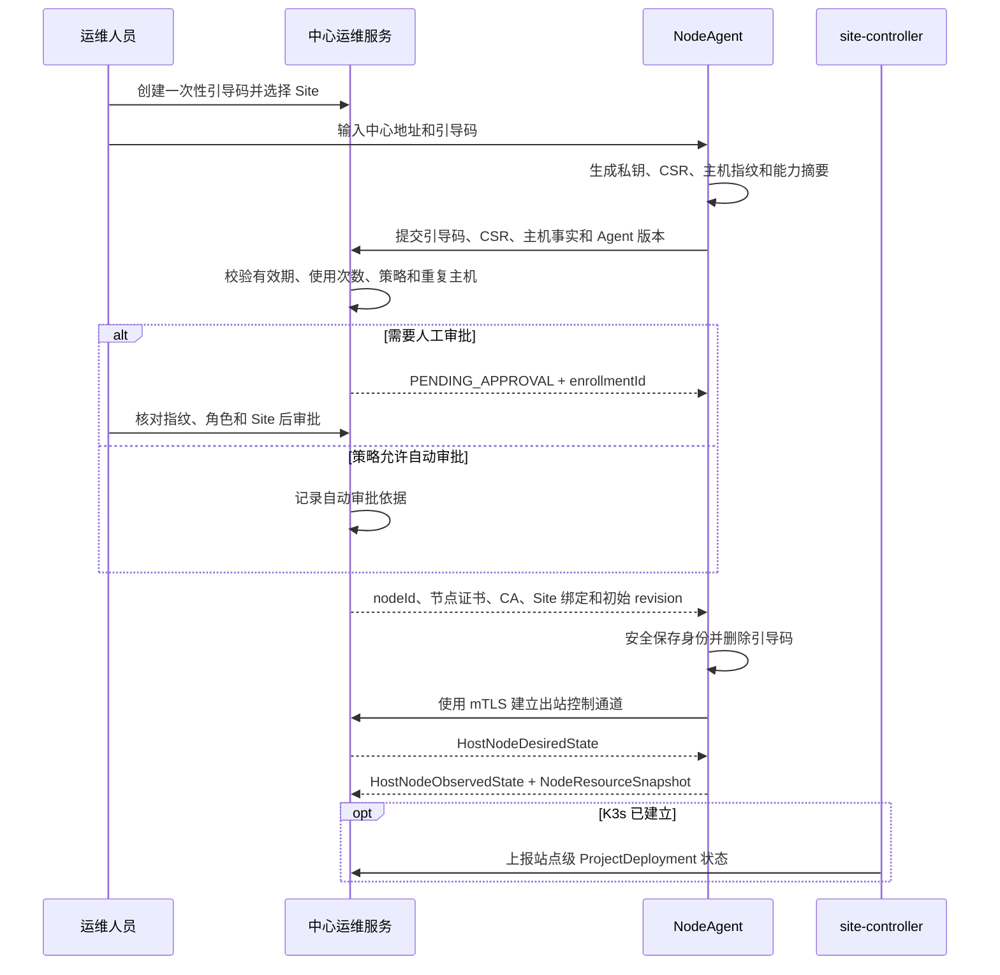

# NodeAgent 初始化与注册流程

## 1. 文档定位

本文定义 NodeAgent 的目标初始化流程。NodeAgent 按宿主机部署，每台主机拥有独立身份；站点级
Kubernetes 资源编排由 `site-controller` 负责，不属于本流程。

本文中的接口名是后续契约设计输入，不代表接口已经实现。冻结接口时仍须遵守统一 REST 前缀、
`code/msg/data/reqId` 响应包络、错误码和审计规范。

## 2. 设计原则

1. 每台主机一个 NodeAgent、一个 `nodeId` 和一套独立设备证书。
2. 注册和日常控制连接均由节点主动向中心发起，不要求中心访问节点管理端口。
3. 在线注册使用短时、一次性的引导码；NodeAgent 不接收或保存中心用户密码。
4. 私钥在节点本地生成且不得导出；浏览器只展示流程和状态，不保存长期令牌、证书或私钥。
5. 审批、证书签发和 Site 归属分开记录，注册成功不自动授予工程或设备操作权限。
6. 中心断开不使已运行工程停机；未初始化节点不得接收发布、采集或高风险运维命令。
7. “离线注册”和“长期独立运行”是两件事：前者用文件往返完成身份签发，后者由部署策略明确
   是否允许且无法提供中心监控。

## 3. 状态模型

| 状态 | 含义 | 允许动作 |
| --- | --- | --- |
| `UNINITIALIZED` | 尚无可信身份 | 生成注册请求、导入离线响应 |
| `ENROLLING` | 已提交注册 | 查询本次申请状态、取消申请 |
| `PENDING_APPROVAL` | 等待运维审批 | 展示指纹和申请信息，不启动业务管理 |
| `ACTIVE` | 证书有效且已绑定 Site | 建立控制通道、上报状态、执行授权期望状态 |
| `DEGRADED` | 已注册但证书、时间或中心连接异常 | 继续本地运行并限制变更，报告明确原因 |
| `REVOKED` | 身份被吊销 | 停止接受中心命令，只保留本地诊断和重新注册 |

状态不得仅由“最后一次接口成功”推导。中心还需分别保存期望状态、观察状态、健康状态和最后
上报时间，以区分节点故障与遥测过期。

## 4. 在线注册

### 4.1 中心准备

运维人员先在中心创建一次性引导码并约束：

- 目标 Site、可加入的节点角色和数量。
- 有效期、单次使用、创建人与审批策略。
- 可选的主机指纹、网段或安装批次限制。

引导码只用于建立身份，不作为日常 API Token。已使用、过期或撤销后必须拒绝再次注册。

### 4.2 节点流程



NodeAgent 应把申请的公钥指纹、主机 UUID、磁盘/网卡稳定标识摘要和 Agent 版本显示给运维人员，
避免只凭可重复的节点名称审批。硬件变化超过策略阈值时进入复核，而不是静默创建新节点。

### 4.3 注册完成条件

以下条件全部满足才进入 `ACTIVE`：

1. 中心 CA 和目标中心地址校验通过。
2. 节点证书、`nodeId`、Site 绑定和权限范围一致。
3. 主机时间在证书和平台允许偏差内。
4. 首次 mTLS 心跳成功，中心已收到能力与资源摘要。
5. 本地身份材料落盘并完成权限检查。

“能打开本地控制台”或“提交申请成功”都不代表注册完成。

## 5. 隔离网络注册

无法直接访问中心时采用双文件往返，不把中心账号或长期令牌带到现场：

1. NodeAgent 本地生成私钥、CSR、随机 nonce、主机事实和能力摘要，导出签名的
   `node-enrollment-request`。
2. 运维人员通过受控介质将请求导入中心，核对指纹、Site、角色和有效期后审批。
3. 中心导出一次性的 `node-enrollment-response`，包含 `nodeId`、节点证书、CA、Site 绑定、
   权限范围、有效期和请求 nonce。
4. NodeAgent 校验 nonce、签名、目标主机和有效期后导入，响应包随即标记已消费。
5. 将来网络打通时使用节点证书建立 mTLS；长期物理隔离时，工程包、期望状态和操作结果也必须
   通过签名离线包交换，中心页面明确显示“无在线监控”。

离线包不得包含可复用于其他节点的共享私钥。导入、导出、介质编号和操作者必须审计。

## 6. 本地存储

推荐配置只保存非敏感连接信息和安全材料引用：

```yaml
agent:
  nodeId: 550e8400-e29b-41d4-a716-446655440000
  siteId: site-shanghai-01
  centerUrl: https://ops.example.internal
  identity:
    certificateRef: system://induforge/node-agent/cert
    privateKeyRef: system://induforge/node-agent/key
    caBundleRef: file:///etc/induforge/pki/center-ca.pem
  state:
    lastAppliedRevision: 42
    queuePath: /var/lib/induforge/node-agent/queue
```

- Linux 优先使用受限文件权限、系统密钥环或 TPM；Windows 优先使用证书存储和 DPAPI。
- 浏览器 `localStorage` 最多保存向导展示偏好，不保存引导码、节点证书、私钥或长期 Token。
- 引导码在注册成功或失败终止后立即清除。
- 本地持久队列、最后期望状态和命令账本必须有容量上限、校验和与损坏恢复策略。

## 7. 证书轮换、吊销与重新注册

- NodeAgent 在证书到期前通过现有 mTLS 身份申请轮换，中心记录新旧序列号和生效窗口。
- 轮换失败进入 `DEGRADED` 并提前告警；证书过期后不得继续接受新控制命令。
- 节点下线先转移 Collector/工作负载所有权、排空 WAL，再吊销身份。
- 重装且本地私钥丢失时必须重新审批；禁止仅凭旧 `nodeId` 恢复身份。
- 克隆磁盘或镜像导致两个实例使用同一证书时，中心应检测并冻结该身份，避免双节点执行。

## 8. 本机诊断入口

NodeAgent 的主控制路径是主动出站通道，不依赖固定入站端口。本机诊断 API 如需启用：

- 默认只绑定 `127.0.0.1` 或本机命名管道。
- 只提供状态、日志摘要和类型化恢复动作，不提供常开任意 Shell。
- 需要远程临时诊断时由中心下发限时授权并完整审计。

当前端口规划中计算沙箱与旧 NodeAgent 草案都使用 `18103`。NodeAgent 实现前必须重新分配；
本文件不继续固化冲突端口。

## 9. site-controller 的初始化边界

NodeAgent 只负责本机 K3s server/agent 的安装、状态和恢复。集群可用后，由站点引导流程安装一个
逻辑 `site-controller`：

- `edge-single` / `site-standard` 可单副本运行。
- `site-ha` 多副本运行并使用 Lease 选主。
- 它使用站点内最小权限 ServiceAccount 编排工程资源。
- 中心不持有站点 kubeconfig，NodeAgent 也不代替它执行 ProjectDeployment 状态机。

site-controller 故障不应停止现有工程；NodeAgent 故障也不得使整个站点失去宿主机恢复能力。

## 10. 验收场景

1. 过期、重复使用、错误 Site 和被撤销的引导码均被拒绝。
2. 待审批节点不能接收发布或 Collector 配置。
3. 浏览器刷新、关闭或更换浏览器不丢失 Agent 后端注册状态，也不暴露凭据。
4. 中心不可达时 Agent 继续保存最后期望状态并有界缓存心跳摘要和关键事件。
5. 中心恢复后按 revision 和 `commandId` 幂等同步，不重复执行重启、升级或下线。
6. 证书轮换失败、主机时间偏差和身份克隆均进入可解释状态并产生运维事件。
7. K3s 完全不可用时 NodeAgent 仍可诊断本机并执行授权的恢复动作。
8. 隔离注册响应不能导入其他主机，重复导入被拒绝。
9. 节点安全下线完成所有权转移和 WAL 排空后才吊销证书。

## 11. 关联文档

- [运维与节点运行态总体架构](../../02-系统设计/运维与节点运行态总体架构.md)
- [节点管理与交付架构](../../02-系统设计/节点管理与交付架构.md)
- [平台运维体系设计](../../06-运维与安全/平台运维体系设计.md)
- [NodeAgent 与运行系统协议](../../04-契约与规范/跨模块契约/node-agent-runtime-protocol.md)
- [Runtime 健康状态协议](../../04-契约与规范/跨模块契约/runtime-health-status-contract.md)
