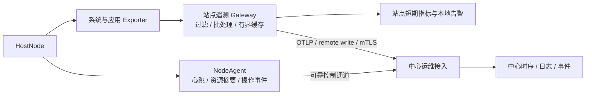

# 平台运维体系设计

## 1. 文档定位

本文档定义 InduForge 中心运维控制面、站点运维数据面和节点侧执行面的产品与技术方案，重点覆盖：

- 中心查看所有站点和节点的 CPU、内存、磁盘、网络与基础健康信息。
- K3s、NATS、数据库、工程运行栈和原生 Collector 的分层观测。
- 工程以开发、预发和生产阶段发布、晋级、回滚和审计。
- 节点注册、维护、升级、备份、恢复、证书轮换和安全下线。
- 中心失联、站点断网、磁盘压力、节点故障和发布失败时的行为。

节点运行组件、拓扑和高可用基线见
[运维与节点运行态总体架构](../02-系统设计/运维与节点运行态总体架构.md)。

本文档处于“设计基线”状态。未标记为“已实现”的接口、组件和阈值均不得被当作当前代码事实。

## 2. 运维目标与非目标

### 2.1 目标

1. 中心提供“站点 → 主机 → 基础设施 → 工程部署 → 工作负载 → Collector”的统一下钻视图。
2. 运维人员能区分期望状态、实际状态、最后成功状态和状态新鲜度。
3. 发布前可预检，发布中可观察，失败可定位和回滚，全部操作可审计。
4. 站点断开中心后继续运行，并在恢复连接后有界、按序地回补状态和事件。
5. 节点资源耗尽、磁盘写满、队列积压和证书到期在影响业务前可发现。
6. 开发与生产复用相同运行契约和不可变 Release，但应用不同的安全与验收门禁。
7. 运维控制不会绕过工程业务权限、设备写入联锁或站点本地安全边界。

### 2.2 非目标

- 运维告警不替代数据中心的业务报警；二者可以共用通知通道，但不能共用状态机和权限模型。
- 中心运维不代理工程用户流量、实时数据和工业协议。
- `/health`、`metrics-server` 或单个进程存活不能代表完整站点健康。
- 首版不承诺跨广域网 K3s 集群、任意两节点自动 HA 或所有原始遥测无损回补。

## 3. 运维对象模型

| 对象 | 唯一标识 | 主要内容 |
| --- | --- | --- |
| `Site` | `siteId` | 站点位置、网络区、时区、期望/实际拓扑和能力状态 |
| `HostNode` | `nodeId` | 物理机/虚机身份、OS、资源、证书、NodeAgent |
| `SiteInfrastructure` | `siteId + component` | K3s、Ingress、NATS、数据库、缓存、MQTT、遥测 |
| `ProjectDeployment` | `deploymentId` | 工程在站点的一个长期部署实例；同工程多阶段可并存 |
| `DeploymentBinding` | `bindingId + revision` | 某 deployment 的资源、连接、Secret 与运行策略绑定 |
| `Release` | `releaseId` | 不可变构建产物、签名和兼容性 |
| `DeploymentPlan` / `RunRequest` | `planId / runRequestId` | 中心审批后的不可变发布输入 |
| `DeploymentRun` | `deploymentRunId` | 站点推进的一次发布/回滚状态与审计 |
| `DeploymentSnapshot` | `snapshotId` | 一次成功部署的完整、不可变回滚点 |
| `SiteInfrastructurePlan` / `Run` | 独立 ID | 站点 Profile、公共能力或基础设施变更 |
| `WorkloadInstance` | `workloadId + instanceId` | Pod、原生进程或逻辑分片 |
| `CollectorAssignment` | `assignmentId` | 工程、连接、采集节点、owner 与 epoch |
| `BackupSet` / `RestoreRun` | 独立 ID | 备份范围、RPO/RTO、校验和恢复记录 |
| `MaintenanceWindow` | 独立 ID | 维护范围、时间、抑制策略和执行状态 |
| `OpsAlert` | `fingerprint` | 运维异常、严重度、证据和处理状态 |

主机与 K3s Node 不是同一个对象：`HostNode` 是受管宿主机，K3s Server/Agent 是它的一种能力。纯 Windows 采集节点只有 HostNode、NodeAgent 和 Collector，也必须进入统一运维视图。

`Site.desiredTopologyProfile / enabledCapabilities` 是目标，
`SiteInfrastructureObservedState.observedTopologyProfile / availableCapabilities / unmetConditions`
是站点已经具备的事实。DeploymentBinding 不得重复声明或修改 Profile，只声明
`continuityPolicy`、`requiredSiteCapabilities` 和可选 `workloadProfile`。发布门禁只读取 Observed；
Profile 与公共能力的变更必须创建独立 `SiteInfrastructurePlan/Run`，不能由工程发布或直接改字段
触发破坏性重构。

同一个 Site 可以同时部署同一工程的 development、staging 和 production，也允许同阶段存在分区
或并行实例。每个实例使用不透明、永久稳定的 `deploymentId`；创建时的 `siteId`、`projectId` 和
`deploymentStage` 不可修改，晋级、迁移或复制创建新的 Deployment，且
`(siteId, projectId, deploymentStage)` 不作唯一键。Namespace、NATS Account、数据空间、域名、
Secret、Collector 进程和 Assignment 都按 `deploymentId` 隔离。Binding 只引用 `deploymentId`，
不得再次保存 Site、Project 或 Stage；Namespace 由 infrastructure-controller 生成并分配，不接受
发布 Desired 自由指定。

## 4. 期望态、观测态与新鲜度

所有声明式对象共用以下状态字段：

| 字段 | 含义 |
| --- | --- |
| `desiredRevision` | 中心期望状态版本 |
| `observedRevision` | 站点已处理的期望状态版本 |
| `healthState` | 本地最近一次健康判断 |
| `observedAt` | 观测发生时间 |
| `receivedAt` | 中心收到时间 |
| `lastHealthyAt` | 最近健康时间 |
| `reasonCode` | 结构化原因 |

只有 `ProjectDeployment`、可发布基础设施和原生进程计划等版本化部署对象才额外保存目标与实际
Release/Binding revision；ProjectDeployment 使用 `lastSuccessfulSnapshotId` 指向完整回滚点，
不能只保存一个“最后成功 Release”。HostNode、MaintenanceWindow、BackupSet 等对象不得为了
“统一”填充无意义的 Release 字段。

健康与通信新鲜度必须拆开：

### 4.1 健康状态

`HEALTHY / DEGRADED / UNAVAILABLE / MAINTENANCE / UNKNOWN`

- `HEALTHY`：依赖、容量和业务探针均满足策略。
- `DEGRADED`：仍可提供核心服务，但副本、容量、延迟或部分能力下降。
- `UNAVAILABLE`：站点本地已经确认服务不可用。
- `MAINTENANCE`：已进入受控维护，告警按维护策略处理。
- `UNKNOWN`：从未获得足够证据。

### 4.2 新鲜度

`FRESH / STALE / EXPIRED`

中心超过心跳期限后只能显示“状态已过期/与中心失联”，不能直接断言服务器宕机。一个站点可以是“最后健康 + EXPIRED”，也可以是“本地确认不可用 + FRESH”。

### 4.3 漂移

出现以下任一情况即标记 `DRIFTED`：

- `desiredRevision != observedRevision` 且超过允许协调时间。
- 实际 Release、镜像、配置、资源或副本与计划不一致。
- 人工修改 K3s 资源后被控制器检测。
- 站点丢失了目标 Release、Secret 引用或运行能力。

漂移默认由 `site-controller` 回归期望状态；涉及数据丢失、缩容、密钥或外部连接的变更必须等待人工确认。

### 4.4 状态单写者

权威观测状态按领域拆分，禁止多个组件更新同一个大对象：

- NodeAgent 只写本机 `HostNodeObservedState`。
- infrastructure-controller 的 Lease leader 只写 `SiteInfrastructureObservedState`。
- site-controller 的 Lease leader 只写 `ProjectDeploymentObservedState` 和 `DeploymentRun.status`。
- 各 K3s/Collector 参与者只写自己的 `ParticipantStatus`；中心和 site-observer 只读聚合，不反写
  领域权威状态。

两个 controller 使用独立 workload identity、独立 Lease 和 leader-only 写会话；备用副本只能
观测与接管，不能同时持有可写控制会话。

## 5. 部署阶段与工程发布模式

### 5.1 字段定义

为避免“开发模式”等于“单机模式”，协议使用四个独立字段：

| 字段 | 示例 | 作用 |
| --- | --- | --- |
| `deploymentStage` | `development / staging / production` | 安全、审批、调试和验收策略 |
| `desired/observedTopologyProfile` | `edge-single / site-standard / site-ha` | 目标与已实现拓扑分离；工程门禁只读取 observed |
| `executionForm` | `k3s-workload / native-linux / native-windows` | 物理执行形态 |
| `rolloutPolicy` | `{ stateless, stateful, collector }` | 各类工作负载的版本切换方式 |

中心自身的开发/生产安装环境另称 `platformEnvironment`，不能复用 `deploymentStage`。

### 5.2 开发模式

开发模式用于在目标节点验证真实运行契约，而不是把 IDE 工作区直接挂到节点：

- 仍然构建、校验、签名和发布不可变 Release。
- 允许更详细日志、源码映射、临时调试入口和模拟数据绑定。
- 页面显著展示“开发部署”，模拟值和真实值不能混淆。
- 设备写入默认关闭；启用时必须指定连接、时限和操作者。
- 可使用 `recreate`，允许较低资源规格和单副本。
- 不满足生产备份、HA 或容量策略时只提示，不宣称生产可用。

### 5.3 预发模式

预发是可选但建议保留的阶段：

- 使用准备投产的同一个 Release。
- 使用独立 Secret、连接和数据空间，避免影响生产。
- 执行契约、Schema、依赖、性能、权限、备份和回滚演练。
- 默认关闭模拟和调试，行为尽量接近生产。
- 预发通过后生成 Promotion Attestation，并在生产 deployment 使用同一 Release 创建新的
  Binding revision/DeploymentRun，不重新构建 Release。

### 5.4 生产模式

生产发布至少通过：

- Release 签名、摘要、兼容性和依赖检查。
- 外部连接、设备绑定、密钥、证书和时间同步检查。
- CPU/内存/磁盘余量、PVC、JetStream 和数据库容量检查。
- 最近备份、恢复演练状态和最后成功 DeploymentSnapshot 检查。
- startup/readiness、业务冒烟、消费延迟和错误率门禁。
- 变更审批、维护窗口、影响范围和回滚计划。
- 模拟、永久调试入口和高敏日志关闭。

生产模式不自动意味着 HA。生产部署到 `edge-single` 时，中心必须展示持续风险提示，并要求按组织策略显式豁免或禁止。

### 5.5 同一产物晋级

```text
Release 构建并签名
→ development Binding 验证
→ staging Binding 验收（可选）
→ production Binding 审批
```

Release 不携带站点域名、真实数据库密码、设备 IP、生产副本数或环境开关。环境差异由版本化 `DeploymentBinding` 提供，Secret 只存引用。

可晋级 Release 从构建时就由统一 Release 签名服务签名，并标记 `promotable=true`。仅供临时
调试、使用开发信任根的 Release 必须标记 `promotable=false`；阶段验收和审批生成独立的
Promotion Attestation，不修改 Release 摘要和签名。Binding 不包含 Release ID，DeploymentRun
显式组合 `deploymentId + releaseId + bindingId + bindingRevision`。

## 6. 运维遥测总体架构

### 6.1 双通道设计

运维数据分为控制遥测和详细可观测性：



1. **控制遥测是必选能力。** NodeAgent 通过 InduForge 自有协议上报心跳、`NodeResourceSnapshot`、发布状态和运维事件，使用有界持久队列。
2. **详细可观测性按 Profile 部署。** Linux 可用 node_exporter，受支持的 Windows 可用 windows_exporter，Kubernetes 对象使用 kube-state-metrics，进程暴露 Prometheus/OTLP 指标。当前 windows_exporter 官方支持 Windows Server 2016+ 和 Windows 10/11 21H2+；更旧的工业现场系统使用 NodeAgent 最小资源采集或经验证的兼容组件，不默认部署最新版 exporter。
3. **站点 Gateway 统一出站。** 第一阶段由 OpenTelemetry Collector Gateway 抓取或接收 Exporter 指标，完成资源标签、过滤、批处理、重试和 TLS 出口；需要主机本地日志、追踪或隔离采集时，再扩展为每主机 Collector Agent 到站点 Gateway 的 agent-to-gateway 模式。
4. **重要站点保留本地查询与告警。** 可部署站点 Prometheus 或兼容时序存储；中心失联时仍能查看近期详情并执行本地运维告警。
5. **禁止未区分身份的重复写入。** 每条指标必须带稳定的 `siteId/nodeId/deploymentId/component` 资源身份；HA scraper/Gateway 还须使用 replica 标签、分片或中心去重，不能把多个副本写成同一条无法区分的逻辑序列。

详细指标通道可以替换具体后端，但控制遥测对象和语义由 InduForge 契约固定。

### 6.2 出站连接

- NodeAgent、site-controller 和 infrastructure-controller 主动连接中心，适配 NAT、工业防火墙
  和无公网入站场景。
- 通道使用每节点/站点独立证书的双向 TLS。
- 控制命令包含 `commandId`、`targetRevision`、过期时间、幂等键和签名。
- 连接恢复后先同步身份和 revision，再回补事件和摘要，最后接受新操作。
- 中心不得通过遥测通道直接转发工程业务数据。
- `site-ha` 中每个 controller Pod 使用独立 workload identity；site-controller 与
  infrastructure-controller 分别只有自己的 Lease leader 建立写会话和发布本领域权威 Observed
  State，热备只能探测和竞选，不能共享可同时写入的证书。

站点声明状态保存在 Kubernetes API/CRD，Release 与配置保存在站点持久存储；运行 epoch、
幂等账本、检查点和 CommitDecision 保存在支持原子比较更新的 SiteControlStore。Controller Pod
本地目录只作可丢缓存，不得成为 HA 权威状态。

## 7. 指标目录

### 7.1 主机基础指标

中心节点详情至少展示：

| 类别 | 必选指标 | 补充指标 |
| --- | --- | --- |
| CPU | 核数、总使用率、每核使用率、负载、iowait | steal、上下文切换 |
| 内存 | total、available、used、swap used | page fault、cache |
| 磁盘容量 | 每挂载点 total/used/available、使用率、inode、只读状态 | 预计耗尽时间 |
| 磁盘性能 | IOPS、吞吐、队列、读写延迟 | 设备健康/SMART（按权限） |
| 网络 | 接口 up/down、吞吐、错误、丢包 | 连接数、重传 |
| 系统 | OS、内核、启动时间、时区、时间偏差 | 温度、电源/风扇（可选） |
| NodeAgent | 版本、心跳、重启、证书到期、队列积压 | 自身 CPU/内存 |

磁盘必须按挂载点展示，不能只展示整机百分比。系统盘、K3s 数据盘、JetStream 数据盘、数据库盘、WAL 盘和日志盘应通过用途标签区分。

### 7.2 K3s 与容器

- Server/Agent 角色、Node Ready、MemoryPressure、DiskPressure、PIDPressure。
- API Server、scheduler、controller、etcd 成员与多数派状态。
- K3s 证书和 token 恢复材料状态。
- Pod Pending、CrashLoop、重启、OOMKilled、调度失败。
- Deployment/StatefulSet 期望与可用副本、PDB 和拓扑分散是否满足。
- PVC 容量、使用率、Volume 异常和 StorageClass 健康。
- Ingress/VIP 可用性和证书到期。

`metrics-server` 只满足资源自动伸缩和 `kubectl top` 的最低需求，不作为完整运维监控方案。

### 7.3 站点基础设施

| 组件 | 关键指标 |
| --- | --- |
| NATS JetStream | 节点/leader、Stream 副本、Consumer 副本、消息和字节、lag、redelivery、磁盘、quorum |
| 关系/时序库 | 连通性、连接池、事务/写入延迟、错误、复制延迟、磁盘、慢查询摘要、备份 |
| 实时缓存 | 内存、命中率、eviction、持久化、复制/集群状态 |
| MQTT | 连接、订阅、吞吐、积压、认证失败 |
| 对象/Release 缓存 | 容量、命中、校验失败、清理和不可删除的回滚版本 |
| 遥测 | 采样失败、出口失败、待发送条数/字节、最老年龄、丢弃数 |

### 7.4 工程运行

- 期望/实际 Release、最后成功 DeploymentSnapshot 与 DeploymentRun 阶段。
- 页面入口和 Runtime API 可用性、延迟、错误率、WebSocket 连接。
- 输入事件率、writer 批量大小、写入延迟、失败、幂等冲突。
- alarm/compute 执行耗时、失败、超时、队列延迟和检查点年龄。
- 分片 owner、epoch、Lease 变更和旧 epoch 拒绝次数。
- 查询并发、扫描范围、超时和受限请求。
- Sandbox Worker 池占用、队列、超时、内存限制和依赖加载失败。

禁止把每个数据点 ID 默认作为指标标签，否则点数增长会造成时序基数失控。单点质量与实时值属于数据中心业务域；运维只保留按工程、接入源、质量和错误类型聚合的统计。

### 7.5 Collector

- 进程、版本、配置 Release、驱动能力和工作集。
- 每连接状态、重连次数、最后成功采样时间、采样成功/失败率。
- 采集周期偏差、批量大小、发布延迟和 PubAck 失败。
- WAL 条数、字节、最老年龄、磁盘水位、回放速度和丢弃计数。
- 主备角色、Lease、epoch、切换时间和拒绝旧 owner 次数。
- 写设备命令成功、失败、超时、过期和幂等冲突。

真实设备通常无法校验平台 epoch。只有存在排他会话、设备令牌、写入网关或网络 fencing 时，
Collector 主备才允许自动接管设备写入；否则 `collector-ha` 只承诺读采集冗余，歧义故障期间
暂停设备写入并要求人工恢复。

点级错误明细按需查询或进入有界事件日志，不作为长期高基数指标。

### 7.6 发布与运维操作

- 预检耗时和失败项。
- Release 下载、校验、展开、预热、切换和观察耗时。
- 当前步骤、进度、错误码、日志关联 ID。
- 自动/人工回滚原因和结果。
- 节点升级、排空、重启、证书轮换、备份与恢复结果。

### 7.7 中心平台自身

中心控制面也必须纳入运维，但不能只依赖中心页面监控自己：

- 监控 dev_core、data_service、中心数据库、Redis、对象存储、统一入口和构建队列。
- 监控中心 CPU、内存、磁盘、证书、Release 存储容量、备份和审计写入。
- 使用独立的外部探针或宿主机 Agent 检查中心入口；中心完全不可用时仍能发送最小故障通知。
- 中心单机故障不得影响站点运行，只影响新发布、集中管理和状态查看。
- 首版可以使用单机 Docker 部署并具备完整备份；需要控制面 HA 时再将无状态服务多副本化，并
  分别为数据库、缓存和对象存储设计真实副本与恢复方案，不能只增加前端或 API 副本。

## 8. 采样、缓存与保留

以下是第一阶段推荐默认值，不是不可修改的协议常量：

| 数据 | 站点采样/产生 | 上送 | 本地缓存 | 中心保留 |
| --- | --- | --- | --- | --- |
| NodeAgent 心跳 | 15 秒 | 立即 | 最近状态 | 当前 + 事件 |
| 主机资源摘要 | 15 秒 | 30 秒批量 | 72 小时或 2 GiB 上限 | 原始 30 天、5 分钟聚合 1 年 |
| 关键运维事件 | 事件触发 | 立即 | 目标 30 天，受硬容量上限约束 | 按审计策略，默认 1 年 |
| 详细指标 | 15～30 秒 | 30～60 秒批量 | 站点 7～30 天 | 按套餐和规模 |
| 普通日志 | 持续 | 默认不上送或采样 | 7 天且按大小滚动 | 按需支持包 |
| 告警/错误日志 | 事件触发 | 批量或立即 | 30 天 | 默认 90 天 |

设计约束：

- 缓存同时限制时长和字节，先达到者生效。
- 为发布结果、审计和关键故障事件设置独立预留队列与数据缺口记录空间；达不到目标保留期时
  必须提前告警。
- 队列达到 70%/85%/95% 分别产生提醒、警告、紧急事件。
- 超限时优先丢弃旧的详细指标和调试日志，并优先保护发布结果、审计和关键故障事件；有界磁盘
  不能在无限断网下承诺绝不丢失。
- 关键预留空间耗尽时按策略 fail-closed、背压或停止接纳新操作；若最终仍被迫丢弃，必须持久化
  数量、时间范围和原因的数据缺口记录，并将运维状态升级为 `DEGRADED/UNAVAILABLE`。
- 回补限速，不能让历史遥测抢占工程业务带宽。
- Prometheus remote write 发送端所读取的 Prometheus/Agent WAL 不能作为 24～72 小时工业断网的可靠回补保证；官方当前实现中，远端持续不可达超过约两小时后，WAL 压缩可能导致未发送样本无法补传。控制摘要和关键事件使用 InduForge 自有持久队列。

## 9. 运维告警

### 9.1 与业务报警分域

| 维度 | 运维告警 | 数据中心业务报警 |
| --- | --- | --- |
| 对象 | 节点、K3s、服务、发布、容量、证书 | 数据点、设备状态、工艺条件 |
| 状态机 | 故障、确认、静默、维护、恢复 | 越限、变化率、离线、确认等业务语义 |
| 权限 | 平台/站点运维人员 | 工程操作员和业务角色 |
| 保留 | 运维与审计策略 | 工程历史策略 |
| 运行位置 | 站点本地检测 + 中心汇聚 | 工程运行数据面 |

二者可共用邮件、短信、Webhook 等通知适配器，但必须带不同的领域、路由和权限。

### 9.2 告警能力

- 基于阈值、持续时间、速率、缺失数据和预测耗尽。
- 按 fingerprint 去重、聚合、抑制和恢复。
- 维护窗口静默但保留事件。
- 支持确认、负责人、备注、关联 DeploymentRun 和处理时间。
- 站点离线时本地继续评估关键告警；中心恢复后回补。
- Alertmanager 层优先可用性并允许重复，以降低漏通知风险，UI 对重复进行聚合；外部短信、邮件和 Webhook 渠道不承诺绝不丢失，必须监控发送失败并支持重试或备用渠道。

### 9.3 推荐首批规则

- 节点状态过期、时间偏差、证书即将到期。
- CPU 持续高占用、available memory 过低、swap 异常增长。
- 任一关键盘 70%/85%/95% 水位、inode 耗尽、只读、I/O 延迟异常。
- K3s Node NotReady、etcd 失去多数派风险、Pod OOM/反复重启。
- JetStream 关键 Stream/Consumer 副本不足、lag 或磁盘异常。
- 数据库复制/备份失败、连接池耗尽、写入延迟。
- Collector 连接失败、数据新鲜度超限、WAL 积压或回放停滞。
- 工程 Release 漂移、发布失败、回滚失败、owner/epoch 异常。

## 10. 发布部署工作流

### 10.1 创建部署

运维工作台采用以下顺序：

1. 选择工程和不可变 Release。
2. 创建新的 ProjectDeployment，系统生成 `deploymentId`，并一次性确定目标 Site、Project 和
   `deploymentStage`；后续迁移或晋级创建新的 deployment。
3. 系统读取 Site 的 `observedTopologyProfile / availableCapabilities / unmetConditions`，校验
   `continuityPolicy` 和 `requiredSiteCapabilities`；工程不能在此修改站点 Profile。
4. 创建或选择仅引用 `deploymentId` 的 DeploymentBinding revision，配置域名、连接、Secret、
   `workloadProfile`、`dataDurabilityClass` 和存储策略。
5. 展示当前状态与目标状态的差异。
6. 执行预检并处理阻断项。
7. 按环境策略审批并冻结不可变 DeploymentPlan/RunRequest；由站点 site-controller 创建或恢复
   DeploymentRun 并作为唯一状态推进者。

不允许让用户手工组合“K3s HA + JetStream R1 + 单副本数据库”后仍显示为 `site-ha`。拓扑规划器应生成合法组合并对例外显式降级。

### 10.2 预检

- NodeAgent、site-controller、K3s 和基础服务版本兼容。
- 节点 Ready、磁盘和资源余量满足请求。
- Release、镜像、依赖和签名可用。
- SBOM/来源信息、漏洞策略和离线能力包兼容性满足目标环境。
- infrastructure-controller 已按 `deploymentId` 分配 Namespace，且域名、端口、PVC、数据空间和
  NATS Account 无冲突。
- 数据库结构升级可执行且具备回滚边界。
- 外部连接、设备绑定和 Secret 引用完整。
- 备份、恢复演练、证书、时钟和维护窗口满足策略。
- 目标 DeploymentSnapshot 所需 Release、Binding/Secret 版本和兼容恢复材料仍在站点缓存或可下载。

### 10.3 发布状态机

```text
PENDING → WAITING_APPROVAL（按策略可选）→ PREFLIGHT → PREPARING → DEPLOYING
→ VERIFYING → CUTTING_OVER → OBSERVING → SUCCEEDED

切换前失败 → FAILED（旧 Deployment 保持健康）
切换后失败 → ROLLING_BACK → ROLLED_BACK
回滚失败 → ROLLBACK_FAILED → MANUAL_INTERVENTION_REQUIRED
人工操作 → PAUSED / CANCELLED
```

每一步保存开始/结束时间、执行节点、输入 revision、输出、reasonCode、关联日志和是否可重试。
重复提交同一 `commandId` 返回既有结果，不重复执行。中心只创建并审批不可变 RunRequest；
site-controller leader 唯一推进 `DeploymentRun.status`，中心仅镜像状态，各参与者只写自己的
`ParticipantStatus`。长期 ProjectDeployment Desired 只保存目标 Snapshot/generation，不内嵌短期
`deploymentRunId`。

### 10.4 健康门禁

- 技术门禁：Pod/进程 Ready、端口、依赖、资源和副本。
- 业务门禁：Runtime API、默认无副作用冒烟、消息消费、数据新鲜度和权限冒烟。写测试只允许
  专用测试资源、可回滚事务或显式授权的受控动作，绝不自动写真实 PLC 输出。
- 容量门禁：发布后预估 CPU、内存、磁盘、队列和连接余量。
- 观察窗口：错误率、延迟、重启、队列积压和业务拒绝率。

健康检查成功不代表发布成功；必须通过观察窗口并生成不可变 DeploymentSnapshot，才能更新
`lastSuccessfulSnapshotId`。

### 10.5 切换策略

- 无状态页面/API：RollingUpdate。
- 开发环境或不支持并行准备的组件：Recreate。
- writer/alarm/compute、infrastructure-controller 和全部相关 Collector NodeAgent：作为同一
  DeploymentRun 的参与者并行 Prepare。site-controller 在站点控制库持久化唯一
  `CommitDecision` 后，各参与者幂等 Commit；失败按阶段 Compensate 或转人工，不能声称跨 K3s、
  数据库和原生进程的分布式原子事务。
- 站点内协调使用独立于工程 NATS Account 的耐久管理通道：controller 之间通过 CRD/控制库，
  NodeAgent 通过主动出站 mTLS 连接 `site-control-gateway`，命令、回执和 ParticipantStatus 先落
  `SiteControlStore` 再投递。中心在切换中断线时，站点按已持久化决议继续；升级管理通道本身必须
  使用独立 SiteInfrastructureRun，不能和普通工程发布混在同一 Run。
- Schema：兼容扩展后切换，跨版本稳定后再收缩；不可逆变更阻断自动回滚。

### 10.6 成功快照与回滚

每次成功发布生成不可变 `DeploymentSnapshot`，至少包含：

- `releaseRef` 与摘要、`bindingId/bindingRevision`。
- 解析后实际使用的 Secret 版本引用，不保存 Secret 明文。
- SiteResource/Namespace/NATS Account/数据空间 revision。
- 全部 CollectorAssignment revision、运行 owner/checkpoint 边界。
- Schema 与 checkpoint 的前后兼容结论。

回滚以目标 Snapshot 创建新的 RunRequest/DeploymentRun，重新执行预检、Prepare、Commit/Compensate
和观察窗口；禁止只改 Release ID、只回滚 K3s Pod 或原地修改当前 Release 目录。

## 11. 节点与站点运维流程

### 11.1 节点接入

1. 中心创建一次性注册凭据和预期节点信息。
2. NodeAgent 主动注册并获得独立证书。
3. 上报硬件、OS、网络、磁盘、时钟和能力。
4. 执行端口、磁盘、证书、容器/K3s、驱动和网络预检。
5. 管理员确认站点、角色和故障域标签。
6. 进入 `HEALTHY` 或带原因的 `DEGRADED`，禁止静默忽略失败项。

### 11.2 站点首次引导

1. 中心生成签名、限时的 `SiteBootstrapPlan`，冻结 `bootstrapEpoch`、Site Profile、K3s 版本、
   节点角色、固定注册地址、基础能力和恢复要求。
2. 指定一台已注册 NodeAgent 为唯一 bootstrap owner，由 owner Lease 和阶段 checkpoint 限定当前
   执行者。owner 创建首个 K3s Server 并在本地生成静态 server token；中心不持有该长期凭据。
3. 新增 Server 通过绑定 `siteId + bootstrapEpoch + nodeId + expiresAt`、目标节点公钥加密的一次性
   capsule 获取 server token；一次性的是安全传递授权，不是 K3s server token。Agent 节点使用
   每节点、限时 K3s bootstrap token，成功加入后由控制器执行 `k3s token delete`。
4. bootstrap owner 安装最小系统 Namespace、infrastructure-controller 和 site-controller。
5. `infrastructure-controller` 接管 Ingress、NATS、遥测、备份控制和站点数据底座；
   `site-controller` 接管 ProjectDeployment。两者使用独立权限身份。
6. 控制器 Ready 且状态写入 CRD 后撤销 bootstrap 临时权限；server token 按轮换版本进入受保护
   备份，并与对应 etcd 快照关联。

引导步骤以 `commandId + desiredRevision + bootstrapEpoch` 幂等，可从最近成功阶段继续。接管前
必须先显式 revoke 旧 owner，并通过电源、网络或人工现场手段完成 fencing；不能确认旧 owner 已
停止时，不得自动创建第二套首集群。site-controller 不负责安装自己，NodeAgent 也不在引导完成后
持续编排工程资源。

### 11.3 维护与重启

```text
创建维护窗口
→ 抑制通知但保留事件
→ 转移 Collector/运行分片所有权
→ 停止领取新任务并排空 WAL/队列/checkpoint
→ cordon / drain
→ 备份与预检
→ 升级或重启
→ 恢复服务与健康门禁
→ 解除维护并观察
```

Kubernetes PDB 主要约束经 Eviction API 发起的主动驱逐，直接删除 Pod/Deployment 可以绕过 PDB，Deployment/StatefulSet 自身滚动升级也由各自更新策略控制。PDB 不能代替业务排空、所有权转移和检查点。

### 11.4 K3s 与基础服务升级

- 先验证备份和恢复材料，再按官方支持的版本跨度升级。
- `site-ha` 一次只维护一个故障域，保持 etcd、NATS 和数据存储多数派。
- 先升级并观察非活动/非 leader 节点，再处理活动节点。
- 升级失败立即停止后续批次，不在不明状态下继续滚动。
- NodeAgent 自身采用 A/B 二进制或等价回滚机制，升级失败仍保留最小恢复服务。

### 11.5 安全下线

- 先停用调度与采集分配，转移 owner。
- 确认 WAL 已提交、备份已完成、Release 与日志保留策略已执行。
- 从 K3s、NATS、存储和授权计数中解除成员。
- 吊销节点证书与凭据。
- 进入可恢复保留期后再清理数据；默认不把“工程删除”映射为立即物理删除。

### 11.6 容量与资源治理

- 站点先为 K3s 控制面、NATS、数据库、WAL、日志和恢复空间保留容量，再分配工程资源。
- production 工作负载必须配置 requests/limits、存储配额和优先级；开发部署不得挤占生产保留。
- 容量预测同时看当前使用率、增长速率、发布临时双份空间、备份空间和离线积压上限。
- 达到阻断水位后停止新发布和非关键扩容，不能等磁盘写满后再依赖告警处理。
- 资源超卖、自动扩缩容和低优先级负载降级都由显式策略控制并写入审计。

## 12. 备份、恢复与灾备运维

### 12.1 备份计划

每个生产站点建立 `BackupPolicy`：

- 保护对象、依赖顺序、备份类型和目标位置。
- RPO、RTO、周期、保留、加密和离站副本。
- 最近成功备份、校验结果和最近恢复演练。
- 允许恢复的版本范围、与每份 etcd 快照对应的 K3s server token 版本、证书材料和 Secret 恢复方式。

K3s etcd 快照只保护 Kubernetes 集群状态，不保护业务数据库、PVC、JetStream 数据或 Collector WAL。数据库必须使用自身一致性备份/PITR；VolumeSnapshot 只有在支持该能力的 CSI 驱动和应用一致性均满足时才可使用。

### 12.2 恢复顺序

1. 恢复主机身份、网络、时间和证书。
2. 恢复 K3s 控制面、StorageClass 和基础网络。
3. 恢复 NATS、关系/时序/实时存储及其一致性。
4. 恢复 infrastructure-controller、site-controller、DeploymentBinding 和最后成功
   DeploymentSnapshot。
5. 恢复工程运行栈和运行状态。
6. 恢复 Collector 分配，生成新 epoch 后再连接设备。
7. 校验数据、队列、权限、入口和业务门禁。
8. 解除恢复模式并观察。

“备份任务成功”不能代替“恢复验证成功”。生产运维首页必须同时展示最近备份和最近恢复演练。

### 12.3 异地灾备

- 灾备站点独立运行 K3s，默认处于待命或只读状态。
- Release 与配置提前缓存，业务数据按 RPO 异步复制。
- 第一阶段使用人工提升；提升前确认旧站点隔离、数据落后量和写入风险。
- 提升后递增站点 epoch，旧站点恢复时不得自动恢复写权限。
- 回切是独立 DeploymentRun，必须先解决主备数据差异。

## 13. 运维工作台信息架构

```text
运维总览
├─ 站点
│  ├─ 状态与容量
│  ├─ 节点
│  ├─ 基础设施
│  └─ 网络与证书
├─ 工程部署
│  ├─ 环境与拓扑
│  ├─ Desired / Observed / Last Successful
│  ├─ 工作负载与 Collector
│  └─ 发布与回滚
├─ 告警与事件
├─ 指标
├─ 日志与诊断
├─ 备份与灾备
├─ 维护
└─ 审计
```

### 13.1 总览

- 站点总数、健康/降级/不可用/状态过期/维护数量。
- 节点 CPU、内存、磁盘容量风险和预计耗尽。
- 生产工程、发布中、漂移、失败和待回滚数量。
- 关键运维告警、证书到期、备份失败和恢复演练过期。

### 13.2 节点详情

- 顶部固定展示节点身份、站点、角色、OS、NodeAgent、健康与最后上报时间。
- CPU、内存、磁盘、网络趋势按用途下钻。
- K3s/Collector/基础服务和本机进程。
- 当前维护、升级、证书、日志和操作记录。
- “状态过期”使用中性色，不与“本地确认故障”的红色混淆。

### 13.3 部署详情

- 环境阶段、期望/实际 Profile 与能力、Binding revision、期望/实际 Release 和最后成功 Snapshot。
- 本次 DeploymentRun 步骤时间线和日志关联。
- 当前副本、owner、epoch、队列与健康门禁。
- 一键回滚只创建新的受审计 DeploymentRun，不直接改文件。

### 13.4 操作设计

- 默认只显示安全、常用动作；高风险操作进入二级菜单。
- 重启、排空、切换主备、回滚、恢复、下线必须先显示影响面和预检结果。
- 批量操作按 Site/故障域分批，禁止默认同时重启所有 HA 成员。
- 开发部署和模拟状态使用持续可见标识，不能只用一次性提示。

## 14. 契约规划

后续需要新增或重构以下契约：

### 14.1 控制对象

- `HostNodeDesiredState / HostNodeObservedState`
- `SiteDesiredState / SiteObservedState`
- `SiteBootstrapPlan / SiteBootstrapRun`
- `SiteInfrastructurePlan / SiteInfrastructureRun / SiteInfrastructureObservedState`
- `ProjectDeploymentDesiredState / ProjectDeploymentObservedState`
- `DeploymentBinding`
- `DeploymentPlan / DeploymentRunRequest / DeploymentRun / ParticipantStatus / CommitDecision`
- `DeploymentSnapshot`
- `CollectorAssignment`
- `MaintenanceWindow`
- `BackupPolicy / BackupSet / RestoreRun`

### 14.2 遥测对象

`NodeResourceSnapshot` 最小示意：

```json
{
  "schemaVersion": 1,
  "siteId": "site-a",
  "nodeId": "node-01",
  "agentEpoch": "agent-install-20260830-01",
  "bootId": "host-boot-uuid",
  "sequence": 1024,
  "observedAt": "2026-08-30T10:00:00+08:00",
  "cpu": { "usageRatio": 0.42, "cores": 8 },
  "memory": { "totalBytes": 17179869184, "availableBytes": 8589934592 },
  "filesystems": [
    {
      "mount": "/var/lib/induforge",
      "purpose": "runtime-data",
      "totalBytes": 536870912000,
      "availableBytes": 214748364800,
      "readOnly": false
    }
  ],
  "agent": {
    "version": "1.0.0",
    "queueBytes": 0,
    "certificateExpiresAt": "2027-08-30T00:00:00Z"
  }
}
```

`OpsEvent` 至少包含 `eventId`、`siteId`、`nodeId`、`projectId`、`deploymentId`、`kind`、
`severity`、`reasonCode`、`occurredAt`、`sequence`、`details` 和关联操作 ID；非工程事件可省略
project/deployment 字段。

### 14.3 传输语义

- 所有列表由后端分页、搜索和排序。
- 资源快照按 `nodeId + agentEpoch + sequence` 幂等；`bootId` 用于区分主机重启，事件按
  `eventId` 幂等。Agent 重装或恢复身份时必须生成新的持久 `agentEpoch`。
- 中心在同一 `agentEpoch` 内只接受 sequence 更新的数据；`observedAt` 只用于展示和诊断，不能
  因现场时钟回退而成为唯一排序依据。
- 统一 REST 响应使用 `code/msg/data/reqId`。
- 详细指标采用标准 OTLP 或 Prometheus remote write；控制对象继续使用平台 REST/长连接契约。

## 15. 权限、安全与审计

### 15.1 权限范围

- 平台查看、站点查看、日志查看、发布、回滚、节点维护、备份、恢复、密钥/证书、远程调试分别授权。
- 工程管理员不能默认操作其他工程或站点基础设施。
- 节点操作员不能获取中心长期密钥或站点其他工程 Secret。
- 生产调试和设备写入采用短时授权并自动过期。
- NodeAgent 使用普通权限协调进程和最小特权 helper；helper 只接受签名命令白名单与类型化参数，
  校验目标路径、防目录穿越，并记录本地提权审计。NodeAgent 升级链必须固定信任根并验证签名。
- infrastructure-controller 负责创建/回收 Namespace 和集群级公共资源；site-controller 只管理已
  分配 Namespace 内资源。两者使用独立 ServiceAccount、Lease、写会话和受管 CRD 权限，不默认
  授予无限制 `cluster-admin`。Kubernetes RBAC 无法按名称前缀限制 Namespace 的 `create`，因此
  还必须使用准入策略校验 `deploymentId/owner` 标签和资源归属。
- 默认只允许类型化、可校验的运维操作，不提供常开任意远程 Shell；后续若提供临时终端，必须
  单独审批、限时、限制目标并记录完整会话审计。

### 15.2 审计

以下操作必须记录操作者、审批人、目标、前后 revision、来源 IP/客户端、命令 ID、结果和关联证据：

- 发布、晋级、回滚和环境切换。
- 节点重启、排空、升级、下线。
- Collector 主备切换和真实设备写入授权。
- Secret/证书轮换、日志下载和远程调试。
- 备份删除、恢复、灾备提升与回切。
- 告警静默和维护窗口。

### 15.3 支持包

支持包默认只包含版本、配置摘要、资源状态、结构化事件和脱敏日志。工程数据、Secret、设备地址、令牌和用户业务负载需单独授权，导出包带有效期、水印和审计记录。

## 16. 验收场景

实现运维体系时至少自动化或人工验证：

1. 中心断开 24 小时，站点工程继续运行，遥测队列有界，恢复后按序回补。
2. NodeAgent 与详细遥测 Gateway 任一故障不会立即影响工程业务。
3. CPU、内存、系统盘、数据盘、WAL 盘分别触发正确状态和告警。
4. K3s 单节点故障、Pod OOM、PVC 异常和证书到期可定位到原因。
5. 在 3 节点、关键 Stream/Consumer 为 R3、副本跨独立故障域且其余两节点健康形成多数派时，失去一个节点仍可继续服务；R1 风险在 UI 可见。
6. 发布预检失败不改变当前版本；切换失败自动保留或恢复最后成功 DeploymentSnapshot。
7. writer/alarm/compute 与 Collector 上行链路切换期间不存在同一分片双 owner，旧 epoch 被拒绝；
   无硬 fencing 的设备写入在歧义故障期间保持暂停而不是双写。
8. 开发 Release 晋级生产不重新构建，环境 Secret 和连接通过 Binding 切换。
9. 维护排空符合所选 `dataDurabilityClass` 的 RPO，WAL 和 Consumer lag 回到正常范围；R1 PubAck
   不被误验收为整个站点断电时零丢失。
10. etcd 快照、业务数据库、配置和 Release 完成一次从零恢复演练。
11. 状态过期与节点本地确认故障在中心 UI 中语义不同。
12. 生产远程调试、设备写入和恢复操作到期后自动失效并完整审计。

## 17. 分阶段落地

### P0：对象和最小闭环

- Site/HostNode/ProjectDeployment/Release、DeploymentBinding、最小 DeploymentPlan/RunRequest/
  DeploymentRun/DeploymentSnapshot 对象。
- 每主机 NodeAgent 注册、心跳、CPU/内存/磁盘摘要。
- 最小 infrastructure-controller 完成 Namespace/公共资源分配，最小 site-controller 执行工程发布；
  两者具备独立身份和单写者规则。
- Desired/Observed/LastSuccessfulSnapshot 与状态新鲜度。
- 单站点开发/生产发布、预检、站点内耐久协调、日志、失败保留旧 Snapshot。

### P1：完整生产运维

- 环境晋级、完整生产门禁、SiteInfrastructurePlan/Run 和控制器升级。
- 详细主机/K3s/NATS/数据库/工程/Collector 指标。
- 站点遥测 Gateway、有界离线缓存、运维告警和维护窗口。
- 备份、恢复、证书、审计和安全下线。

### P2：站点高可用

- `site-ha` 拓扑规划、JetStream R3、存储 HA 和故障域分散。
- Lease + epoch、运行分片、Collector 主备和维护接管。
- HA 发布、升级、故障和恢复演练。

### P3：异地灾备与规模化

- 独立灾备站点、异步复制、提升与回切。
- 多站点聚合、容量预测、分批升级和策略化发布。
- 在满足仲裁、安全与数据一致性条件后评估自动灾备。

## 18. Review 结论

### 18.1 现有设计可保留

- 中心不进入站点实时运行链路。
- 一个站点一套独立 K3s/JetStream，多工程隔离。
- Collector 原生运行、本地 WAL、站点离线自治。
- 不可变 Release、短期下载授权和失败保留旧 DeploymentSnapshot。

### 18.2 本轮补齐

- 中心监控 CPU、内存、磁盘等节点基础信息的完整数据路径。
- 控制遥测与详细指标分层，避免只依赖 `/health` 或 remote write。
- 开发/预发/生产、拓扑 Profile、执行形态和发布策略四维解耦。
- 同一 Release 晋级与 DeploymentBinding。
- 以 `deploymentId` 隔离同工程多阶段实例，并拆分 Site 期望/实际 Profile 与能力门禁。
- NodeAgent、site-controller、infrastructure-controller 的引导、权限和持久状态边界。
- K3s 与原生 Collector 参与同一 DeploymentRun，避免半发布；设备写入单独要求硬 fencing。
- 生产发布门禁、观察窗口、有状态单权切换和数据结构回滚边界。
- 维护、备份恢复、异地灾备、运维告警、审计和 UI 信息架构。

### 18.3 仍待产品/技术冻结

1. 中心和站点详细指标存储的具体产品、规模和保留套餐。
2. 站点数据库、时序、缓存、MQTT 在各 Profile 下的 HA 产品组合。
3. 行业套餐的最低硬件、RPO、RTO 和恢复演练周期。
4. 生产单节点部署的豁免权限和授权计数方式。
5. 控制通道采用 HTTPS 长轮询、WebSocket、gRPC stream 或独立消息通道的最终实现。
6. site-controller 与 NodeAgent 的升级依赖和最低兼容窗口。
7. Collector 不同工业协议支持热备接管的能力矩阵。
8. 跨站灾备首批同步的数据范围和回切冲突处理。
9. 当前开发端口规划中计算沙箱与尚未实现的 NodeAgent 都占用 `18103`；NodeAgent 实现前必须
   重新分配端口，且新架构应优先使用主动出站通道，只为本机诊断保留回环地址。
10. 中心控制面的单机与 HA 套餐、独立故障通知和恢复目标。
11. 现有平台总体架构、多站点部署和工程运行 SVG/drawio 仍按旧的 Site NodeAgent 逻辑绘制；
    本轮以新文档中的 Mermaid 和文字为准，组件边界冻结后统一重画，避免同时维护两套未定稿图片。

## 19. 外部依据

- [OpenTelemetry Collector deployment patterns](https://opentelemetry.io/docs/collector/deploy/)：Agent/Gateway 分层采集。
- [OpenTelemetry Gateway deployment](https://opentelemetry.io/docs/collector/deploy/gateway/)：站点或区域 Gateway、资源身份和单写者注意事项。
- [OpenTelemetry Collector resiliency](https://opentelemetry.io/docs/collector/resiliency/)：重试、队列和持久化边界。
- [Prometheus node_exporter](https://prometheus.io/docs/guides/node-exporter/)：Linux 主机 CPU、文件系统和网络指标。
- [windows_exporter](https://github.com/prometheus-community/windows_exporter)：Windows 主机指标。
- [kube-state-metrics](https://kubernetes.io/docs/concepts/cluster-administration/kube-state-metrics/)：Kubernetes 对象状态指标。
- [Kubernetes Resource Metrics Pipeline](https://kubernetes.io/docs/tasks/debug/debug-cluster/resource-metrics-pipeline/)：metrics-server 的能力边界。
- [Kubernetes Node Problem Detector](https://kubernetes.io/docs/tasks/debug/debug-cluster/monitor-node-health/)：系统日志、内核、运行时和 Node Conditions。
- [Prometheus Remote Write](https://prometheus.io/docs/specs/prw/remote_write_spec/) 与
  [Remote write tuning](https://prometheus.io/docs/practices/remote_write/)：发送协议、WAL 和长时间断连限制。
- [Prometheus Federation](https://prometheus.io/docs/prometheus/latest/federation/)：站点详细数据与中心聚合数据分层。
- [Prometheus Alertmanager HA](https://prometheus.io/docs/alerting/latest/high_availability/)：通知去重与网络分区时优先不漏报。
- [Kubernetes Disruptions](https://kubernetes.io/docs/concepts/workloads/pods/disruptions/)：PDB 与维护排空边界。
- [K3s etcd snapshot](https://docs.k3s.io/cli/etcd-snapshot)：控制面快照和恢复。
- [K3s High Availability Embedded etcd](https://docs.k3s.io/datastore/ha-embedded)：3 个或更多奇数 Server 与多数派要求。
- [K3s token](https://docs.k3s.io/cli/token)：Server token 与限时 Agent bootstrap token 的差异。
- [NATS JetStream in a cluster](https://docs.nats.io/learn/topologies/jetstream-in-a-cluster)：Stream/Consumer 副本、R3 与多数派边界。
- [NATS JetStream storage model](https://github.com/nats-io/nats.docs/blob/master/nats-concepts/jetstream/README.md)：FileStore 同步间隔、PubAck 与断电 RPO 边界。
