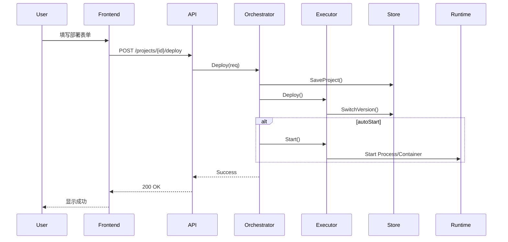
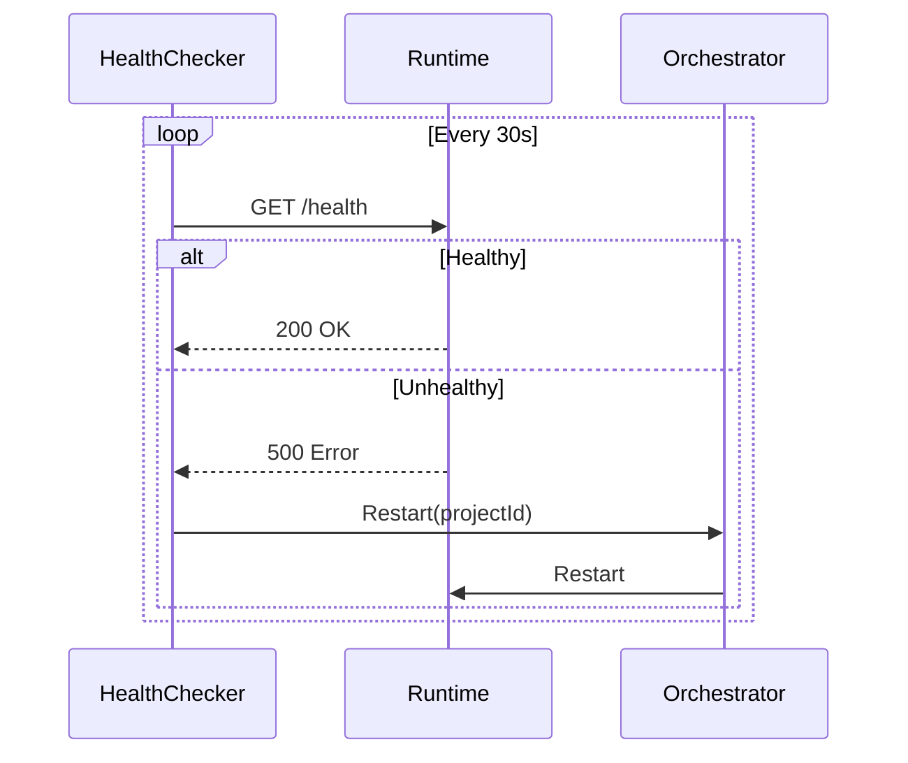
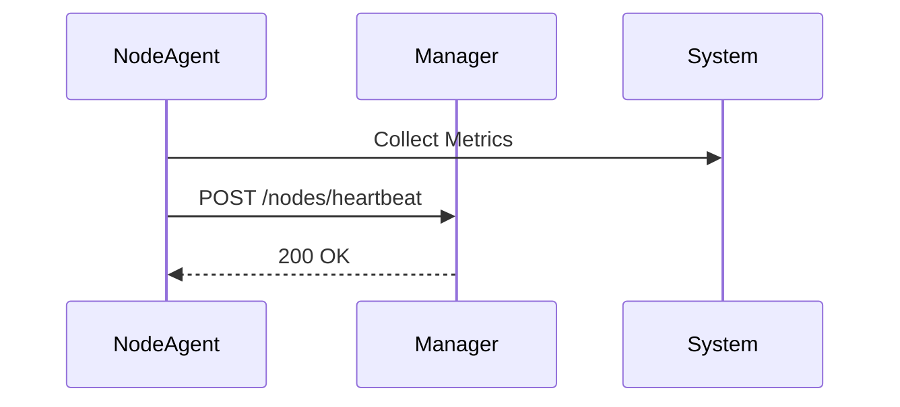

# NodeAgent 系统架构文档

## 概述

NodeAgent 是一个完整的分布式 RuntimeEngine 管理系统，采用前后端分离架构，包括 Go 后端服务（NodeAgent）和 Vue 前端管理界面（NodeAgent Front）。该系统旨在在节点上部署、运行和管理 RuntimeEngine，提供高可用、自动化的运行时环境。

## 系统架构

### 整体架构图

```
┌─────────────────────────────────────────────────────────────────┐
│                     NodeAgent Front (Vue)                        │
│  ┌──────────────┐  ┌──────────────┐  ┌──────────────┐         │
│  │  Dashboard   │  │  Projects    │  │   Profile    │         │
│  └──────────────┘  └──────────────┘  └──────────────┘         │
│  ┌──────────────┐                                                │
│  │    Logs      │                                                │
│  └──────────────┘                                                │
│                           │ HTTP REST API (JSON)                 │
└───────────────────────────┼─────────────────────────────────────┘
                            │
                            │ Reverse Proxy / Direct
                            ▼
┌─────────────────────────────────────────────────────────────────┐
│                     NodeAgent (Go)                              │
│  ┌──────────────┐  ┌──────────────┐  ┌──────────────┐         │
│  │   API        │  │ Orchestrator │  │    Store     │         │
│  │  Handler     │  │   (State)   │  │   (Local)    │         │
│  └──────────────┘  └──────────────┘  └──────────────┘         │
│  ┌──────────────┐  ┌──────────────┐  ┌──────────────┐         │
│  │   Executor   │  │    Health    │  │   Network    │         │
│  │  (Multi)    │  │   Checker    │  │ (Heartbeat)  │         │
│  └──────────────┘  └──────────────┘  └──────────────┘         │
└─────────────────────────────────────────────────────────────────┘
                            │
                            ▼
┌─────────────────────────────────────────────────────────────────┐
│                     RuntimeEngine                                │
│  ┌──────────────┐  ┌──────────────┐  ┌──────────────┐         │
│  │   Process    │  │   Docker     │  │   Systemd     │         │
│  │   (Default)  │  │  (Optional)  │  │   (Future)   │         │
│  └──────────────┘  └──────────────┘  └──────────────┘         │
└─────────────────────────────────────────────────────────────────┘
```

## 组件说明

### 1. NodeAgent Front（前端）

**技术栈**: Vue 3 + Element Plus + Pinia + Vite
**功能**: 提供用户友好的 Web 管理界面

**核心模块**:
- **Dashboard**: 节点状态总览和快速操作
- **Projects**: 项目全生命周期管理
- **Profile**: 连接配置管理
- **Logs**: 实时日志查看和过滤

**通信方式**: HTTP REST API (JSON)

### 2. NodeAgent（后端）

**技术栈**: Go + Gorilla Mux + Viper
**功能**: 提供核心运行时管理能力

**核心模块**:
- **API Handler**: RESTful API 接口
- **Orchestrator**: 状态机编排
- **Executor**: 执行器抽象（进程、Docker）
- **Store**: 本地存储管理
- **Health Checker**: 健康检查
- **Network**: 心跳上报

**通信方式**: HTTP REST API + 心跳上报

## 数据流

### 1. 项目部署流程



### 2. 健康检查流程



### 3. 心跳上报流程



## 核心特性

### 1. 多执行器支持

**进程执行器（默认）**
- 直接启动 RuntimeEngine 进程
- 轻量级，无额外依赖
- 适用于资源受限环境

**Docker 执行器（可选）**
- 容器化运行，提供隔离性
- 易于移植和管理
- 需要 Docker 环境

**Systemd 执行器（未来）**
- 系统服务管理
- 开机自启
- 高级系统集成

### 2. 状态机管理

**状态定义**:
- `Stopped`: 已停止
- `Deploying`: 部署中
- `Running`: 运行中
- `Stopping`: 停止中
- `Error`: 错误
- `RollingBack`: 回滚中

**状态转换**:
- 所有操作通过状态机验证
- 失败时自动回滚
- 确保数据一致性

### 3. 版本管理

**目录结构**:
```
/var/lib/node_agent/data/projects/{project}/
├── project.json          # 项目信息
├── profile.json         # 连接配置
├── versions/            # 版本目录
│   ├── v1.0.0/
│   └── v1.0.1/
└── current -> versions/v1.0.1  # 软链接
```

**原子切换**:
- 使用软链接实现原子切换
- 切换失败可回滚
- 保证服务连续性

### 4. 健康检查

**检查机制**:
- 定期 HTTP 请求
- 可配置间隔和超时
- 自动重启失败服务

**配置**:
```yaml
runtime:
  healthCheck:
    enabled: true
    interval: 30s
    timeout: 5s
    retries: 3
```

### 5. 心跳上报

**上报内容**:
- 节点状态
- 系统指标（CPU、内存、磁盘）
- 运行项目列表
- 主机信息

**上报频率**:
- 默认 10 秒
- 可配置
- 失败重试

## API 接口设计

### 节点信息

| 方法 | 路径 | 功能 |
|------|------|------|
| GET | `/api/v1/node/info` | 节点基本信息 |
| GET | `/api/v1/node/status` | 节点详细状态 |

### 项目管理

| 方法 | 路径 | 功能 |
|------|------|------|
| GET | `/api/v1/projects` | 项目列表 |
| GET | `/api/v1/projects/{id}` | 项目详情 |
| POST | `/api/v1/projects/{id}/deploy` | 部署项目 |
| POST | `/api/v1/projects/{id}/start` | 启动项目 |
| POST | `/api/v1/projects/{id}/stop` | 停止项目 |
| POST | `/api/v1/projects/{id}/restart` | 重启项目 |
| POST | `/api/v1/projects/{id}/rollback` | 回滚版本 |
| GET | `/api/v1/projects/{id}/logs` | 项目日志 |

### 配置管理

| 方法 | 路径 | 功能 |
|------|------|------|
| GET | `/api/v1/profile` | 获取连接配置 |
| POST | `/api/v1/profile` | 保存连接配置 |

### 健康检查

| 方法 | 路径 | 功能 |
|------|------|------|
| GET | `/health` | 健康检查 |
| GET | `/status` | 状态检查 |

## 部署架构

### 单节点部署

```
┌─────────────────────────────┐
│         NodeAgent           │
│  ┌─────────────────────┐   │
│  │  RuntimeEngine #1   │   │
│  └─────────────────────┘   │
│  ┌─────────────────────┐   │
│  │  RuntimeEngine #2   │   │
│  └─────────────────────┘   │
│  ┌─────────────────────┐   │
│  │  RuntimeEngine #3   │   │
│  └─────────────────────┘   │
└─────────────────────────────┘
```

### 多节点部署

```
┌──────────────────────────────────────────────────────────────┐
│                    管理中心                                   │
│         (OpsManagement - Vue)                                │
└───────────────────────┬──────────────────────────────────────┘
                        │
        ┌──────────────┼──────────────┐
        │              │              │
┌───────▼──────┐ ┌────▼──────┐ ┌────▼──────┐
│  NodeAgent 1  │ │ NodeAgent 2 │ │ NodeAgent 3 │
│ ┌──────────┐ │ │ ┌────────┐ │ │ ┌────────┐ │
│ │Runtime #1 │ │ │ │Runtime│ │ │ │Runtime│ │
│ └──────────┘ │ │ └────────┘ │ │ └────────┘ │
│ ┌──────────┐ │ │ ┌────────┐ │ │ ┌────────┐ │
│ │Runtime #2 │ │ │ │Runtime│ │ │ │Runtime│ │
│ └──────────┘ │ │ └────────┘ │ │ └────────┘ │
└──────────────┘ └────────────┘ └────────────┘
```

## 安全考虑

### 1. 本地访问

**设计原则**:
- NodeAgent 仅监听 `127.0.0.1`
- 前端通过代理访问
- 防止远程攻击

### 2. 敏感信息

**保护措施**:
- 连接配置权限 `0600`
- 敏感字段不持久化
- 传输使用 HTTPS（可选）

### 3. 权限控制

**当前**:
- 无用户认证
- 基于本地访问控制

**未来规划**:
- Token 认证
- RBAC 权限控制
- HTTPS 强制加密

## 监控和日志

### 1. 多层日志

**NodeAgent 日志**:
- 位置: `/var/log/node_agent/agent.log`
- 级别: DEBUG, INFO, WARN, ERROR
- 格式: JSON

**Runtime 日志**:
- 位置: `/var/log/node_agent/runtime/{project}.log`
- 实时输出
- 支持下载

### 2. 指标收集

**系统指标**:
- CPU 使用率
- 内存使用率
- 磁盘使用率
- 网络流量

**业务指标**:
- 项目状态
- 健康检查结果
- 操作历史

### 3. 告警机制

**当前**:
- 自动重启失败服务
- 日志记录异常

**未来规划**:
- 告警通知
- 阈值配置
- 告警升级

## 扩展性

### 1. 执行器扩展

**接口定义**:
```go
type Executor interface {
    Deploy(ctx context.Context, req DeployRequest) error
    Start(ctx context.Context, projectID string) error
    Stop(ctx context.Context, projectID string) error
    Restart(ctx context.Context, projectID string) error
    Rollback(ctx context.Context, projectID, version string) error
    GetStatus(ctx context.Context, projectID string) (*RuntimeStatus, error)
}
```

**扩展步骤**:
1. 实现 `Executor` 接口
2. 在工厂函数中注册
3. 更新配置选项

### 2. 存储扩展

**当前实现**:
- LocalStore: 本地文件系统

**未来规划**:
- SQLite: 轻量级数据库
- Redis: 分布式缓存
- MySQL/PostgreSQL: 企业级数据库

### 3. 监控扩展

**当前**:
- HTTP 健康检查

**未来规划**:
- Prometheus 指标导出
- Grafana 仪表板
- 自定义指标

## 性能优化

### 1. 资源使用

**内存**:
- 按需加载配置
- 及时释放资源
- 限制缓存大小

**CPU**:
- 异步处理
- 批量操作
- 减少轮询频率

**磁盘**:
- 日志轮转
- 压缩归档
- 自动清理

### 2. 网络优化

**心跳**:
- 批量上报
- 压缩传输
- 失败重试退避

**API**:
- 响应缓存
- 分页查询
- 增量更新

## 故障恢复

### 1. 自动恢复

**场景**:
- 进程崩溃自动重启
- 健康检查失败重启
- 容器异常重建

**机制**:
- 监控检测
- 自动执行恢复操作
- 记录恢复历史

### 2. 数据备份

**当前**:
- 文件系统自动备份
- 版本目录完整保留

**未来规划**:
- 定期备份策略
- 跨节点复制
- 增量备份

### 3. 灾难恢复

**流程**:
1. 检测故障
2. 尝试自动恢复
3. 记录失败
4. 告警通知
5. 人工介入

## 最佳实践

### 1. 配置管理

**推荐配置**:
```yaml
# 高可用配置
agent:
  executor:
    type: "process"  # 稳定性优先
  runtime:
    healthCheck:
      enabled: true
      interval: 30s  # 平衡及时性和开销
      retries: 3     # 避免误判
  network:
    heartbeat:
      interval: 10s  # 及时上报状态
```

### 2. 监控建议

**关键指标**:
- 服务可用性 > 99.9%
- 平均启动时间 < 30s
- 故障恢复时间 < 5min

### 3. 运维建议

**定期检查**:
- 日志审计
- 性能分析
- 安全更新

**容量规划**:
- 根据项目数量规划资源
- 预留 20% 余量
- 定期评估使用率

## 未来规划

### 1. 短期目标

- [ ] Systemd 执行器
- [ ] 单元测试覆盖
- [ ] 性能优化
- [ ] 文档完善

### 2. 中期目标

- [ ] Kubernetes 支持
- [ ] 分布式部署
- [ ] 高可用集群
- [ ] 企业级认证

### 3. 长期愿景

- [ ] 多租户支持
- [ ] 自动扩缩容
- [ ] 智能运维
- [ ] 云原生生态

## 总结

NodeAgent 系统提供了完整的 RuntimeEngine 管理能力，包括：

- ✅ 前后端分离架构
- ✅ 多执行器支持
- ✅ 状态机管理
- ✅ 健康检查和自动恢复
- ✅ 心跳上报和监控
- ✅ 版本管理和原子切换
- ✅ 完整的 Web 管理界面
- ✅ RESTful API 接口
- ✅ 敏感信息安全存储

该系统具有高度的可扩展性和可维护性，能够满足各种规模的生产环境需求。通过合理的设计和实现，NodeAgent 为分布式应用的部署和管理提供了坚实的基础。
