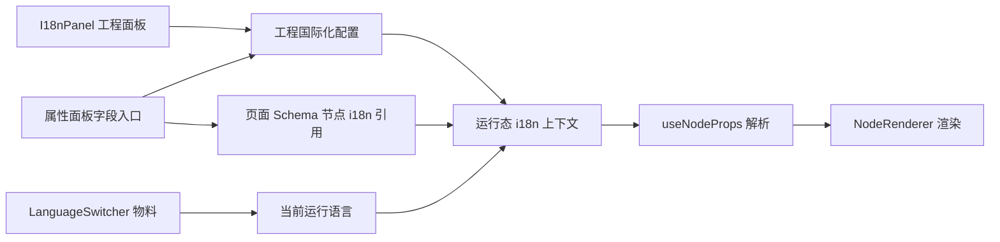

# 低代码页面国际化设计

## 1. 背景

`designer` 现有国际化只服务设计器壳层，包括工具栏、面板、提示和 Element Plus 语言包。
这套能力不作用于画布内用户搭建的页面。

本设计面向低代码平台访问用户看到的页面文案国际化。
配置范围限定为本工程内页面文案。
不做跨工程词条库。
不做机器翻译。

## 2. 目标

- 支持开发人员在工程内配置可用语言和默认语言。
- 支持开发人员维护本工程内页面文案资源。
- 支持运行态访问用户通过页面组件切换语言。
- 支持预览态验证语言切换效果。
- 支持扫描整个工程，发现可国际化字段和缺失翻译。
- 保持现有组件 `props` 结构稳定，兼容旧页面。
- 发布态输出完整国际化配置，运行态不依赖设计器接口回查。

## 3. 非目标

- 不做跨工程词条库。
- 不做机器翻译。
- 不做翻译审批流。
- 不做翻译版本管理。
- 不做多租户共享资源。
- 不做图片、视频、样式、接口数据的国际化。
- 不做路由按语言自动改写。
- 不做复杂复数规则、性别规则、地域格式化规则。
- 不改变设计器壳层 `vue-i18n` 的职责。

## 4. 核心原则

- 工程配置决定支持哪些语言。
- 国际化资源归工程所有。
- 组件节点只保存字段到资源 key 的引用。
- 语言切换组件只切换运行态语言，不维护翻译资源。
- 渲染器统一解析文案，不让每个物料重复实现。
- 没有翻译时必须有明确回退。
- 默认语言文案优先保证完整，其他语言允许缺失但要提示。

## 5. 现有上下文

当前左侧工具栏已有 `i18n` 入口。

- `DesignerView.vue` 的左侧 `ToolRail` 已包含 `i18n` 项。
- `I18nPanel.vue` 已存在，但目前是占位。
- 工程设置已有 `globalVariables`、`globalScripts` 保存链路。
- 页面 Schema 已保存组件节点、页面配置、变量、脚本等内容。
- 预览态使用 `NodeRenderer` 和 `useNodeProps` 解析组件属性。

因此第一期主要新增：

- 工程级 `i18n` 设置。
- 节点级字段引用。
- 左侧 `I18nPanel` 编辑体验。
- 属性面板字段级入口。
- 运行态语言上下文。
- `LanguageSwitcher` 物料。
- 发布态契约。

## 6. 用户角色

### 6.1 开发人员

在设计器中配置工程语言、维护翻译资源、拖入语言切换组件、预览验证。

### 6.2 页面访问用户

在运行态页面中通过语言切换组件切换语言。
访问用户不直接维护翻译资源。

## 7. 术语

| 术语 | 说明 |
| --- | --- |
| locale | 语言编码，如 `zh-CN`、`en-US` |
| 默认语言 | 工程的基准语言，缺翻译时优先回退到它 |
| 当前编辑语言 | 国际化面板正在编辑的目标语言 |
| 当前运行语言 | 预览态或运行态实际展示的语言 |
| 资源 key | 一个文案资源的稳定标识 |
| 源文案 | 从节点字段扫描得到的原始文案 |
| 国际化绑定 | 节点字段到资源 key 的引用关系 |
| 孤儿资源 | 资源引用的页面、节点或字段已不存在 |

## 8. 整体架构



## 9. 数据模型

### 9.1 工程级配置

在工程设置中增加 `i18n`。
建议与 `globalVariables`、`globalScripts` 同级保存。

```ts
export interface ProjectI18nSettings {
  enabled: boolean;
  defaultLocale: string;
  locales: ProjectI18nLocale[];
  resources: Record<string, ProjectI18nResource>;
}

export interface ProjectI18nLocale {
  code: string;
  name: string;
  enabled: boolean;
}

export interface ProjectI18nResource {
  sourceText: string;
  namespace: "page" | "component";
  pageId?: string;
  nodeId?: string;
  propPath: string;
  values: Record<string, string>;
  updatedAt?: number;
}
```

示例：

```json
{
  "enabled": true,
  "defaultLocale": "zh-CN",
  "locales": [
    { "code": "zh-CN", "name": "简体中文", "enabled": true },
    { "code": "en-US", "name": "English", "enabled": true }
  ],
  "resources": {
    "page_home.node_btn_submit.props.text": {
      "sourceText": "提交",
      "namespace": "component",
      "pageId": "page_home",
      "nodeId": "node_btn_submit",
      "propPath": "props.text",
      "values": {
        "zh-CN": "提交",
        "en-US": "Submit"
      },
      "updatedAt": 1799999999999
    }
  }
}
```

### 9.2 节点级引用

在组件节点增加 `i18n`。

```ts
export interface ComponentNodeI18n {
  props?: Record<string, string>;
}
```

示例：

```json
{
  "id": "node_btn_submit",
  "type": "Button",
  "props": {
    "text": "提交"
  },
  "i18n": {
    "props": {
      "text": "page_home.node_btn_submit.props.text"
    }
  }
}
```

`props.text` 仍是普通字符串。
`i18n.props.text` 表示这个字段运行时要从资源表解析。

### 9.3 页面级引用

页面标题、描述不属于组件节点。
页面级资源直接通过资源表记录。

```json
{
  "key": "page_home.meta.title",
  "namespace": "page",
  "pageId": "page_home",
  "propPath": "config.meta.title"
}
```

页面 Schema 可选增加：

```ts
export interface PageNodeI18n {
  config?: Record<string, string>;
}
```

第一期可不强依赖页面节点引用。
页面级资源通过 `pageId + propPath` 匹配即可。

## 10. 资源 key 规则

资源 key 由系统生成。
开发人员不手写 key。

### 10.1 组件字段

格式：

```text
page_{pageId}.{nodeId}.{propPath}
```

示例：

```text
page_page_home.node_btn_submit.props.text
```

### 10.2 数组项字段

数组项必须使用稳定项标识。
优先级：

1. `id`
2. `key`
3. `name`
4. `value`
5. 兜底索引 `index_{n}`

示例：

```text
page_page_home.node_tabs.props.tabs.tab1.label
page_page_home.node_table.props.columns.deviceName.label
```

如果数组项没有稳定标识，系统允许生成 `index_{n}`，但面板应提示“索引 key 在重排后可能变化”。

### 10.3 页面字段

格式：

```text
page_{pageId}.config.meta.title
page_{pageId}.config.meta.description
```

## 11. 字段支持范围

第一期只支持本工程页面文案。

### 11.1 组件 props 字段

- `props.text`
- `props.label`
- `props.title`
- `props.placeholder`
- `props.content`

### 11.2 数组字段

- `props.items[].label`
- `props.items[].title`
- `props.items[].content`
- `props.tabs[].label`
- `props.tabs[].content`
- `props.columns[].label`

### 11.3 页面字段

- `page.config.meta.title`
- `page.config.meta.description`

### 11.4 不支持字段

- 样式字段。
- 图片、视频、文件地址。
- 接口返回数据。
- 脚本代码中的字符串。
- 绑定表达式产出的动态值。
- 组件内部固定提示文案。

## 12. 运行态解析规则

### 12.1 当前语言来源

运行态当前语言按优先级解析：

1. URL 查询参数 `locale`。
2. 宿主运行态上下文下发。
3. `LanguageSwitcher` 记住的本地选择。
4. 工程 `i18n.defaultLocale`。
5. 工程第一个启用语言。

编辑器壳层语言不参与运行态页面语言解析。

### 12.2 文案解析顺序

对于一个绑定了资源 key 的字段：

1. 当前语言资源值。
2. 默认语言资源值。
3. 资源 `sourceText`。
4. 原始 `props` 字段值。
5. 空字符串。

### 12.3 与数据绑定的优先级

现有属性解析链路：

```text
props -> expression bindings -> resolvedProps
```

新增后：

```text
props -> expression bindings -> i18n -> resolvedProps
```

但如果某字段存在运行时绑定，国际化不覆盖绑定结果。
具体规则：

- 字段未绑定：允许 i18n 解析。
- 字段绑定为表达式、变量、数据点：不做 i18n 解析。
- 属性面板对同时存在绑定和 i18n 的字段显示冲突提示。

原因：绑定代表动态运行值，静态翻译不应覆盖动态值。

## 13. 左侧国际化面板设计

`I18nPanel` 是工程级国际化管理入口。
扫描范围固定为整个工程。

### 13.1 面板结构

面板分为四块：

1. 工程配置区。
2. 语言列表区。
3. 资源列表区。
4. 资源编辑抽屉。

### 13.2 工程配置区

字段：

- 启用国际化。
- 默认语言。
- 当前编辑语言。

操作：

- 新增语言。
- 保存配置。
- 扫描整个工程。
- 清理孤儿资源。

状态：

- 未启用：资源表仍可查看，但运行态不解析。
- 已启用：预览态和运行态解析资源。

### 13.3 语言列表区

每行显示：

- 语言名称。
- 语言编码。
- 是否启用。
- 是否默认。
- 缺失翻译数量。

操作：

- 编辑名称。
- 启用 / 禁用。
- 设为默认。
- 删除。

限制：

- 默认语言不可禁用。
- 默认语言不可删除。
- 至少保留一个启用语言。
- 删除语言前提示会删除对应资源值。

### 13.4 资源列表区

筛选条件：

- 页面。
- 组件。
- 字段。
- 状态。
- 关键词。

状态包括：

- 完整。
- 缺默认语言。
- 缺当前语言。
- 源文案变化。
- 孤儿资源。
- 绑定丢失。

表格列：

| 列 | 说明 |
| --- | --- |
| 页面 | 页面名称 |
| 组件 | 节点 label 或 type |
| 字段 | `props.text` 等 |
| 源文案 | 扫描得到的原始文案 |
| 默认语言 | 默认语言值 |
| 当前语言 | 当前编辑语言值 |
| 状态 | 完整、缺失、孤儿等 |
| 操作 | 编辑、定位、移除绑定 |

### 13.5 资源编辑抽屉

展示单个资源的所有语言值。

字段：

- 资源 key，只读。
- 页面，只读。
- 组件，只读。
- 字段，只读。
- 源文案，只读。
- 各语言翻译值。

操作：

- 保存。
- 复制默认语言到空项。
- 清空当前语言。
- 移除资源绑定。

## 14. 属性面板字段入口

对可国际化字段展示一个小按钮。

### 14.1 未绑定状态

显示灰色按钮。
点击后：

1. 自动生成资源 key。
2. 创建资源项。
3. 将当前字段值写入默认语言。
4. 写入节点 `i18n.props[propName] = key`。
5. 打开资源编辑弹窗。

### 14.2 已绑定状态

显示已绑定状态。
点击后打开资源编辑弹窗。

### 14.3 状态提示

- 灰色：未绑定。
- 绿色：已绑定且启用语言都完整。
- 黄色：缺当前语言。
- 橙色：源文案与默认语言不一致。
- 红色：资源 key 不存在。

### 14.4 字段值修改后的处理

当已绑定字段的原始 `props` 值被修改：

- 更新资源 `sourceText`。
- 如果默认语言值为空，同步写入默认语言。
- 如果默认语言已有值，不自动覆盖。
- 状态标记为“源文案变化”，提示开发人员确认。

## 15. 扫描整个工程

扫描入口固定为“扫描整个工程”。
不提供只扫描当前页面作为第一期功能。

### 15.1 扫描输入

- 页面列表。
- 每个页面的 Schema。
- 工程 i18n 配置。

### 15.2 扫描输出

```ts
interface I18nScanResult {
  candidates: I18nCandidate[];
  missingResources: I18nMissingResource[];
  orphanResources: I18nOrphanResource[];
  conflicts: I18nConflict[];
}
```

### 15.3 候选字段

候选字段包括：

- 未绑定但可国际化的字段。
- 已绑定但资源不存在的字段。
- 已绑定且资源完整的字段。

### 15.4 自动修复

扫描后允许一键处理：

- 为未绑定字段批量创建资源。
- 为绑定丢失的字段补资源壳。
- 为默认语言空值填入源文案。
- 标记孤儿资源。

不自动删除孤儿资源。
删除必须由开发人员确认。

### 15.5 冲突识别

冲突包括：

- 字段同时存在数据绑定和 i18n 绑定。
- 资源 key 重复指向多个不相关字段。
- 数组项使用索引 key 且数组顺序变化。
- 资源指向不存在页面、节点或字段。

## 16. 语言切换物料

新增 `LanguageSwitcher` 物料。

### 16.1 定位

运行态组件。
开发人员拖入页面后，访问用户可切换当前运行语言。

### 16.2 属性

```ts
props: {
  mode: "select" | "button-group";
  display: "name" | "code" | "name-code";
  remember: boolean;
  size: "small" | "default" | "large";
  disabled: boolean;
}
```

### 16.3 数据来源

语言列表只来自工程 `i18n.locales`。
组件不单独配置语言列表。

只展示：

- `enabled = true` 的语言。

### 16.4 行为

用户切换语言后：

```ts
runtimeI18n.setLocale(nextLocale);
```

如果 `remember = true`，写入本地存储。

存储 key 建议：

```text
designer:runtime-i18n:{projectId}:locale
```

### 16.5 事件

可暴露事件：

- `change`

事件载荷：

```ts
{
  locale: string;
  previousLocale: string;
}
```

第一期只支持基础事件，不扩展动作系统。

## 17. 预览态设计

预览页需要提供运行态 i18n 上下文。

### 17.1 初始化

`PreviewView` 加载工程设置和页面 Schema 后：

1. 读取工程 `i18n`。
2. 解析初始 locale。
3. `provide(runtimeI18nKey, runtimeI18n)`。
4. `NodeRenderer` 读取上下文解析文案。

### 17.2 切换

`LanguageSwitcher` 修改 runtime locale 后：

- 当前页面重新计算 `resolvedProps`。
- 不重启预览 runtime。
- 不清空组件状态。

### 17.3 与编辑器壳层隔离

设计器顶部语言变化只影响壳层。
预览内语言由 runtime i18n 控制。
两者互不覆盖。

## 18. 保存设计

### 18.1 工程设置保存

工程级 `i18n` 与工程设置一起保存。

```json
{
  "globalVariables": {},
  "globalScripts": {},
  "i18n": {}
}
```

涉及：

- `project-settings-actions.ts`
- `projectApi.ts`
- 相关类型。

### 18.2 页面保存

节点上的 `i18n` 引用跟随页面 Schema 保存。

涉及：

- `ComponentNode` 类型。
- `Serializer.exportPage`。
- 页面更新接口。

### 18.3 保存一致性

保存工程设置失败时，不应标记页面保存成功。
保存页面失败时，不应丢工程资源改动。

第一期交互建议：

- `I18nPanel` 自己有保存按钮，保存工程 i18n。
- 属性面板创建绑定时，先更新页面 Schema，再更新工程资源内存态。
- 自动保存或手动保存页面时保存节点引用。
- 工程资源需显式保存。

后续可做统一脏状态提示。

## 19. 发布态契约

发布态 `project.json` 增加：

```json
{
  "locale": "zh-CN",
  "i18n": {
    "enabled": true,
    "defaultLocale": "zh-CN",
    "locales": [
      { "code": "zh-CN", "name": "简体中文" },
      { "code": "en-US", "name": "English" }
    ],
    "resources": {}
  }
}
```

页面节点保留：

```json
{
  "i18n": {
    "props": {
      "text": "page_page_home.node_btn_submit.props.text"
    }
  }
}
```

发布裁剪规则：

- 只输出启用语言。
- 不输出设计态统计字段。
- 孤儿资源不输出。
- 未被任何页面引用的资源不输出。

## 20. 校验规则

保存工程 i18n 前：

- `enabled = true` 时，至少有一个启用语言。
- 默认语言必须存在且启用。
- 语言编码不可重复。
- 资源 key 不可重复。
- 资源默认语言为空时警告。
- 非默认语言缺失时警告。

扫描后：

- 已绑定 key 不存在，报错。
- key 指向不存在节点，标记孤儿。
- 字段存在动态绑定和 i18n，警告。

发布前：

- 默认语言不存在，阻断。
- 已引用资源不存在，阻断。
- 非默认语言缺失，警告。

## 21. 回退策略

运行态永不因为缺翻译报错。

回退链路：

```text
当前语言 -> 默认语言 -> sourceText -> 原始 props -> ""
```

如果工程未启用 i18n：

- 不解析资源。
- 使用原始 props。

如果访问用户选择了已删除或已禁用语言：

- 回退到默认语言。
- 更新本地记忆值。

## 22. 复制与删除

### 22.1 复制节点

复制节点时：

- 新节点生成新的资源 key。
- 复制原资源所有语言值。
- 新资源指向新节点。

### 22.2 复制页面

复制页面时：

- 新页面生成新的资源 key 前缀。
- 复制页面内资源。
- 新资源指向新页面和新节点。

### 22.3 删除节点

删除节点时：

- 节点引用随页面 Schema 删除。
- 工程资源不立即删除。
- 下次扫描标记为孤儿资源。

### 22.4 删除语言

删除语言时：

- 删除 `locales` 中该语言。
- 删除每个资源 `values[locale]`。
- 如果删除默认语言，必须先设置新的默认语言。

## 23. 导入导出

第一期支持 JSON 导入导出。

导出内容：

```json
{
  "locales": [],
  "resources": {}
}
```

导入策略：

- 语言不存在时可选择自动创建。
- key 已存在时可选择覆盖或跳过。
- 不支持跨工程 key 自动重映射。

由于不做跨工程词条库，导入导出仅用于本工程备份和批量编辑。

## 24. UI 文案建议

左侧栏标题：

- 国际化

按钮：

- 启用国际化
- 新增语言
- 扫描整个工程
- 清理孤儿资源
- 复制默认语言到空项
- 定位组件
- 移除绑定

状态：

- 完整
- 缺默认语言
- 缺当前语言
- 源文案变化
- 孤儿资源
- 绑定丢失
- 动态绑定冲突

## 25. 实现模块建议

### 25.1 类型

- `designer/src/editor-core/document/types.ts`
  - `ProjectI18nSettings`
  - `ProjectI18nLocale`
  - `ProjectI18nResource`
  - `ComponentNodeI18n`

### 25.2 Store

- `designer/src/stores/editor-store.ts`
  - 增加 `projectI18n`
  - 增加设置、保存、扫描相关 action

- `designer/src/stores/editor/project-settings-actions.ts`
  - 加载和保存 `i18n`

### 25.3 运行态

- `designer/src/ui/editors/page/preview/runtime-i18n.ts`
  - 创建 runtime i18n 上下文
  - `setLocale`
  - `translate`

- `designer/src/ui/editors/page/canvas/composables/use-node-props.ts`
  - 接入字段解析

### 25.4 面板

- `designer/src/ui/shared/tool-panels/I18nPanel.vue`
  - 工程配置
  - 语言管理
  - 资源列表
  - 扫描整个工程

### 25.5 属性面板

- `PropertyPanel.vue`
  - 可国际化字段按钮
  - 字段资源编辑弹窗

### 25.6 物料

- `designer/src/materials/LanguageSwitcher`
  - `manifest.ts`
  - `index.ts`
  - descriptor

## 26. 测试建议

### 26.1 单元测试

- 语言配置规范化。
- 资源 key 生成。
- 字段扫描。
- 孤儿资源识别。
- 文案回退链路。
- 动态绑定冲突识别。

### 26.2 组件测试

- `I18nPanel` 新增语言、删除语言、设置默认语言。
- `I18nPanel` 扫描整个工程。
- 属性面板字段创建国际化绑定。
- `LanguageSwitcher` 切换语言。

### 26.3 集成测试

- 配置语言后保存刷新仍存在。
- 预览页切换语言，按钮文案更新。
- 缺当前语言时回退默认语言。
- 编辑器壳层语言变化不影响预览页运行语言。
- 工程未启用 i18n 时页面不解析资源。

## 27. 验收标准

- 开发人员可以在左侧国际化面板配置工程语言。
- 开发人员可以扫描整个工程生成资源清单。
- 开发人员可以在资源表维护本工程页面文案。
- 开发人员可以在属性面板为字段开启国际化。
- 访问用户可以通过 `LanguageSwitcher` 切换页面语言。
- 预览态语言切换无需刷新页面。
- 缺翻译时按规则回退。
- 保存刷新后配置和节点引用不丢失。
- 发布态包含运行所需的完整 i18n 数据。

## 28. 风险

- 工程设置和页面 Schema 分开保存，可能出现资源已保存但节点引用未保存，或反过来。
- 数组字段如果没有稳定项标识，重排后资源 key 可能失效。
- 动态绑定和静态翻译同时存在时，开发人员可能误解优先级。
- 全工程扫描需要加载所有页面，页面数量大时要处理加载时间和失败页面。

## 29. 推荐第一期边界

第一期只做完整闭环：

1. 工程语言配置。
2. 工程资源表。
3. 扫描整个工程。
4. 字段级国际化绑定。
5. 预览态语言解析。
6. `LanguageSwitcher` 物料。
7. 发布态契约更新。

不做：

- 跨工程复用。
- 机器翻译。
- 图片和样式国际化。
- 脚本字符串扫描。
- 后端数据国际化。
