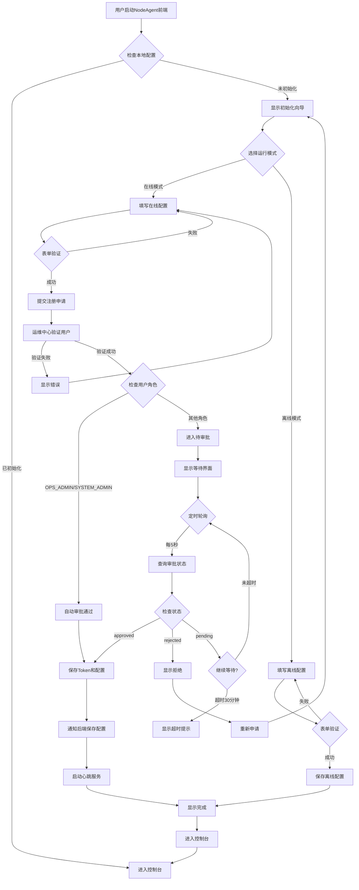
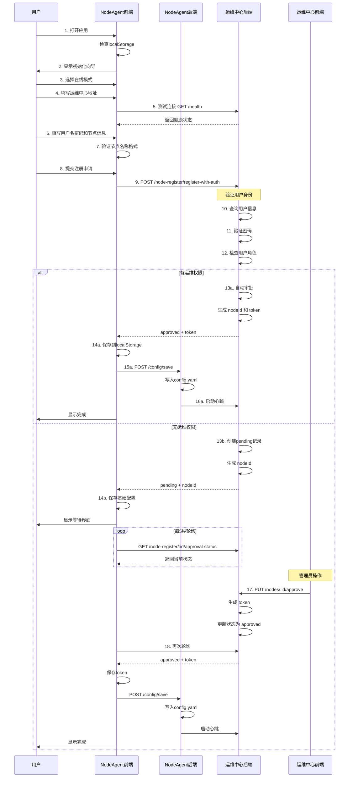

# NodeAgent 初始化流程详解

## 概述

本文档详细说明 NodeAgent 首次启动时的初始化流程，包括在线模式和离线模式的完整注册审批流程。

## 整体流程图



## 在线模式详细流程

### 1. 用户注册流程



### 2. 审批流程

**运维中心管理员操作**:

1. 管理员登录运维中心（dev_ide）
2. 进入"运维监控中心"页面
3. 点击待审核通知图标
4. 查看待审核列表：
   - 申请人用户名和角色
   - 节点名称、描述
   - 节点模式（在线/离线）
   - IP地址、端口
   - Agent版本
   - 申请时间
5. 点击"通过审批"或"拒绝"按钮
6. 审批通过后显示生成的 token（可复制）

**权限控制**:
- 仅 OPS_ADMIN 和 SYSTEM_ADMIN 可见审批按钮
- 其他角色只能查看，无法操作

## 离线模式详细流程

### 1. 配置流程


### 2. 功能说明

离线模式下：
- 不连接运维中心
- 不启动心跳服务
- 不接收远程指令
- 需要手动导入工程包（.ifp 文件）
- 手动控制工程启停
- 适合开发测试或隔离网络环境

## 配置存储机制

### 前端配置（localStorage）

存储键名规范：
- `nodeagent_mode`: 节点模式
- `nodeagent_node_id`: 节点ID
- `nodeagent_node_name`: 节点名称
- `nodeagent_center_url`: 运维中心地址
- `nodeagent_registration_token`: 注册令牌
- `nodeagent_approval_status`: 审批状态
- `nodeagent_ip_address`: IP地址
- `nodeagent_port`: 端口

### 后端配置（config.yaml）

在线模式配置示例：
```yaml
agent:
  mode: online
  online:
    centerUrl: "http://192.168.1.100:19601"
    nodeId: "550e8400-e29b-41d4-a716-446655440000"
    registrationToken: "abc123..."
```

离线模式配置示例：
```yaml
agent:
  mode: offline
  offline:
    enabled: true
```

## 名称规范

### 节点名称约束

**正则表达式**: `^[a-zA-Z0-9_-]{3,50}$`

**规则说明**:
- 仅允许字母（a-zA-Z）
- 数字（0-9）
- 中划线（-）
- 下划线（_）
- 长度：3-50个字符

**示例**:
- ✓ `production-node-01`
- ✓ `dev_node_test`
- ✓ `edge-gateway-001`
- ✗ `node 01`（包含空格）
- ✗ `节点1`（包含中文）
- ✗ `n@1`（包含特殊字符）

## 常见问题

### Q1: 初始化后如何重新配置？

A: 需要清除本地配置：
1. 打开浏览器开发者工具
2. 进入 Application > Local Storage
3. 删除所有 `nodeagent_` 开头的键
4. 刷新页面，重新进入初始化向导

### Q2: 在线模式审批超时怎么办？

A: 
1. 点击"停止自动刷新"按钮
2. 联系管理员确认审批状态
3. 使用"手动刷新"按钮查询最新状态
4. 如果长时间未审批，可重新申请

### Q3: 离线模式如何切换到在线模式？

A: 离线模式初始化后无法切换到在线模式，需要重新初始化：
1. 清除本地配置（见 Q1）
2. 刷新页面
3. 选择在线模式重新配置

### Q4: 如何验证初始化是否成功？

A: 
- 在线模式：查看控制台是否有心跳日志，运维中心是否显示节点在线
- 离线模式：能正常进入控制台即表示成功

### Q5: 注册时提示节点名称已存在怎么办？

A: 
- 该租户下已有同名节点
- 修改节点名称为唯一值
- 或联系管理员删除旧节点

## API 接口说明

### 注册接口

**POST /api/v1/node-register/register-with-auth**

请求体：
```json
{
  "username": "admin",
  "password": "password123",
  "nodeName": "production-node-01",
  "nodeDescription": "生产环境节点",
  "ipAddress": "192.168.1.50",
  "port": 8080,
  "agentVersion": "1.0.0",
  "mode": "online"
}
```

响应（自动审批）：
```json
{
  "success": true,
  "data": {
    "nodeId": "uuid",
    "nodeName": "production-node-01",
    "approvalStatus": "approved",
    "registrationToken": "token_string",
    "message": "自动审批通过",
    "autoApproved": true
  }
}
```

响应（待审批）：
```json
{
  "success": true,
  "data": {
    "nodeId": "uuid",
    "nodeName": "production-node-01",
    "approvalStatus": "pending",
    "registrationToken": null,
    "message": "申请已提交，等待管理员审批",
    "autoApproved": false
  }
}
```

### 审批状态查询接口

**GET /api/v1/node-register/:nodeId/approval-status**

响应：
```json
{
  "success": true,
  "data": {
    "nodeId": "uuid",
    "nodeName": "production-node-01",
    "approvalStatus": "approved",
    "registrationToken": "token_string"
  }
}
```

### 配置保存接口

**POST /api/v1/config/save**

请求体：
```json
{
  "mode": "online",
  "centerUrl": "http://192.168.1.100:19601",
  "nodeId": "uuid",
  "registrationToken": "token_string"
}
```

响应：
```json
{
  "status": "success",
  "message": "配置保存成功"
}
```

## 安全考虑

1. **密码传输**: 使用 HTTPS 加密传输用户名密码
2. **Token 存储**: registrationToken 保存在 localStorage 和 config.yaml
3. **权限验证**: 注册时验证用户身份，审批时验证管理员权限
4. **审批控制**: 敏感角色（OPS_ADMIN/SYSTEM_ADMIN）自动审批，其他角色需人工审核
5. **配置备份**: 更新 config.yaml 前自动创建 .backup 备份文件

## 最佳实践

1. **生产环境**:
   - 使用在线模式
   - 由专业运维人员初始化
   - 使用具有运维权限的账号注册（自动审批）

2. **开发环境**:
   - 可使用离线模式
   - 快速配置，无需审批

3. **测试环境**:
   - 使用在线模式
   - 由测试人员申请，运维审批

4. **安全建议**:
   - 定期更换 registrationToken
   - 监控异常心跳行为
   - 及时清理已删除节点的配置
