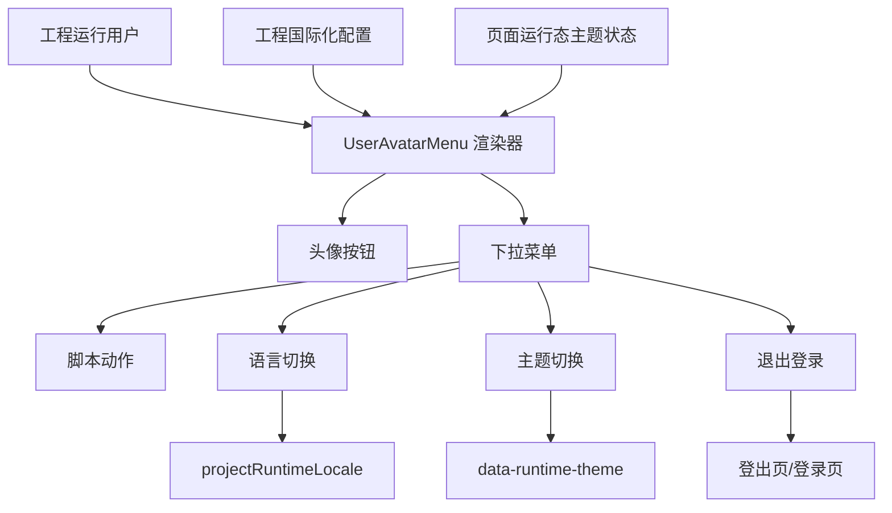

# 设计器用户头像系统组件设计

## 背景

设计器已有系统组件区域，并已接入语言切换组件。现在需要新增一个用户头像系统组件，供开发用户拖入页面后，在预览态和运行态展示当前工程运行用户，并提供常见用户菜单能力。

该组件不是固定业务页面，而是一个通用用户菜单模板。开发用户可以基于默认模板调整菜单项，并把个人资料等业务动作接到自己搭建的页面、弹窗或脚本。

## 目标

- 在系统组件中新增 `用户头像` 组件。
- 组件读取当前工程运行用户信息。
- 默认展示头像、用户名、副标题和下拉菜单。
- 菜单默认包含个人资料、语言切换、主题切换、退出登录。
- 属性栏支持配置菜单项的显示、排序、文案、图标、动作和危险样式。
- 语言切换使用已有工程国际化运行态语言。
- 主题切换作用于用户搭建页面的预览态和运行态主题，不影响 IDE 主题。
- 退出登录优先跳转工程登出页；没有登出页时清理运行态登录状态并回登录页。

## 非目标

- 不做工程用户管理功能。
- 不新增机器翻译能力。
- 不实现个人资料页面。
- 不把组件绑定到 IDE 主题。
- 不要求开发用户为语言切换、主题切换、退出登录编写脚本。

## 组件定义

组件类型：`UserAvatarMenu`

组件名称：`用户头像`

组件分类：系统组件

物料展示：

- 系统组件区域显示一个头像菜单卡片。
- 组件不依赖工程国际化开关。
- 已有 `LanguageSwitcher` 的显示规则保持不变。

默认尺寸：

- 宽度：160
- 高度：44

## 展示结构

组件主体：

- 圆形头像。
- 用户名。
- 副标题，默认显示角色或用户类型。
- 下拉箭头。

下拉面板：

- 顶部用户信息区：头像、用户名、邮箱或账号。
- 菜单列表。
- 支持分隔线。
- 危险菜单项使用红色。

默认视觉风格参考通用 SaaS 顶栏用户菜单。组件应紧凑、清晰，适合放在页面顶部导航或工具栏中。

## 用户信息来源

组件读取当前工程运行用户。

设计态：

- 使用内置管理员用户作为默认数据。
- 头像可用用户名首字占位。

预览态：

- 跟随当前预览选择的工程用户。
- 用户切换后组件同步更新。

运行态：

- 读取运行态登录用户。
- 当前没有头像字段时显示用户名首字占位。
- 当工程用户数据包含头像字段时，组件使用头像字段。

属性栏不提供用户名、邮箱、头像等基础资料配置。组件只负责展示当前用户。

## 菜单模型

菜单项采用默认模板 + 可增删改排序的方式。

菜单项类型：

- `builtin`：内置动作。
- `script`：脚本动作。
- `divider`：分隔线。

默认菜单项：

| key     | 名称     | 类型    | 行为                         |
| ------- | -------- | ------- | ---------------------------- |
| profile | 个人资料 | script  | 默认脚本为空，由开发用户配置 |
| locale  | 语言切换 | builtin | 展开语言子菜单               |
| theme   | 主题切换 | builtin | 展开浅色/深色主题子菜单      |
| logout  | 退出登录 | builtin | 执行退出登录                 |

菜单项字段：

- `id`：菜单项 ID。
- `label`：显示名称。
- `icon`：图标。
- `type`：菜单项类型。
- `builtinAction`：内置动作类型。
- `script`：脚本动作代码。
- `hidden`：是否隐藏。
- `danger`：是否危险样式。

## 属性栏配置

基础配置：

- 显示用户名。
- 显示副标题。
- 头像尺寸。
- 展示样式：紧凑、标准。

菜单配置：

- 菜单项列表。
- 新增菜单项。
- 删除菜单项。
- 上移、下移。
- 编辑菜单项名称。
- 编辑菜单项图标。
- 设置菜单项类型。
- 设置是否隐藏。
- 设置危险样式。
- 脚本动作项可编辑点击脚本。

内置项配置：

- 个人资料：可改名称、图标、脚本。
- 语言切换：可改名称、图标、隐藏。
- 主题切换：可改名称、图标、隐藏。
- 退出登录：可改名称、图标、隐藏、危险样式。

## 语言切换

语言切换是内置子菜单。

行为：

- 读取工程国际化配置中的启用语言。
- 点击语言后调用现有运行态语言切换能力。
- 已配置国际化资源的页面文案随语言变化。
- 未配置翻译时继续使用现有 fallback 逻辑。

当工程未开启国际化时：

- 默认隐藏语言切换菜单项。
- 如果开发用户强制显示，则菜单项禁用。

## 页面运行态主题

主题切换是用户搭建页面的运行态主题，不是 IDE 主题。

内置主题：

- `light`：浅色。
- `dark`：深色。

运行态状态：

- 新增页面运行态主题状态，默认 `light`。
- 预览态和运行态共享同一套切换逻辑。
- 切换后在页面运行容器根节点写入 `data-runtime-theme="light"` 或 `data-runtime-theme="dark"`。

主题变量：

- 通过 CSS 变量提供基础主题能力。
- 首批变量覆盖页面背景、文本、边框、卡片背景、主色。
- 页面样式配置和组件样式可以使用这些变量。

建议变量：

```css
--runtime-bg-color
--runtime-surface-color
--runtime-text-color
--runtime-text-muted-color
--runtime-border-color
--runtime-primary-color
```

## 退出登录

退出登录是内置动作。

执行顺序：

1. 如果工程配置了登出页，跳转登出页。
2. 如果没有登出页，清理运行态登录状态。
3. 清理后回到登录页。
4. 如果登录页也不存在，回到工程首页或显示未登录状态。

退出登录菜单项默认开启危险样式。

## 脚本动作

脚本动作菜单项由开发用户配置。

典型用途：

- 打开个人资料弹窗。
- 跳转个人资料页面。
- 打开 API 密钥管理页面。
- 执行自定义业务逻辑。

组件提供菜单点击上下文：

```ts
{
  ;(item, user, runtimeTheme, runtimeLocale)
}
```

脚本动作只在预览态和运行态执行。编辑态点击菜单只用于预览交互，不修改页面结构。

## 数据流



## 文件影响范围

实现影响范围：

- `designer/src/materials/UserAvatarMenu/`
- `designer/src/materials/index.ts`
- `designer/src/materials/manifests/index.ts`
- `designer/src/editor-core/descriptors/`
- `designer/src/ui/editors/page/sidebar-panels/left/ComponentPanel.vue`
- `designer/src/ui/editors/page/sidebar-panels/right/PropertyPanel.vue`
- `designer/src/stores/editor-store.ts`
- `designer/src/ui/editors/page/preview/`
- `designer/src/ui/editors/page/canvas/`
- `designer/src/i18n/messages/zh.ts`
- `designer/src/i18n/messages/en.ts`

如果已有运行用户上下文不完整，需要在设计器运行态补一个轻量读取入口，但不实现完整用户管理。

## 错误处理

- 无用户信息时显示默认管理员占位。
- 无头像时显示用户名首字。
- 国际化未开启时隐藏语言切换。
- 没有可用语言时禁用语言切换。
- 主题切换失败时保持当前主题。
- 退出登录找不到登出页或登录页时回首页。
- 脚本动作执行失败时通过现有消息机制提示。

## 测试计划

单元测试：

- 物料注册后能获取 `UserAvatarMenu`。
- 系统组件区域展示用户头像组件。
- 默认 props 包含四个默认菜单项。
- 国际化未开启时语言项隐藏或禁用。
- 主题切换写入页面运行态主题状态。
- 退出登录按登出页优先规则选择目标页。

组件测试：

- 渲染默认用户信息。
- 点击头像打开下拉菜单。
- 点击语言项展开语言子菜单。
- 点击主题项展开浅色/深色子菜单。
- 点击脚本动作项触发脚本回调。

手工验证：

- 在物料区看到用户头像组件。
- 拖入页面后编辑态可见。
- 属性栏能配置菜单项。
- 预览态下拉菜单样式正常。
- 预览态切换用户后头像信息更新。
- 预览态语言切换生效。
- 预览态主题切换只影响页面，不影响 IDE。
- 退出登录能跳转登出页。

## 决策记录

- 用户头像组件作为系统组件长期显示，不依赖国际化开关。
- 主题切换是页面运行态主题，不是 IDE 主题。
- 个人资料由开发用户自己搭建页面或弹窗，并通过脚本动作打开。
- 菜单配置采用默认模板 + 可扩展模型。
- 用户信息来自工程运行用户，不在属性栏静态配置。
- 退出登录优先跳转工程登出页。
- 语言和主题采用子菜单交互。
