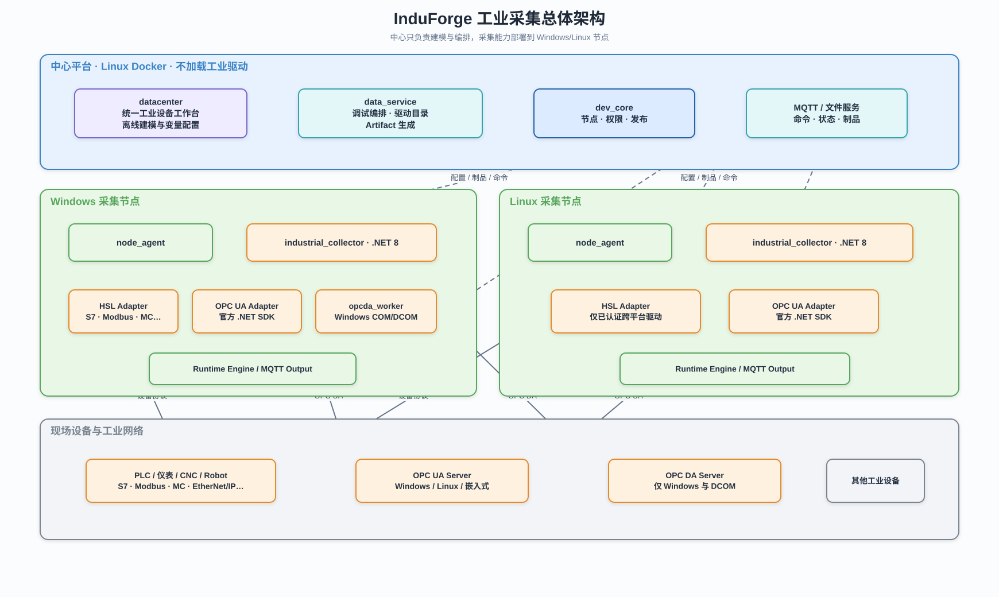
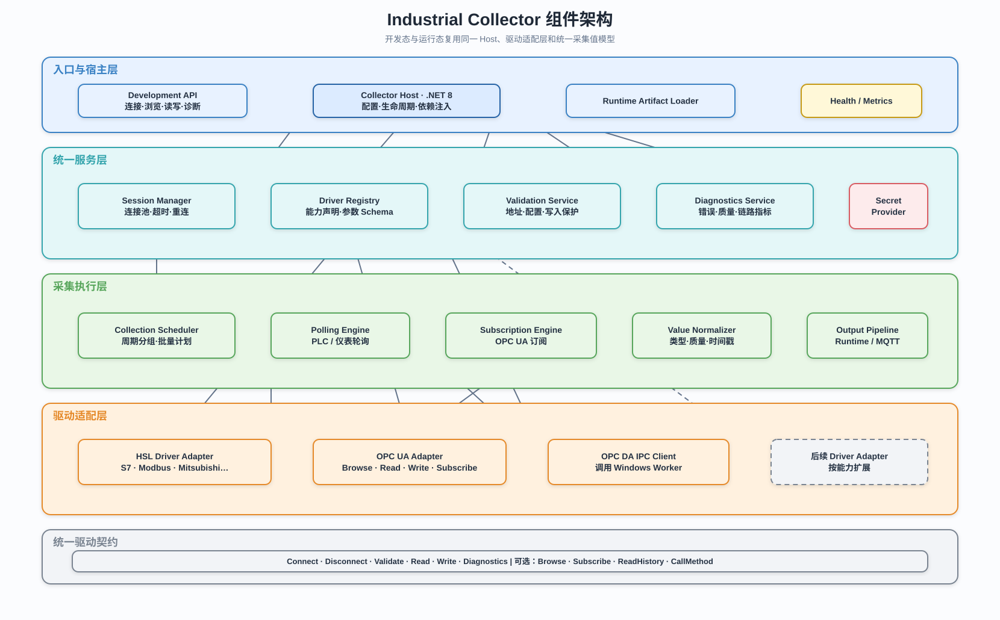

# InduForge 工业采集架构

## 1. 文档定位

本文档定义工业采集子系统的目标架构，包括开发态调试、运行态采集、驱动体系、节点部署、数据契约、安全和交付边界。

平台整体关系见 [平台整体架构](../../01-产品与架构/平台系统架构.md)。

## 2. 核心决策

- 工业采集从中心平台独立，中心不直接连接现场设备。
- 新建 `.NET 8` 的 `industrial_collector`，同时支持 development 和 runtime 模式。
- PLC、仪表和厂商协议优先使用 HSL SDK。
- OPC UA 直接使用 OPC Foundation 官方 .NET SDK。
- OPC DA 使用 Windows 专属 `opcda_worker`，不进入 Linux 节点。
- 开发态和运行态复用相同驱动适配器、连接配置和变量模型。
- 前端使用统一工业设备工作台，通过驱动能力决定可用功能。

## 3. 采集子系统架构

工业采集从中心平台独立部署。中心负责统一建模、调试编排和发布，Windows/Linux 节点负责真实设备连接与长期采集，OPC DA 仅由 Windows 可选 Worker 承担。



可编辑源文件：[工业采集总体架构.drawio](./旧架构图/工业采集总体架构.drawio)。

## 4. 开发态与运行态

### 4.1 开发态

只安装 Linux 中心包时，可以完成配置、变量建模、数据点映射、计算、报警、存储策略和 Artifact 生成。没有 Collector 时不能真实连接、浏览和读写。

需要联调时启动：

```text
industrial_collector --mode development
```

开发态负责驱动目录、连接测试、地址空间浏览、单点和批量读取、受控写入、短时订阅以及诊断。会话超时后自动释放，不承担长期采集。

### 4.2 运行态

正式节点运行：

```text
industrial_collector --mode runtime
```

运行态负责加载 Artifact、长期连接、批量轮询、OPC UA Subscription、断线重连、质量转换、数据输出和运行指标上报。

## 5. Collector 内部结构

Collector 使用统一 Host、会话管理、采集调度、驱动适配和输出管道，development 与 runtime 模式只更换入口和生命周期策略。



可编辑源文件：[Collector组件架构.drawio](./旧架构图/Collector组件架构.drawio)。

```text
industrial_collector/
├─ Host
├─ Contracts
├─ Drivers
│  ├─ Hsl
│  └─ OpcUa
├─ Sessions
├─ Collection
├─ Messaging
└─ Api
```

第一版使用单进程，只有在驱动位数、稳定性或原生依赖要求下才拆分 Worker。

所有驱动至少支持：

```text
Connect
Disconnect
Read
Write
Validate
Diagnostics
```

可选能力独立声明：

```text
Browse
Subscribe
ReadHistory
CallMethod
```

## 6. 驱动体系

### 6.1 HSL

HSL 用于快速接入 S7、Modbus、三菱、欧姆龙、Allen-Bradley、基恩士、台达、汇川、信捷等协议。

第一阶段只验证：

1. Modbus TCP。
2. Siemens S7 TCP。
3. Mitsubishi MC TCP。

新增驱动只增加驱动描述、参数 Schema、HSL 工厂映射、地址规则、能力声明和验证用例，不新增完整前端工作台。

### 6.2 OPC UA

直接使用 OPC Foundation 官方 .NET SDK，负责 Endpoint 发现、安全策略、身份认证、Browse、Read、Write、Subscription、Session 恢复，以及可选的历史读取和方法调用。

运行态优先使用 Subscription；开发态单次测试使用 Read。地址优先保存 Namespace URI：

```text
nsu=http://example.com/process;s=Reactor.Temperature
```

### 6.3 OPC DA

OPC DA 基于 Windows COM/DCOM，只支持 Windows 节点。推荐独立进程：

```text
opcda_worker.exe
```

负责 Server 枚举、ProgID/CLSID、Group、Item、DataChange、Quality、Timestamp 和 DCOM 诊断，主 Collector 通过本地 IPC 调用。

## 7. 平台支持矩阵

| 能力                          | Windows | Linux      |
| ----------------------------- | ------- | ---------- |
| HSL 纯 TCP/UDP 驱动           | 支持    | 逐驱动认证 |
| 普通串口驱动                  | 支持    | 逐设备认证 |
| HSL Windows native DLL        | 支持    | 不支持     |
| OPC UA                        | 支持    | 支持       |
| OPC DA                        | 支持    | 不支持     |
| Siemens S7 Plus 当前 HSL 实现 | 支持    | 不支持     |
| PComm                         | 支持    | 不支持     |

驱动状态使用 `verified`、`candidate`、`windows_only`、`unsupported`。前端根据目标节点平台和已安装驱动过滤选项。

## 8. 统一工业数据模型

### 8.1 驱动描述

```json
{
  "driverId": "hsl.siemens.s7",
  "provider": "hsl",
  "displayName": "Siemens S7 TCP",
  "platforms": ["windows-x64", "linux-x64"],
  "capabilities": {
    "read": true,
    "write": true,
    "browse": false,
    "subscribe": false
  }
}
```

### 8.2 工业接入源

```json
{
  "id": "source-1",
  "type": "industrial",
  "driverId": "hsl.siemens.s7",
  "name": "一号线 PLC",
  "connection": {
    "ip": "192.168.1.10",
    "port": 102,
    "plcModel": "S1200",
    "rack": 0,
    "slot": 0
  },
  "assignment": null
}
```

接入源允许未绑定节点，此时可配置和建模，但不可在线调试。

### 8.3 工业变量

```json
{
  "id": "variable-1",
  "sourceId": "source-1",
  "name": "反应釜温度",
  "address": "DB1.DBD0",
  "dataType": "float32",
  "access": "read",
  "collection": {
    "mode": "polling",
    "intervalMs": 1000
  },
  "driverOptions": {}
}
```

协议专属参数放入 `driverOptions`，稳定公共字段保持统一。

## 9. 统一工业设备工作台

固定区域：概览、连接配置、变量管理、在线调试、采集计划和诊断。

按能力显示：

- OPC UA/OPC DA 地址空间浏览。
- OPC UA Subscription 参数。
- PLC 地址辅助输入和批量读取计划。
- 串口、证书或 DCOM 专属配置。

没有在线执行器时，测试连接、浏览、读取、写入和监控按钮必须禁用，并提示“未分配采集节点或调试执行器”。

## 10. 采集策略

### 10.1 PLC 与仪表

- 以轮询为主。
- 按采集周期分组。
- 按设备、从站、地址连续性和协议上限生成批量读计划。
- 单连接内控制并发，避免压垮设备和串口总线。

### 10.2 OPC UA

- 运行态优先 Subscription。
- 按 Publishing Interval 和 Sampling Interval 分组。
- 重连后恢复或重建 Session、Subscription 和 MonitoredItem。
- 重连期间数据质量转为 `uncertain` 或 `bad`。

### 10.3 统一采集值

```text
variableId
value
quality
sourceTimestamp
serverTimestamp
receivedAt
error
```

驱动原始质量和错误必须保留在诊断中。

## 11. 通信契约

### 11.1 开发态最小接口

```text
GET    /health
GET    /api/v1/drivers
POST   /api/v1/sessions
POST   /api/v1/sessions/{id}/connect
POST   /api/v1/sessions/{id}/browse
POST   /api/v1/sessions/{id}/read
POST   /api/v1/sessions/{id}/write
DELETE /api/v1/sessions/{id}
```

响应遵循 `code`、`msg`、`data`、`reqId` 契约。

### 11.2 运行态

- NodeAgent 负责发布和进程控制。
- Collector 将采集值交给 Runtime Engine 或 MQTT。
- Collector 上报驱动、连接和采集指标。
- 中心不得直接维持设备长连接。

## 12. 安全与授权

- 开发态 Collector 不得暴露公网。
- 写入测试默认关闭，开启后需要权限、二次确认和审计。
- HSL 激活码通过节点机密文件或环境变量注入。
- OPC UA 客户端私钥保存在节点证书目录，不进入 Artifact。
- OPC DA 使用受限 Windows 服务账户。
- 设备密码不得写入日志或明文导出。
- 开发阶段可使用 HSL 免费验证模式；正式交付前必须完成商业授权。

## 13. 建设阶段

1. **统一模型与工作台**：工业接入源、工业变量、驱动目录和无执行器离线建模。
2. **开发态 Collector**：Windows development Collector，接入三种 HSL 驱动和 OPC UA。
3. **运行态采集**：NodeAgent 管理 Collector，Artifact 驱动长期采集并接入 MQTT。
4. **平台扩展**：Linux 驱动认证、OPC DA Worker、更多驱动和 Worker 隔离。

## 14. 第一阶段验收标准

- 只安装中心包时可完成工业接入源和变量建模。
- 三种 HSL 驱动共用同一个工作台和变量模型。
- OPC UA 使用同一工作台并支持 Browse、Read 和短时 Subscription。
- 新增第四种 HSL 驱动不需要新增完整 Vue 页面。
- development 与 runtime 使用相同驱动配置。
- Collector 异常不会导致中心服务退出。
- 敏感信息不进入 Artifact 和日志。

## 15. 关联文档

- [平台整体架构](../../01-产品与架构/平台系统架构.md)
- [数据中心概览](../../03-模块设计/datacenter/README.md)
- [数据服务概览](../../03-模块设计/data_service/README.md)
- [NodeAgent 概览](../../03-模块设计/node_agent/README.md)
- [环境端口规划](../../06-运维与安全/环境端口规划.md)
