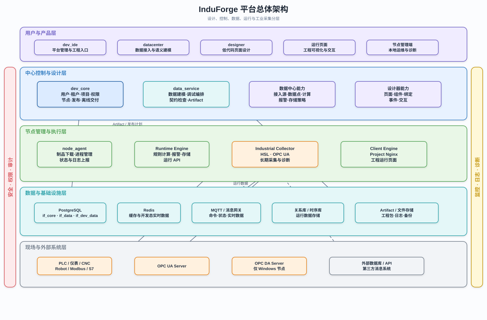
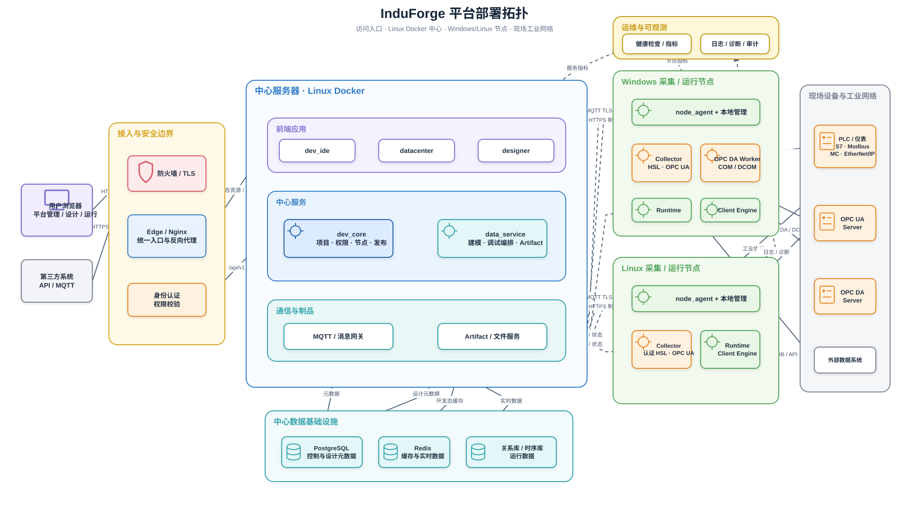
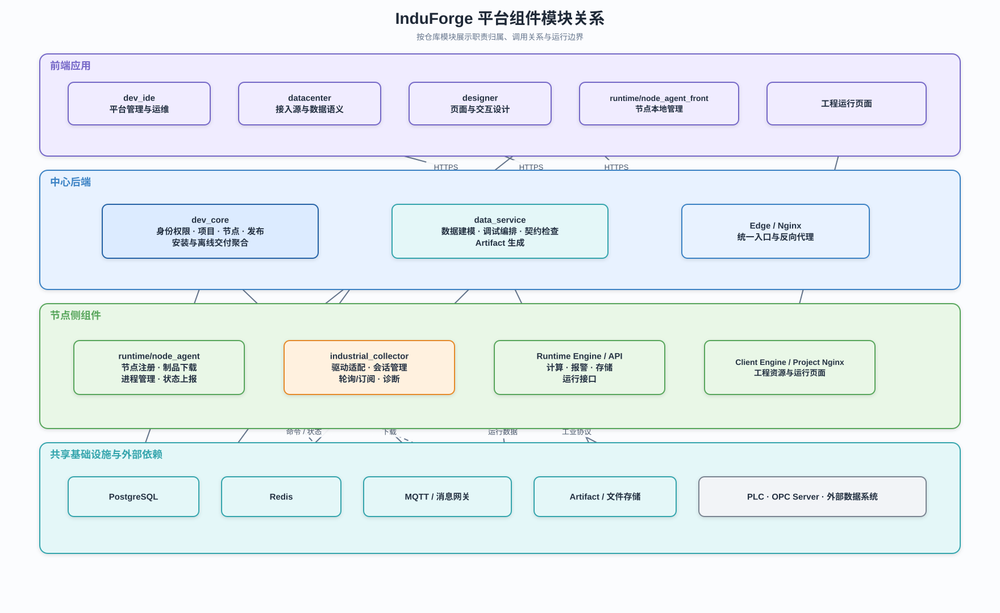
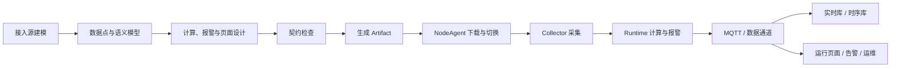

# InduForge 平台整体架构

## 1. 文档定位

本文档是 InduForge 平台整体架构的正式基线，定义中心平台、开发工具、节点运行环境、工业采集、数据通道、发布交付和模块职责边界。

工业采集的驱动、开发态调试与运行态执行细节见 [工业采集架构](../../02-系统设计/工业采集架构.md)。

## 2. 架构目标

- 中心平台运行在 Linux Docker，负责设计、治理、配置、发布和数据汇聚。
- 工业协议执行独立于中心，由 Windows 或 Linux 采集节点连接现场设备。
- 开发态和运行态复用同一套采集程序、驱动适配器和配置契约。
- 设计对象通过 Artifact 发布，节点正式运行不依赖中心数据库在线查询配置。
- 数据点作为设计器、计算、报警、存储和运行页面的统一数据语义。
- 中心包、节点包、驱动包和工程 Artifact 分别安装、升级与回滚。

## 3. 架构视图

### 3.1 平台总体架构

总体架构按用户产品、中心控制与设计、节点执行、数据基础设施、现场系统分层，横向体现安全治理与可观测能力。



可编辑源文件：[平台总体架构.drawio](./旧架构图/平台总体架构.drawio)。

### 3.2 平台部署架构

部署架构明确中心 Linux Docker、Windows/Linux 节点、现场网络以及 HTTPS、MQTT 和工业协议边界。



可编辑源文件：[平台部署架构.drawio](./旧架构图/平台部署架构.drawio)。

### 3.3 平台组件模块关系

组件关系图按仓库模块说明前端、中心后端、节点侧组件、基础设施和现场依赖之间的调用与管理关系。



可编辑源文件：[平台组件模块关系.drawio](./旧架构图/平台组件模块关系.drawio)。

## 4. 模块分层与职责

### 4.1 体验与设计层

- `dev_ide`：平台入口、项目上下文、运维和发布视图。
- `designer`：页面、组件、绑定、事件和交互定义。
- `datacenter`：数据点、接入源、存储策略、计算单元和报警单元工作台。

### 4.2 中心控制层

- `dev_core`：租户、用户、权限、项目、节点、发布、授权和平台治理。
- 不解释工业协议地址，不连接现场设备。

### 4.3 中心数据设计层

- `data_service`：数据域对象、开发态调试编排、契约检查和运行 Artifact 生成。
- 保存声明式配置，不承担工业设备长期连接和正式采集。

### 4.4 节点管理层

- `runtime/node_agent`：节点注册、命令处理、制品下载、进程守护、升级回滚和状态上报。
- `runtime/node_agent_front`：节点本地安装、诊断和运维界面。

### 4.5 节点执行层

- `industrial_collector`：工业驱动、设备会话、采集调度、质量转换和数据输出。
- `opcda_worker`：Windows 专属 OPC DA COM/DCOM 执行器，按需安装。
- `runtime_engine`：计算、报警、运行态数据管道和本地缓存。
- `runtime_api`：工程运行态用户、权限、数据 API 和 WebSocket。
- `client_engine`：工程页面运行和共享运行内核。

## 5. 职责边界

| 模块                   | 负责                         | 不负责                       |
| ---------------------- | ---------------------------- | ---------------------------- |
| `dev_core`             | 平台治理、项目、节点、发布   | 工业协议、数据采集           |
| `data_service`         | 数据建模、调试编排、Artifact | 长期连接 PLC、协议轮询       |
| `datacenter`           | 数据工作台和配置交互         | 直接调用 SDK、浏览器本地采集 |
| `designer`             | 页面与交互设计               | 底层数据源协议               |
| `node_agent`           | 节点和进程生命周期           | 设备协议业务逻辑             |
| `industrial_collector` | 工业设备通信与采集           | 平台治理、工程设计           |
| `runtime_engine`       | 运行态计算、报警、数据管道   | 设计态对象维护               |

## 6. 核心业务流

### 6.1 核心数据流



该图只表达配置与数据的流转顺序；组件归属和部署位置分别以组件关系图、部署架构图为准。

### 6.2 设计流

```text
dev_ide
→ datacenter / designer
→ dev_core / data_service
→ 中心元数据数据库
```

设计阶段允许没有采集节点。用户仍可完成接入源配置、变量建模、数据点映射、计算、报警、存储策略和页面设计。

### 6.3 开发态调试流

```text
datacenter
→ data_service
→ development industrial_collector
→ 真实设备或模拟器
→ data_service
→ datacenter
```

开发态执行器按需启动，只负责短时连接、浏览、读写和监控。

### 6.4 发布流

```text
设计数据
→ 契约检查
→ 生成运行 Artifact
→ dev_core 创建发布计划
→ node_agent 下载并校验
→ 节点切换工程版本
```

### 6.5 运行数据流

```text
现场设备
→ industrial_collector / opcda_worker
→ runtime_engine
→ MQTT / 消息网关
→ 中心实时库、时序库、报警和运行页面
```

## 7. 中心与节点通信

- **控制通道**：节点注册、命令、发布、启停、升级、回滚和开发态调试。
- **数据通道**：数据点实时值、质量、计算输出、报警事件、调试结果和缓存恢复数据。
- **管理通道**：进程版本、操作系统、驱动能力、资源指标、设备状态、成功率和重连次数。

## 8. 数据与制品

### 8.1 中心元数据

- 用户、租户、项目和权限。
- 接入源、变量、数据点和采集计划。
- 存储策略、计算单元和报警策略。
- 页面、组件、绑定和交互定义。
- 节点、发布记录和制品版本。

### 8.2 运行 Artifact

```text
manifest.json
industrial-sources.json
industrial-variables.json
collection-plans.json
datapoints.json
storage-policies.json
compute-units.json
alarm-policies.json
runtime-permissions.json
pages/
```

Artifact 不包含 SDK、可执行程序、许可证、设备私钥或明文密码。

## 9. 安装与交付

- **Linux 中心包**：中心业务服务、前端、Edge、PostgreSQL、Redis、消息网关和安装脚本，不包含工业驱动 SDK。
- **Windows 节点包**：NodeAgent、Collector、Runtime、OPC UA 官方 SDK；HSL 和 OPC DA 按需安装。
- **Linux 节点包**：NodeAgent、Collector、Runtime、OPC UA 官方 SDK和经过 Linux 验证的驱动。
- **驱动与许可证包**：独立升级；激活码、节点密钥、设备密码和证书私钥通过节点机密配置注入。

## 10. 当前实现到目标架构

| 当前能力                                   | 目标调整                               |
| ------------------------------------------ | -------------------------------------- |
| `data_service` 直接执行 OPC UA、S7、Modbus | 真实协议执行迁移到 Collector           |
| OPC UA、S7、Modbus 专属模型                | 收敛为工业接入源、变量和采集计划       |
| 多个协议专属工作台                         | 收敛为能力驱动的统一工业设备工作台     |
| 开发态协议会话位于中心                     | 中心编排，开发态 Collector 执行        |
| 节点只负责部署和进程管理                   | 扩展管理 Collector 和 Runtime 生命周期 |
| 运行态采集能力未完整落地                   | Collector 长期采集并输出统一数据点     |

## 11. 架构约束

- 中心平台不得直接依赖 HSL、OPC UA 或 OPC DA SDK。
- 工业接入源允许未分配节点，不得阻塞设计态建模。
- 开发态和运行态必须使用同一种驱动配置与变量契约。
- 新增工业驱动不得新增一级导航或复制完整工作台。
- OPC DA 只允许分配给 Windows 节点。
- Linux 驱动必须经过实机认证后才能标记为正式支持。
- 节点正式运行不得依赖中心数据库在线查询配置。
- 敏感信息不得进入 Git、默认安装包或工程 Artifact。

## 12. 关联文档

- [工业采集架构](../../02-系统设计/工业采集架构.md)
- [数据中心概览](../../03-模块设计/datacenter/README.md)
- [数据服务概览](../../03-模块设计/data_service/README.md)
- [NodeAgent 概览](../../03-模块设计/node_agent/README.md)
- [节点侧客户端引擎与工程运行网关设计](./节点侧客户端引擎与工程运行网关设计.md)
- [节点侧运行态数据引擎设计](./节点侧运行态数据引擎设计.md)
- [IF 内置运行库设计](../../03-模块设计/datacenter/IF内置运行库设计.md)
