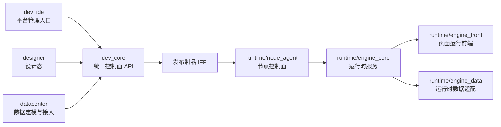

# 高层设计

## 1. 设计目标
- 以现有 `dev_core + dev_ide + datacenter + designer + runtime/node_agent` 为基础，补齐可交付运行时闭环。
- 明确平台层、设计层、数据层、节点层、运行时层职责，避免模块重复建设。
- 为后续按模块拆分 AI 开发提供稳定边界。

## 2. 当前已实现
### 2.1 模块职责现状
| 模块 | 当前职责 | 当前状态 |
| --- | --- | --- |
| `dev_core` | 统一后端 API、认证、多租户、工程、设计页、数据中心、发布、部署、节点管理 | 主干已成型 |
| `dev_ide` | 平台管理端、工程入口、运维与部署管理、租户与用户管理 | 主干已成型 |
| `datacenter` | 数据连接、查询、MQTT、数据点管理与监控 | 接入层较完整 |
| `designer` | 页面设计、组件编排、属性编辑、绑定与表达式 | 设计态主干完成 |
| `runtime/node_agent` | 节点注册、部署拉取、命令执行、本地运行控制、节点前端 | 控制面完成度较高 |
| `runtime/engine_*` | 运行态页面渲染、数据消费、页面服务 | 当前缺失 |

### 2.2 当前系统边界
- 平台当前已经覆盖“定义工程 -> 发布版本 -> 下发部署 -> 节点执行”流程。
- 真正缺失的是“版本部署后由谁解释页面、消费数据、提供运行访问入口”的运行时引擎层。

## 3. 共创后建议目标
### 3.1 分层架构

### 3.2 模块职责定义
#### `dev_core`
- 负责平台主数据、权限、项目配置、制品生成、部署编排、节点指令编排。
- 不负责具体页面运行。

#### `dev_ide`
- 负责运维、发布、部署、审批、监控、版本管理。
- 不承载设计器能力，不负责节点执行细节。

#### `datacenter`
- 负责数据源接入、查询、点位抽象、基础处理单元。
- 不负责页面渲染。

#### `designer`
- 负责页面与交互设计、绑定定义、工程输出。
- 不负责部署执行。

#### `runtime/node_agent`
- 负责节点生命周期、制品拉取、启动运行时进程、探活、日志与状态回传。
- 不解释页面 Schema。

#### `runtime/engine_*`
- 负责运行时页面解释、路由、组件渲染、绑定执行、数据消费。
- 不处理平台管理动作。

## 4. 核心组件设计
### 4.1 平台控制面组件
- API Gateway：统一 `/api/v1` 接口入口。
- Auth/Tenant：统一认证、多租户上下文。
- Project Service：工程、页面、资产、工程设置。
- Data Service：连接、查询、数据点、MQTT 配置。
- Publish Service：工程快照、制品打包、版本元数据。
- Deployment Service：部署单创建、节点指令、回滚、状态汇总。
- Node Service：节点注册审批、心跳、命令分发。

### 4.2 节点与运行时组件
- Node Agent API：节点本地管理端接口与中心代理。
- Node Agent Executor：下载、解压、目录切换、进程拉起。
- Runtime Core：运行时项目加载器、路由器、页面解释器。
- Runtime Data：数据点拉取、订阅、缓存、回写适配。
- Runtime Front：页面渲染前端。

## 5. 核心交互流程
### 5.1 发布流程
1. `designer`/`dev_ide` 触发发布。
2. `dev_core` 聚合项目、页面、数据点、连接和资源。
3. 生成 `manifest.json` 与版本制品。
4. 记录发布版本和可部署元数据。

### 5.2 部署流程
1. 运维人员在 `dev_ide` 发起部署。
2. `dev_core` 生成部署记录与节点命令。
3. `node_agent` 拉取待执行命令。
4. 节点下载制品并启动 `runtime_engine`。
5. 状态、日志、健康信息回传平台。

### 5.3 运行流程
1. Runtime Core 读取制品中的项目配置与页面定义。
2. Runtime Front 渲染入口页面。
3. Runtime Data 建立数据点与查询数据上下文。
4. 用户通过浏览器访问节点页面并查看实时数据。

## 6. 依赖关系
### 6.1 上游依赖
- `dev_core` 依赖数据库、Redis、Socket.IO、对象存储/文件系统。
- `node_agent` 依赖 `dev_core` 提供节点与部署接口。
- `runtime_engine` 依赖发布制品契约稳定。

### 6.2 下游消费
- `dev_ide` 消费 `dev_core` 所有运维与管理接口。
- `designer` 消费项目、页面、数据、资源相关接口。
- `runtime_engine` 消费发布制品与数据服务契约。

## 7. 风险与约束
### 7.1 当前风险
- 旧文档和现状偏差较大，错误引用会造成返工。
- `runtime/engine_*` 尚为空，当前无法闭合运行时链路。
- Designer 输出契约尚未冻结，运行时很容易返工。

### 7.2 设计约束
- 接口统一保持 `/api/v1`，响应统一 `ApiResponse`。
- 数据库初始化仍通过脚本与迁移，不走 `sequelize.sync()`。
- 根目录环境变量为统一入口，NodeAgent 允许读取根 `.env` 覆盖默认端口。

## 8. 待确认事项
- RuntimeEngine 是否独立仓内开发，还是继续保留在 `runtime/engine_*` 子目录。
- 运行时是否仅支持浏览器访问，还是预留独立壳程序。
- 制品是否需要在当前阶段加入签名验签。
