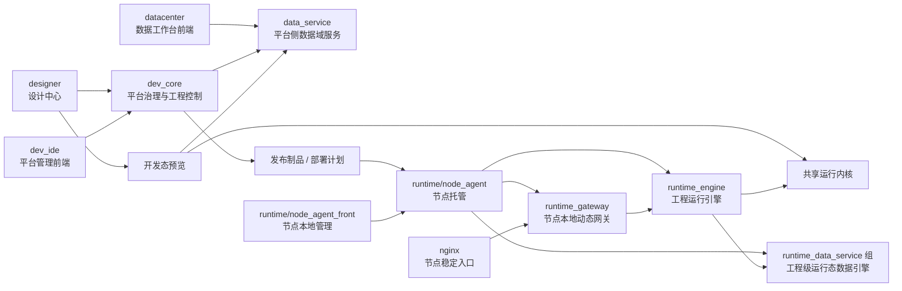

# 高层设计

## 1. 文档定位

本文档定义 InduForge 的最终态系统架构、分层关系、模块连接方式与长期边界。本文档不承载当前阶段计划、任务顺序和实现清单。

## 2. 架构目标

InduForge 的高层架构目标包括：

- 将平台稳定拆分为设计层、平台数据层、控制与管理层、共享运行内核层和运行与节点层。
- 让开发态预览与最终运行时共享同一套运行内核，避免长期形成两套分叉的页面运行能力。
- 将数据域拆分为平台侧 `data_service` 与运行态 `runtime_data_service`，同时保持统一的数据域契约。
- 让 `dev_core` 专注平台治理、设计中心接口、工程管理、发布部署编排，不承担长期数据域后端职责。
- 让节点侧工程运行组合具备独立发布、平滑切换和尽量不影响已有工程访问的能力。

## 3. 总体架构视图

这张总图表达的是：

- `designer` 和 `dev_ide` 的主后端入口是 `dev_core`。
- 开发态预览访问平台侧 `data_service`。
- 节点运行侧通过 `nginx -> runtime_gateway -> runtime_engine` 承接页面访问。
- 运行态页面通过工程对应的 `runtime_data_service` 实例组获取运行态数据服务能力。
- `node_agent` 负责节点侧运行组合的托管、注册、切换与状态管理。

## 4. 架构分层

### 4.1 设计层

- 模块：`designer`
- 负责工程、页面、组件、绑定与交互定义。
- 对平台后端的主调用入口是 `dev_core`。

### 4.2 平台数据层

- 模块：`datacenter`、`data_service`
- `datacenter` 提供数据工作台前端入口。
- `data_service` 提供平台侧与开发态的数据域服务能力。

### 4.3 控制与管理层

- 模块：`dev_core`、`dev_ide`
- `dev_core` 负责租户、用户、平台角色、工程管理、设计中心接口、平台管理接口、发布部署编排。
- `dev_core` 同时负责工程运行态用户、角色、资源授权规则主数据以及发布所需安全快照组织。
- `dev_ide` 负责平台管理、工程管理、运维与部署管理视图。

### 4.4 共享运行内核层

- 提供页面解释、组件渲染、绑定求值、变量上下文与事件分发能力。
- 被开发态预览和最终运行引擎共同使用。

### 4.5 运行与节点层

- 模块：`runtime_gateway`、`runtime_engine`、`runtime_data_service`、`runtime/node_agent`、`runtime/node_agent_front`
- 负责节点侧访问入口、工程运行单元、工程级数据引擎、节点托管与本地运维能力。

## 5. 平台侧架构

平台侧遵循“统一治理入口 + 分域能力服务”的原则。

### 5.1 `dev_core` 的平台职责

`dev_core` 承担以下长期职责：

- 租户、用户、平台角色与平台治理能力
- `dev_ide` 的平台管理接口
- `designer` 的设计中心与工程管理接口
- 工程运行态用户、角色、授权规则与安全快照组织
- 工程聚合、发布制品组织与部署编排
- 节点、部署、运行状态的中心侧控制与汇总

### 5.2 前端到后端的主入口关系

- `designer` 的设计中心、工程、资源、发布等能力以 `dev_core` 为主后端入口。
- `dev_ide` 的平台管理、运维、工程管理与部署操作以 `dev_core` 为主后端入口。
- `datacenter` 以 `data_service` 为数据域主入口，必要的平台上下文和工程运行态角色主数据由 `dev_core` 提供。

## 6. 数据域架构

InduForge 的数据域采用“双数据服务结构”。

### 6.1 `data_service`

- 定位：平台侧与开发态数据域服务
- 作用：承接连接、查询、数据点、协议接入、计算、预览会话和数据域管理能力
- 服务对象：`datacenter`、开发态预览、平台侧数据域流程

### 6.2 `runtime_data_service`

- 定位：运行态工程级数据引擎
- 作用：承接工程运行期的数据接入、采集、计算、存储与本地数据服务
- 服务对象：节点侧该工程对应的 `runtime_engine`

### 6.3 双数据服务之间的关系

- 两者共享数据域契约、领域模型和运行所需数据语义。
- 两者不是同一实例，也不是同一部署单元。
- 开发态预览只访问 `data_service`。
- 运行态页面只访问所属工程的 `runtime_data_service` 实例组。

## 7. 共享运行内核与运行引擎关系

### 7.1 共享运行内核的职责

共享运行内核负责：

- 页面结构解释
- 组件渲染
- 绑定求值
- 变量上下文管理
- 事件分发与基础交互

### 7.2 开发态预览如何接入

- 开发态预览在 `designer` 内运行。
- 预览通过共享运行内核解释页面。
- 预览的数据访问通过平台侧 `data_service` 完成。

### 7.3 最终运行引擎如何接入

- `runtime_engine` 使用同一套共享运行内核能力。
- `runtime_engine` 不直接访问平台侧 `data_service`。
- `runtime_engine` 只访问当前工程绑定的 `runtime_data_service` 实例组。

## 8. 关键链路

### 8.1 设计链路

- `designer` 通过 `dev_core` 管理工程、页面、资源与发布动作。
- `datacenter` 通过 `data_service` 提供数据域配置与调试能力。

### 8.2 开发态预览链路

- `designer` 触发预览。
- 共享运行内核解释页面定义。
- 预览通过平台侧 `data_service` 获取开发态数据域能力。

### 8.3 发布部署链路

- `dev_core` 聚合工程结构、资源、运行所需数据快照与安全快照，生成发布制品。
- `dev_core` 生成部署计划并下发到 `node_agent`。

### 8.4 运行时执行链路

- `node_agent` 拉起节点本地运行组合。
- 外部访问通过 `nginx -> runtime_gateway -> runtime_engine`。
- `runtime_engine` 通过当前工程的 `runtime_data_service` 实例组访问运行态数据能力。
- 节点本地网关、运行引擎和数据引擎共同消费发布包内的安全快照，完成本地认证与本地鉴权。

## 9. 运行与托管架构

节点侧采用“稳定入口 + 本地动态网关 + 工程运行组合”的结构。

### 9.1 节点稳定入口

- `nginx` 作为节点稳定入口层，负责外部访问接入与反向代理到本地网关。
- `nginx` 不承担工程级动态编排，不应因为单个工程部署频繁改动主配置。

### 9.2 本地动态网关

- `runtime_gateway` 维护节点本地工程路由注册表。
- 新工程部署、旧工程切换、实例扩缩容时，优先更新 `runtime_gateway` 的注册信息。
- 工程级路由变化尽量不通过重载节点公共入口来实现。

### 9.3 工程运行组合

每个工程在节点侧形成一个独立运行组合：

- 一个 `runtime_engine`
- 一组 `runtime_data_service` 实例
- 一条在 `runtime_gateway` 中注册的工程访问记录

组内多个 `runtime_data_service` 实例服务同一个工程，用于负载均衡与吞吐扩展，而不是节点共享公共数据服务。

### 9.4 `node_agent` 的托管责任

`node_agent` 负责：

- 发布制品落地
- `runtime_gateway`、`runtime_engine` 与 `runtime_data_service` 实例组的进程托管
- 工程切换、摘流、加流、探活与状态回传
- 与 `runtime/node_agent_front` 协同提供本地运维视图

## 10. 架构边界与演进原则

- `dev_core` 不承接长期数据域后端职责。
- `designer` 和 `dev_ide` 的主后端入口是 `dev_core`。
- `datacenter` 作为数据工作台前端，主数据域入口是 `data_service`。
- 开发态和运行态共用共享运行内核，但不共用同一个数据服务实例。
- `runtime_data_service` 按工程实例组部署，不按节点公共服务部署。
- `runtime_gateway` 负责工程级动态路由，`nginx` 保持节点级稳定入口。
- 节点托管层不承担页面语义解释、平台治理和平台侧数据域能力。
- 节点运行时登录与资源授权优先基于本地安全快照闭环，不依赖中心在线校验。
